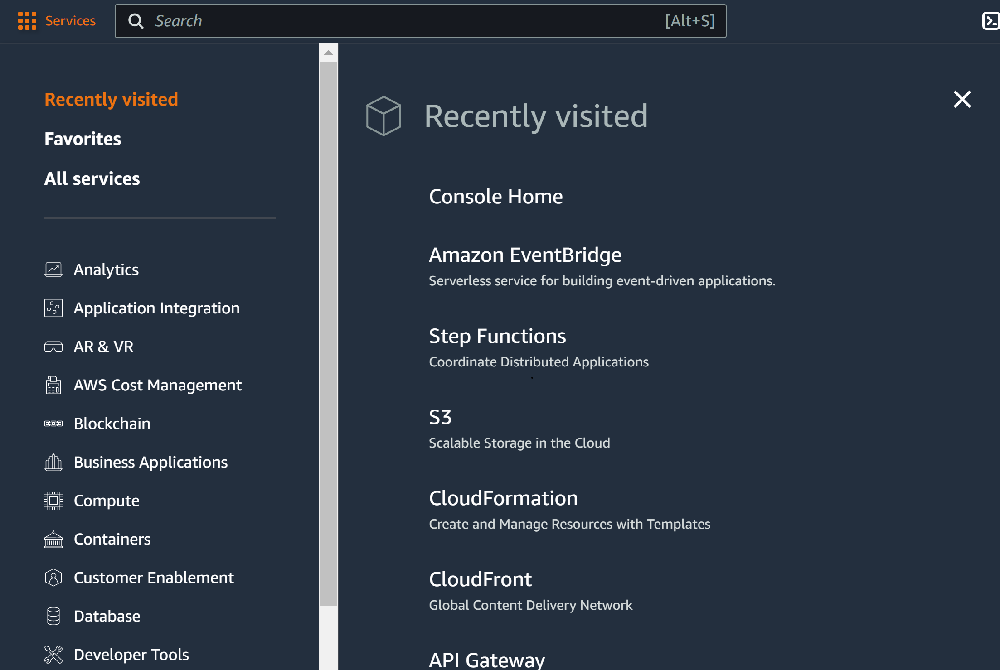

## AWS

### (Combined session)

---

### Overview

- What is AWS?
- AWS Console
- IAM (Identity and Access Management)
- AWS CLI (Command Line Interface)
- EC2 (Elastic Compute Cloud)
- S3 (Simple Storage Service)
- Lambda

---

### Learning Objectives

- Define the role AWS plays in modern software development
- Identify the different use cases for the console and CLI
- Implement services such as IAM, EC2, S3 and Lambda

---

### What is the cloud?

- "The cloud" refers to servers that are accessed over the Internet, and the software and databases that run on those servers
- Cloud servers are located in data centers all over the world
- By using cloud computing, users and companies do not have to manage physical servers themselves or run software applications on their own machines

Notes:
Ask the learners for ideas why running applications on their own machines is a bad idea.

E.g.:

- they turn it off / runs out of battery
- runs out of storage / processing capacity
- many concurrent connections

---

### What is AWS?

- **Amazon Web Services** is a cloud computing platform
- Offerings encompass computing power, database storage, content delivery, logging and monitoring - if you need to do a thing, there's an AWS product for it
- At last count, there were over 200 AWS products to choose from...

---

### Regions

- A physical location somewhere in the world where AWS data centers are clustered
- Each group of logical data centres within a Region is called an **Availability Zone**
- Multiple geographic Regions, including North America, South America, Europe, China, Asia Pacific, South Africa, and the Middle East
- Regions have a code name, such as `eu-west-1` which represents the Irish region

Notes:
Availability Zones expanded on in next slide.

Another example is `eu-west-2` which is based in London.

---

### Availability Zones

- One (or more) discrete data center(s) in an AWS region
- AZs in a region are physically-separate, but within 100km of each other - high-bandwidth, low-latency networking
- Gives customers the ability to operate production applications and databases that are more highly available, fault tolerant, and scalable than would be possible from a single data center
- If an application is partitioned across AZ's, companies are better isolated and protected from issues such as power outages, lightning strikes, tornadoes, earthquakes, and more

Notes:
Data centres are just enormous buildings that operate a vast amount of computer machinery, with its own cooling and power setup.

Currently 33 AWS regions, containing 105 AZs.

London (eu-west-2) has 3 AZs.

This is a useful tool to visualise it:
https://aws.amazon.com/about-aws/global-infrastructure

Example of outage: London 2022 heatwave caused data centres to power down to protect servers - https://www.protocol.com/bulletins/google-oracle-cloud-uk-heat

---

### Emoji Check:

Do you feel you understand Regions and Availability Zones? Say so if not!

1. 😢 Haven't a clue, please help!
2. 🙁 I'm starting to get it but need to go over some of it please
3. 😐 Ok. With a bit of help and practice, yes
4. 🙂 Yes, with team collaboration could try it
5. 😀 Yes, enough to start working on it collaboratively

Notes:
The phrasing is such that all answers invite collaborative effort, none require solo knowledge.

The 1-5 are looking at (a) understanding of content and (b) readiness to practice the thing being covered, so:

1. 😢 Haven't a clue what's being discussed, so I certainly can't start practising it (play MC Hammer song)
2. 🙁 I'm starting to get it but need more clarity before I'm ready to begin practising it with others
3. 😐 I understand enough to begin practising it with others in a really basic way
4. 🙂 I understand a majority of what's being discussed, and I feel ready to practice this with others and begin to deepen the practice
5. 😀 I understand all (or at the majority) of what's being discussed, and I feel ready to practice this in depth with others and explore more advanced areas of the content

---

### Exercise prep

> Instructor to give out the zip file of exercises for `aws`
>
> Everyone please unzip the file

---

<!-- .slide: data-only="schooloftech" -->
### Exercise time

> From the zip, you should have a file `exercises/aws-setup-azure-login.md`
>
> Let's all follow the AWS Account Access steps, we'll get to the CLI setup a bit later

Notes:
Get the learners to all do this together in case there are any questions.

---

<!-- .slide: data-only="generation jlr sainsburys" -->
### Exercise time

> From the zip, you should have a file `exercises/aws-setup-sso.md`
>
> Let's all follow the AWS Account Access steps, we'll get to the CLI setup a bit later

Notes:
Get the learners to all do this together in case there are any questions.

---

### The AWS Management Console

<!-- .element: class="centered" height="350px" -->

---

### The AWS Management Console

- The standard graphical interface to AWS
- AWS make changes to it regularly, so don't be surprised if things move every few months!
- The home page has a list of your commonly used services, account summary info, and announcements

Notes:
Worth mentioning the region selection on the page so that learners can confirm they're on the right one for the course.

---

### The AWS Management Console

- The full list of services can be accessed from the tab at the top
<!-- .element: class="centered" -->
- There are many(!) services, and each of them have been built by different teams (or even companies) around the world
- As such, many of the services have a very different look and feel when using them in the Management Console

---

### AWS Services

Services tend to be grouped under one of several categories, including:

- File storage (e.g. `S3`)
- Compute (e.g. `EC2`, `Lambda`)
- Security & identity (e.g. `IAM`)
- Databases (e.g. `RDS (Relational Database Service)`)

We'll be covering some of these in more detail in this session.

---

## IAM

<!-- .element: class="centered" height="350px" -->

---

### IAM

- **Identity and Access Management**
- Manage users and their level of access to the CLI or console
- Manage roles permissions for the roles
- Manage authentication for users or applications accessing AWS
- Free to use - you can create as many roles as you wish

---

### IAM Features

- Granular permission - user or app can access service X but not service Y
- Identity Federation (login with Facebook, Google, Active Directory etc.)
- MFA
- Password rotation policy
- Integrates with many different AWS services

---

### IAM Key Terms

- Users
- Groups
- Roles
- Policies

We will dive into what each means.

---

### IAM - Users

- End users such as people, employees etc.
- Accounts with username and password
- Can define level of access to AWS services
- Manage the permissions of what the user can perform
- Manage their security credentials (MFA etc.)
- You are either the account owner (root) or an IAM user.

Notes:
Example: Each learner is an IAM user.

---

### IAM - Groups

- A collection of users, where you can define permissions for all of them in an easier way
- A group can contain many users, and a user can belong to multiple groups
- Groups can't be nested; they can contain only users, not other groups
- There's no default group that automatically includes all users in the AWS account

Notes:
Example: All learners will be in a group called Learners.

---

### IAM - Roles

- Similar to an IAM user, except a role is intended to be assumed by anyone or any service that needs it
- Provides temporary security credentials for the length of the session, as opposed to a username and password
- Specific permissions on AWS services and resources
- Policies are attached to roles to grant them access/privilege

Notes:
Example: Each learner assumes a role with their IAM user that gives them wider access to AWS services as opposed to the user itself.

---

### IAM - Policies

- You manage access in AWS by creating policies and attaching them to IAM identities (users, groups, roles) or AWS resources
- A policy is an object that, when associated with an identity/resource, defines their permissions
- These permissions determine if a request is allowed or denied
- Most policies are stored as JSON

Notes:
Example: The role/group the learners are in have policies associated to give them a certain amount of access to services.

---

### IAM - Best Practices

- Create **individual** users
- Manage permissions with groups
- Use IAM roles for as many actions
- Grant **least privilege** with permissions
- Configure a **strong** password policy
- Enable MFA for privileged users

---

### IAM - Best Practices

- Setup audits with AWS CloudTrail.
- CloudTrail logs for exactly who did what, when, and from where
- Use IAM roles to allow users and services to share access to another service
- Rotate security credentials **regularly**
- Restrict privileged access further with conditions (for instance, only allowing a range of IPs that a request must come from)
- Reduce use of root (mostly used for billing and locking down account securely)

Notes:
An example of a 'condition' you could impose would be, for example, allowing a user to use a certain service but only Mon - Fri.

Demo the IAM dashboard.

---

### Emoji Check:

Do you feel you understand the basics of IAM? Say so if not!

1. 😢 Haven't a clue, please help!
2. 🙁 I'm starting to get it but need to go over some of it please
3. 😐 Ok. With a bit of help and practice, yes
4. 🙂 Yes, with team collaboration could try it
5. 😀 Yes, enough to start working on it collaboratively

Notes:
The phrasing is such that all answers invite collaborative effort, none require solo knowledge.

The 1-5 are looking at (a) understanding of content and (b) readiness to practice the thing being covered, so:

1. 😢 Haven't a clue what's being discussed, so I certainly can't start practising it (play MC Hammer song)
2. 🙁 I'm starting to get it but need more clarity before I'm ready to begin practising it with others
3. 😐 I understand enough to begin practising it with others in a really basic way
4. 🙂 I understand a majority of what's being discussed, and I feel ready to practice this with others and begin to deepen the practice
5. 😀 I understand all (or at the majority) of what's being discussed, and I feel ready to practice this in depth with others and explore more advanced areas of the content

---

## AWS CLI

<!-- .element: class="centered" height="350px" -->

---

### AWS CLI

- The way we interact with AWS services through the CLI
- Ease of use over logging in to the console
- If you can do it on the Console, you can do it in the CLI - YAY!
- Simple use-cases: searching logs, quick S3 upload/download

---

<!-- .slide: data-only="schooloftech" -->
### CLI Installation

Follow the *AWS CLI Setup* steps in the `exercises/aws-setup-azure-login.md` file

Once we're done we'll be able to communicate with AWS via the command line:

```sh
$ aws < command > < subcommand > [options and parameters]
```

---

<!-- .slide: data-only="generation" -->
### CLI Installation

Follow the *AWS CLI Setup* steps in the `exercises/aws-setup-sso.md` file
Once we're done we'll be able to communicate with AWS via the command line:

```sh
$ aws < command > < subcommand > [options and parameters]
```

---

### Emoji Check:

How do you feel about the CLI installation process?

Do you feel you understand why the AWS CLI is useful?

1. 😢 Haven't a clue, please help!
2. 🙁 I'm starting to get it but need to go over some of it please
3. 😐 Ok. With a bit of help and practice, yes
4. 🙂 Yes, with team collaboration could try it
5. 😀 Yes, enough to start working on it collaboratively

Notes:
The phrasing is such that all answers invite collaborative effort, none require solo knowledge.

The 1-5 are looking at (a) understanding of content and (b) readiness to practice the thing being covered, so:

1. 😢 Haven't a clue what's being discussed, so I certainly can't start practising it (play MC Hammer song)
2. 🙁 I'm starting to get it but need more clarity before I'm ready to begin practising it with others
3. 😐 I understand enough to begin practising it with others in a really basic way
4. 🙂 I understand a majority of what's being discussed, and I feel ready to practice this with others and begin to deepen the practice
5. 😀 I understand all (or at the majority) of what's being discussed, and I feel ready to practice this in depth with others and explore more advanced areas of the content

---

### Quiz Time! 🤓

---

**What is an AWS Region?**

1. An AWS Infrastructure offering that's optimised for mobile edge computing applications.
1. A physical location somewhere in the world where AWS data centers are clustered.
1. A type of AWS infrastructure deployment that places AWS compute, storage, database, and other select services close to large population, industry, and IT centers.
1. One (or more) discrete data center(s) in an AWS region.

<span><br>Answer: `2`</span><!-- .element: class="fragment" -->

---

**What are the four main areas of AWS IAM?**

1. Groups, Permissions, Roles, Users
1. Groups, Policies. Roles, People
1. Pools, Policies, Roles, Users
1. Groups, Policies, Roles, Users
1. Groups, Policies, Requirements, Users

<span><br>Answer: `4`</span><!-- .element: class="fragment" -->

---

**What are policies used for in AWS IAM?**

1. An object that, when associated with an identity/resource, defines their permissions.
1. An object that provides temporary security credentials for the length of the session, as opposed to a username and password.
1. A document that is intended to be assumed by anyone or any service that needs it.
1. A document that defines a user permissions for one specific AWS service.

<span><br>Answer: `1`</span><!-- .element: class="fragment" -->

---

## EC2

<!-- .element: class="centered" height="350px" -->

---

### EC2 (Elastic Compute Cloud)

- Service that allows you to rent virtual computers on which you can run your own applications
- 'Elastic' because you pay by the second for what you use!
- You get control over the geographical location of your virtual computers

Before cloud computing, you'd need to put in a request for physical hardware which could take weeks to provision, now it takes seconds, with a few clicks.

---

### EC2 Pricing Types

**On Demand**:

Allows you to pay a fixed rate by the hour/minute/second with no commitment.

**Reserved**:

Provides you with a capacity reservation and a significant discount on the hourly charge of an instance. Locked into contract terms of 1 or 3 years.

---

### EC2 Pricing Types

**Spot**:

Enables you to bid whatever price you want for instance capacity, making better savings if your applications have flexible start/end times.

**Dedicated Hosts**:

Physical EC2 server dedicated for your own use.

---

### EC2 - Concepts

**Image**: what is being used to build an instance (similar to Docker)

**Instance**: the machine you're creating

**Security**: security groups, key management, network interfaces

Notes:
Image - essentially a sort of template that contains the software configuration required to launch your instance.

Security Group - a virtual firewall for your EC2 instances to control incoming & outgoing traffic.

Key management: You use key pairs to connect to your EC2 instances (public key is stored in .ssh directory of instance).

Network interface: Configuring stuff like port numbers and network access.

---

### EC2 & EBS

- Elastic Block store - high performance, highly available storage for EC2
- Block-level (organised/identified in blocks) storage that can be attached to EC2 instances
- 2 options available: SSD or HDD

Notes:
Block storage breaks up data into blocks and then stores those blocks as separate pieces, each with a unique identifier.

The SAN places those blocks of data wherever it is most efficient. That means it can store those blocks across different systems and each block can be configured (or partitioned) to work with different operating systems.

SSD - Solid State Drive
HDD - Hard Disk Drive

---

### Quiz Time! 🤓

---

**You have created an instance in EC2, and you want to connect to it. What should you do to log in to the system for the first time?**

1. Use the username/password combination you created within the EC2 setup.
1. Use the key-pair combination you created within the EC2 setup.
1. Generate a secure login from your AWS Secret Access Key.
1. Log in with your AWS username/password/MFA.

<span><br>Answer: `2`</span><!-- .element: class="fragment" -->

---

**True or False: You can use the AWS Console to add a role to an EC2 instance after that instance has been created and powered up.**

<span><br>Answer: `True`</span><!-- .element: class="fragment" -->

---

**True or False: When creating a new security group, all inbound traffic is allowed by default.**

<span><br>Answer: `False`</span><!-- .element: class="fragment" -->

---

### Exercise

> Let's all do `AWS EC2` steps in the `exercises/aws-exercise.md` file.
>
> You will be able to find relevant files for `Setting up the website` in the `handouts` folder.

---

### Emoji Check:

How did you find exercises on using EC2 service in AWS?

1. 😢 Haven't a clue, please help!
2. 🙁 I'm starting to get it but need to go over some of it please
3. 😐 Ok. With a bit of help and practice, yes
4. 🙂 Yes, with team collaboration could try it
5. 😀 Yes, enough to start working on it collaboratively

Notes:
The phrasing is such that all answers invite collaborative effort, none require solo knowledge.

The 1-5 are looking at (a) understanding of content and (b) readiness to practice the thing being covered, so:

1. 😢 Haven't a clue what's being discussed, so I certainly can't start practising it (play MC Hammer song)
2. 🙁 I'm starting to get it but need more clarity before I'm ready to begin practising it with others
3. 😐 I understand enough to begin practising it with others in a really basic way
4. 🙂 I understand a majority of what's being discussed, and I feel ready to practice this with others and begin to deepen the practice
5. 😀 I understand all (or at the majority) of what's being discussed, and I feel ready to practice this in depth with others and explore more advanced areas of the content

---

## S3

<!-- .element: class="centered" height="350px" -->

---

### S3 - Simple Storage Service

- Secure, durable, highly scalable object store
- Safe place to store files
- **Object**-based storage
- Files can be 0 bytes to 5TB
- **Unlimited** storage, you pay for what you use
- Files are stored in **buckets** (basically a folder)
- Globally distributed

---

### S3 - Objects

S3 is object-based. Think of objects just like files. They consist of the following:

**Key**: The name of the object

**Value**: The sequence of bytes containing the data

**Version ID**: For versioning

**Metadata**: Data about data you're storing

---

### S3 Guarantee Model

- Up to 99.99% availability
- Up to 99.999999999% durability (11x 9s)

99.99% availability equates to 52.60 minutes of downtime per year.

99.999999999% durability means that if you store 10 million objects then you expect to lose a single object of your data every 10,000 years.

---

### S3 - Advanced Features

- Object versioning
- Storage class: trade durability/availability for cost
- Lifecycle policies: manage the lifetime of your files automatically
- Encryption at-rest
- MFA Delete
- Bucket policies to control who can access them

---

### Quiz Time! 🤓

---

**1. What is the maximum file size you can store in Amazon S3?**

1. `1TB`
2. `5TB`
3. `10TB`
4. `100GB`

Answer: `2`<!-- .element: class="fragment" -->

---

**2. What is the term used to describe the storage container for files in Amazon S3?**

1. `Cabinets`
2. `Buckets`
3. `Shelves`
4. `Boxes`

Answer: `2`<!-- .element: class="fragment" -->

---

**3. What does Amazon S3's 99.999999999% durability mean?**

1. `If you store 10 million objects, you can expect to lose one object every year.`
2. `If you store 10 million objects, you can expect to lose one object every 100 years.`
3. `If you store 10 million objects, you can expect to lose one object every 1,000 years.`
4. `If you store 10 million objects, you can expect to lose one object every 10,000 years.`

Answer: `4`<!-- .element: class="fragment" -->

---

**4. Which of the following is NOT a component of an S3 object?**

1. `Key`
2. `Value`
3. `Timestamp`
4. `Version ID`

Answer: `3`<!-- .element: class="fragment" -->

---

**5. Which of the following is an advanced feature of Amazon S3?**

1. `Object versioning`
2. `Auto-scaling`
3. `Dynamic load balancing`
4. `Event-driven computing`

Answer: `1`<!-- .element: class="fragment" -->

---

### Exercise

> Let's all do `AWS S3` part in the `exercises/aws-exercise.md` file.
>
> You will be able to find relevant files for `Part 2` in the `handouts` folder.

---

### Emoji Check:

How did you find exercises on using S3 service in AWS?

1. 😢 Haven't a clue, please help!
2. 🙁 I'm starting to get it but need to go over some of it please
3. 😐 Ok. With a bit of help and practice, yes
4. 🙂 Yes, with team collaboration could try it
5. 😀 Yes, enough to start working on it collaboratively

Notes:
The phrasing is such that all answers invite collaborative effort, none require solo knowledge.

The 1-5 are looking at (a) understanding of content and (b) readiness to practice the thing being covered, so:

1. 😢 Haven't a clue what's being discussed, so I certainly can't start practising it (play MC Hammer song)
2. 🙁 I'm starting to get it but need more clarity before I'm ready to begin practising it with others
3. 😐 I understand enough to begin practising it with others in a really basic way
4. 🙂 I understand a majority of what's being discussed, and I feel ready to practice this with others and begin to deepen the practice
5. 😀 I understand all (or at the majority) of what's being discussed, and I feel ready to practice this in depth with others and explore more advanced areas of the content

---

## Lambda

<!-- .element: class="centered" height="350px" -->

---

### Lambda

- 100% code, 0% infrastructure
- Run code without worrying about OS, patching, scaling, any physical hardware
- Never worry about capacity again
- Lambdas run in response to events such as data changes in S3, DB record being inserted
- You can even call them from through HTTP requests, SDK, or the AWS CLI

---

### Lambda Triggers

A lambda function is automatically invoked when one of its triggers is activated.

For example:

- When a record has been inserted into a DB table
- When a file has been uploaded to S3
- When a commit is pushed onto a repo hosted in CodeCommit (Git for AWS)
- When a monitoring alarm goes off

---

### Lambda Pricing Model

**Number of requests:** First 1 million requests per month are free, $0.20 per 1 million after (cheap!)

**Duration:** Calculated from the time your code begins until it terminates, up to the millisecond. The price depends on how much memory you allocate. Roughly $0.0000166667 for every GB-second used. The first 400,000 are free per month.

Notes:
It used to be rounded to the nearest ms but is now at a per ms basis.

---

### Limitations

- Cold starts: Time it takes to kick off an instance (it's a container under the hood)
- Difficult to scale without understanding the concurrency execution model
- Tightly integrated to work with other AWS services so may have potential 'lock-in'
- Can be difficult to develop locally
- Unsuitable for tasks that take 15+ minutes

---

### Use Cases

- Tasks that take less than 15 minutes to complete
- Asynchronous, event-driven workloads
- Consistent level of traffic

---

### Quiz Time! 🤓

---

**1. Which of the following best describes AWS Lambda?**

1. `An AWS service for managing server infrastructure`
1. `A serverless compute service that runs your code in response to events`
1. `A tool for automatically scaling EC2 instances`
1. `A container orchestration service for running containerized applications`

Answer: `2`<!-- .element: class="fragment" -->

---

**2. After what time will an AWS Lambda function timeout?**

1. `5 minutes`
1. `10 minutes`
1. `15 minutes`
1. `30 minutes`

Answer: `3`<!-- .element: class="fragment" -->

---

**3. What is a potential drawback of AWS Lambda?**

1. `Limited integration with other AWS services`
1. `Difficulty in scaling without understanding the concurrency execution model`
1. `Inability to handle asynchronous, event-driven workloads`
1. `Inability to run code in response to events`

Answer: `2`<!-- .element: class="fragment" -->

---

**4. Which of the following is a use case for AWS Lambda?**

1. `Tasks that take more than 15 minutes to complete`
1. `Running code without worrying about underlying infrastructure`
1. `Deploying and managing containerized applications`
1. `Scaling and managing server infrastructure`

Answer: `2`<!-- .element: class="fragment" -->

---

**5. What is a "cold start" in the context of AWS Lambda?**

1. `The time it takes for a Lambda function to scale up`
1. `The time it takes to kick off an instance (container) to run a Lambda function`
1. `The process of initialising a new Lambda function`
1. `The process of stopping an unused Lambda function`

Answer: `2`<!-- .element: class="fragment" -->

---

## Exercise

> Let's all do `AWS Lambda` part in the `exercises/aws-exercise.md` file.

---

### Emoji Check:

How did you find exercises on using Lambda service in AWS?

1. 😢 Haven't a clue, please help!
2. 🙁 I'm starting to get it but need to go over some of it please
3. 😐 Ok. With a bit of help and practice, yes
4. 🙂 Yes, with team collaboration could try it
5. 😀 Yes, enough to start working on it collaboratively

Notes:
The phrasing is such that all answers invite collaborative effort, none require solo knowledge.

The 1-5 are looking at (a) understanding of content and (b) readiness to practice the thing being covered, so:

1. 😢 Haven't a clue what's being discussed, so I certainly can't start practising it (play MC Hammer song)
2. 🙁 I'm starting to get it but need more clarity before I'm ready to begin practising it with others
3. 😐 I understand enough to begin practising it with others in a really basic way
4. 🙂 I understand a majority of what's being discussed, and I feel ready to practice this with others and begin to deepen the practice
5. 😀 I understand all (or at the majority) of what's being discussed, and I feel ready to practice this in depth with others and explore more advanced areas of the content

---

### Clean Up

Make sure to delete the following once you are done:

- Lambdas
- EC2 instances
- S3 buckets

---

### Terms and Definitions - recap

**Cloud Computing**: The on-demand availability of computer system resources, especially data storage and computing power, without direct active management by the user.

**Data Centre**: A building, dedicated space within a building, or a group of buildings used to house computer systems and associated components, such as telecommunications and storage systems.

**Region**: A physical location somewhere in the world where data centers are clustered.

**Availability Zone**: One (or more) discrete data center(s) in a region.

---

### Terms and Definitions - recap

**IAM**: Defining and managing the roles and access privileges of individual users and the circumstances in which users are granted (or denied) those privileges.

**EC2**: A web service that provides secure, resizable compute capacity in the cloud.

**EBS**: An easy to use, high-performance, block-storage service designed for use with Amazon EC2 for both throughput and transaction intensive workloads at any scale.

**S3**: An object storage service that offers industry-leading scalability, data availability, security, and performance.

**Lambda**: A serverless compute service that lets you run code without provisioning or managing servers.

---

### Overview - recap

- What is AWS?
- AWS Console
- IAM
- AWS CLI
- EC2
- S3
- Lambda

---

### Learning Objectives - recap

- Define the role AWS plays in modern software development
- Identify the different use cases for the console and CLI
- Implement services such as IAM, EC2, S3 and Lambda

---

### Further Reading

- [AWS IAM Introduction](https://towardsdatascience.com/aws-iam-introduction-20c1f017c43?gi=74f13b6e2a07)
- [AWS Docs](https://docs.aws.amazon.com/)
- [AWS Cloud Practitioner Certification](https://aws.amazon.com/certification/certified-cloud-practitioner/)

Notes:
The AWS Cloud Practitioner is a good certification to get familiar with a lot of the main concepts of AWS.

Included as mention here so the learners know it is available as an option. If they are interested in AWS they can pursue the certification in their own time post-course.

---

### Emoji Check:

On a high level, do you think you understand the main concepts of this session? Say so if not!

1. 😢 Haven't a clue, please help!
2. 🙁 I'm starting to get it but need to go over some of it please
3. 😐 Ok. With a bit of help and practice, yes
4. 🙂 Yes, with team collaboration could try it
5. 😀 Yes, enough to start working on it collaboratively

Notes:
The phrasing is such that all answers invite collaborative effort, none require solo knowledge.

The 1-5 are looking at (a) understanding of content and (b) readiness to practice the thing being covered, so:

1. 😢 Haven't a clue what's being discussed, so I certainly can't start practising it (play MC Hammer song)
2. 🙁 I'm starting to get it but need more clarity before I'm ready to begin practising it with others
3. 😐 I understand enough to begin practising it with others in a really basic way
4. 🙂 I understand a majority of what's being discussed, and I feel ready to practice this with others and begin to deepen the practice
5. 😀 I understand all (or at the majority) of what's being discussed, and I feel ready to practice this in depth with others and explore more advanced areas of the content
