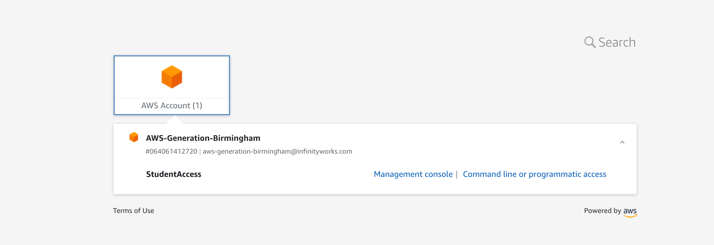

# AWS Setup using `aws sso`

## AWS Account Access

1. Open your email client and find the email from no-reply@login.awsapps.com
1. Click '_Accept Invitation_'
1. Input a **strong** password which matches the ruleset (use a password manager if you can)
1. You will then need to register an MFA device with your account. Select the **Authenticator app** option and hit next
1. Follow the steps to complete the MFA sign-up stage and click 'Assign MFA'
1. You should get a message saying '_Authenticator app registered_'. Click '_Done_'
1. Once completed, you will be redirected to a new screen. Click on the '_AWS Account (1)_' box so that it expands, then click on the wider box underneath. You should see a screen that looks like the below:

  <!-- .element: class="centered" -->

1. Click on '_Management console_' and you will be successfully signed into the AWS console

---

## AWS CLI Setup

### Installation

**Windows**:

1. Download the [latest version](https://awscli.amazonaws.com/AWSCLIV2.msi)
1. Open the download and follow the installation steps
1. Verify your installation with the following command:
    1. `aws --version`

```sh
C:\> aws --version
aws-cli/2.1.24 Python/3.7.4 Windows/10 botocore/2.0.0
```

Note: you may see a more recent version number.

**MacOS**:

1. Download the [latest version](https://awscli.amazonaws.com/AWSCLIV2.pkg)
1. Open the download and follow the installation steps
1. Verify your installation with the following commands:

```sh
$ which aws
/usr/local/bin/aws

$ aws --version
aws-cli/2.1.24 Python/3.7.4 Darwin/18.7.0 botocore/2.0.0
```

Note: you may see a more recent version number.

**Linux**:

Follow the guide which best matches your setup [here](https://docs.aws.amazon.com/cli/latest/userguide/install-cliv2-linux.html).

### Configuration

1. On a terminal, run `aws configure sso`
1. When it asks for `SSO session name`, enter a reasonable name, such as `de-course`
1. Enter your SSO (_Single Sign-On_) URL (if you don't know it, your instructor will be able to tell you - it will likely be something like `https://<bootcamp-name>.awsapps.com/start#/`)
1. Enter the SSO Region, which should be `eu-west-1`
1. When it asks for _SSO registration scopes_, hit enter
1. A webpage will open asking you to sign into the AWS CLI, click the `*Sign in to AWS CLI*` button
1. Looking back at your terminal, you will see some text which looks something like this:
   > Using the account ID _xxxxxxxxxxxx_
   > The only role available to you is: StudentAccess
   > Using the role name "StudentAccess"
1. When it asks for _CLI default client Region_, enter `eu-west-1`
1. When it asks for _CLI default output format_, enter `json`
1. When it asks for _CLI profile name_, enter the same name as above e.g. `de-course`
1. Check your login works
    1. Run `aws sso login --profile <profile-name>` in your terminal (i.e. use the _CLI profile name_ you entered above)
1. That's all (for now!)

You can log out of your SSO any time by running `aws sso logout` in your terminal.

You can now login any time by running `aws sso login --profile <profile-name>` in your terminal.

### Practice using the CLI

1. On your terminal, check which user you're using to call the AWS operations by running this:
    1. `aws sts get-caller-identity --profile <profile-name>`
1. Get a list of available S3 buckets by running this:
    1. `aws s3 ls --profile <profile-name>`
1. On the Management Console in your browser:
    1. Search for S3 in the services search box at the top of the page
    1. Select S3 from the list of services
    1. Look at the list of available buckets - does this match what you saw in the terminal?

We'll hear more info on what S3 and buckets are soon!
