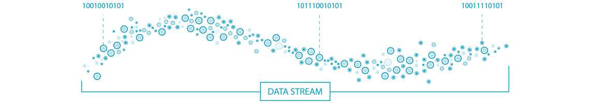
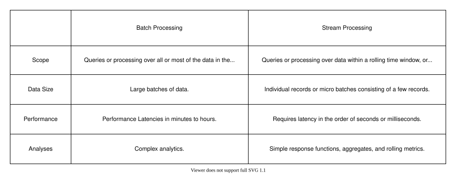
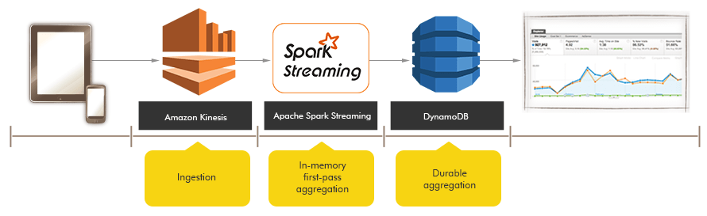
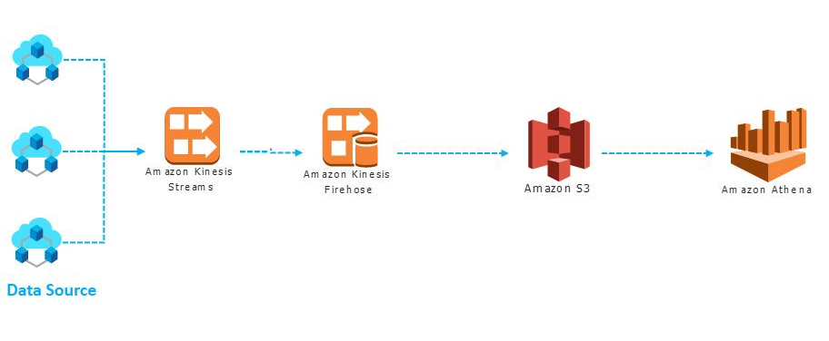
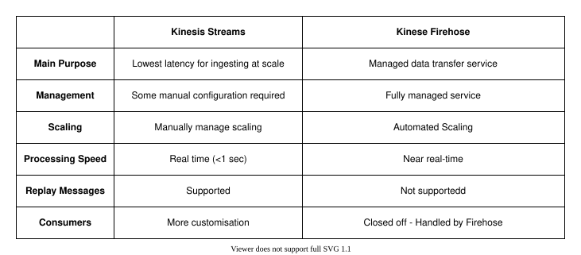
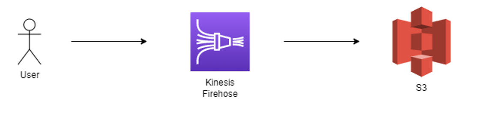
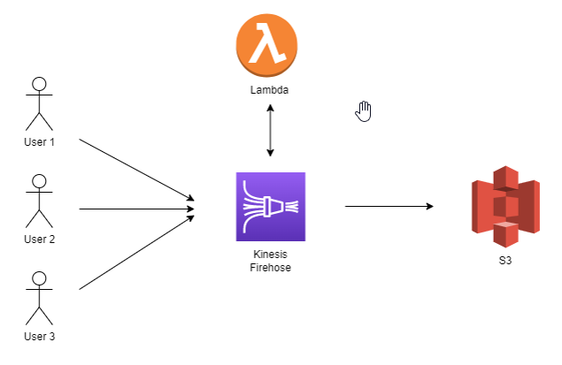

## Data Streams

---

### Overview

- Streamed data and sources
- Streaming data vs batch processing
- Challenges with streaming data
- AWS Kinesis

Notes:

Streaming data: the process of working with streamed data

Kinesis: AWS offering of streaming data

---

### Learning Objectives

- Gain an understanding of what streamed data is
- Appreciate cases where use of streamed data may be appropriate
- Identify similarities and differences between stream processing and batch processing
- Discover the challenges of working with streaming data
- Gain a basic understanding of AWS Kinesis

---

### What is streamed data?

<!-- .element: class="centered" -->

- Data that is generated continuously, usually from a number of sources
- Often many data records created simultaneously
- Generally data is small in size, often just a few kilobytes

Notes:
The question you might ask, what is the difference between a stream and a queue?

stream: processing of sequence of events

queue: standalone messages

in streams you do not delete the messages and they are persisted for a pre-configured time (retention time).

Message vs. Record

How to decide which?
Queue: When you can **process** messages **independently** and when you are done delete the messages

Stream: When you want to **analyse** the **sequence** of items in the stream

**Streamed Data**:

Final project: **Real time dashboard**

First thing you should ask? give me csv rows in an stream as it occurs

Netflix: streams video to your device on-demand (not just the whole content)

The idea of streamed data is that the data keeps being generated continuously, for example in Netflix case, it does not send you the episode in batch/blob, it sends you that as a stream and you can start processing (watching) it as it comes.

---

### What does a data stream look like?

<!-- .element: class="centered" -->

Data is sent in lots of smaller chunks which may be put together into a readable result at the destination, or processed in individual chunks.

Notes:

you have something in the middle that processes the data, and it's up to you and up to what you building to how send the processed data to the next step.(maybe batch maybe stream)

---

### What is data streaming?

Using data streaming, we process the incoming data on a record-by-record basis, or over a sliding time window.

Notes:

**data streaming** which describes how we process streamed data.

processing the data points in real-time:

- They can be processed as individual data points
- aggregated with others in a moving time **window**.

Windowing: fixed sized windows/sliding windows (moving avg, avg of temperature of the last hour in every minute) / session windows (user interaction with your website)

processor waits until window finishes then it will process it.

- Amazon real-time recommendation
- fraud detection in bank transactions

---

### Data Sources

<!-- .element: class="centered" -->

Here are some examples of sources of data streams.

Can you think of any others?

Notes:
Talk about each of them briefly.

Here we have an illustration showing some examples of data sources from which we might received streaming data. As you can see, it is a wide range of potential sources.

In the image, all of the individual streams coalesce into one larger stream of data. In reality, this may or may not be the case. Depending on how you want to do data streaming, you could process each individual source separately, or process an entire stream of different sources at once. Each individual use case will require a different approach.

---

### Data Sources

- Purchases
- Financial trades
- IoT device telemetry
- Gaming
- Machinery sensors
- Log files

Notes:
Instructor can expand on some of the above with more details:

- fraud detection in bank transactions
- An e-commerce site tracks purchases in real-tine to manage stock and potentially special offers
- A financial institution tracks changes in the stock market in real time, computes value-at-risk, and automatically re-balances portfolios based on stock price movements
- An online gaming company collects streaming data about player-game interactions, and feeds the data into its gaming platform.
- Sensors in transportation vehicles, industrial equipment, and farm machinery send data to a streaming application. The application monitors performance, detects any potential defects in advance, and places a spare part order automatically
- A fintech company constantly processes log files to look for potential indicators of fraud
- **Log file > metrics**

---

### Why do we use data streams?

- Near-real-time processing
- Concurrent application patterns with "fan out" architecture
- Quick feedback cycles
- Processing can be distributed and doesn't require a single powerful machine
- New algorithms can be added without affecting existing performance
- Many technology offerings can "micro batch" data

Notes:

- Near-real-time processing - data is processed as it is received, and whatever output comes from the processing is also updated rapidly
- Concurrent application patterns with 'fan out' architecture - allows processing of data from multiple sources concurrently, and also output to multiple 'sinks' (storage)
- Quick feedback cycle - processing and output happens with very low latency, allows for speedy intervention as required.
- Processing can be distributed - in fact in many cases, given the amount of data and variety of sources involved in data stream processing, it can be strongly recommended to use distributed processing so that the load is spread across multiple machines
- New algorithms can be added - the atomic nature of analysis makes it easier to expand functionality, versus if huge chunks of data are analysed at once

---

### Data Streaming vs Batch Processing

Firstly - what is batch processing?

We process data in 'blocks' which have already been stored.

Example - a retail company stores records of all transactions, then does some weekly processing of all transactions made by customers in the past week. At this point, the data could be millions of records, and is all processed as one batch.

Notes:

Batch: something you were doing so far in your project

---

### Data Streaming vs Batch Processing

How do data streaming and batch processing compare?

<!-- .element: class="centered" -->

---

### So batch may be more effective when...

- You want to process a whole data set anyway. Perhaps looking at yesterdays shopping data...
- There really isn't any time pressure
- Very complex algorithms are required

---

### Emoji Check:

How did you find the concepts of Batching and Streaming Data?

1. 😢 Haven't a clue, please help!
2. 🙁 I'm starting to get it but need to go over some of it please
3. 😐 Ok. With a bit of help and practice, yes
4. 🙂 Yes, with team collaboration could try it
5. 😀 Yes, enough to start working on it collaboratively

Notes:
The phrasing is such that all answers invite collaborative effort, none require solo knowledge.

The 1-5 are looking at (a) understanding of content and (b) readiness to practice the thing being covered, so:

1. 😢 Haven't a clue what's being discussed, so I certainly can't start practising it (play MC Hammer song)
2. 🙁 I'm starting to get it but need more clarity before I'm ready to begin practising it with others
3. 😐 I understand enough to begin practising it with others in a really basic way
4. 🙂 I understand a majority of what's being discussed, and I feel ready to practice this with others and begin to deepen the practice
5. 😀 I understand all (or at the majority) of what's being discussed, and I feel ready to practice this in depth with others and explore more advanced areas of the content

---

### Quiz Time! 🤓

---

ACME bank wants to conduct a detailed analysis of customer transactions which happened in the last year, utilising a large number of factors to design improvements to its mobile application. Which approach to data processing may be more suitable here?

1. Stream Processing
1. Batch Processing

Answer: `2`<!-- .element: class="fragment" -->

Notes:
Key here is the volume of data and the complexity of the analysis.

---

The investment arm of ACME bank needs to process the last week of data relating to performance of its investments. This was a request from the taxman, who needs to see some output in 2 months' time. Which approach to data processing may be more suitable here?

1. Stream Processing
1. Batch Processing

Answer: `2`<!-- .element: class="fragment" -->

Notes:
While it is much lower volume than the previous question, the key here is that they don't need any real-time output due to the relaxed deadline, so batch processing still probably a good approach.

---

ACME bank has a serious commitment to protecting its customers from identity theft. It wants to process transaction data to instantly identify suspicious transactions, and freeze a user's account until the bank has had a chance to call them. Which approach to data processing may be more suitable here?

1. Stream Processing
1. Batch Processing

Answer: `1`<!-- .element: class="fragment" -->

Notes:
Key here is the requirement to process the data in real-time.

---

### An Example

Have a look at the below image - what data sources could be involved here, and and how is the data being used?

<!-- .element: class="centered" -->

Notes:
Might be worth asking a few questions to learners here to open discussion and get them thinking about a real-world application of data streaming.

Perhaps first ask what are the various things being measured? Answers could include - moisture, acidity, soil temp, air temp, precipitation, air pressure.

Also worth asking what are the likely sources of data here - answers may include various sensors being used to measure moisture or acidity. What about the air temperature and pressure - perhaps another stream of weather data is being pulled.

A further question might be why this is being done? If I am a farmer, what are the things I might want to be alerted about? Perhaps if soil acidity gets too high my wheat will grow slower, or if moisture drops too low, the crop might wither.

---

### An Example

- Sensors in agricultural fields send data to a streaming application
- The application monitors levels of environment data over windows of time such as hourly, daily, weekly and monthly
- It detects any degradation in factors such as nitrogen levels benchmarked against older data
- When this happens the farmer is notified and nitrogen supplicants are ordered ready for dispersion

---

### Challenges with Streaming Data

Streaming data processing requires two layers: a storage layer and a processing layer.

Notes:
KDS: storage

KDF: both

KDA: processing

You are familiar with these concepts: currently in your batch system, s3 is storage layer and lambda is processing layer.

Streaming data platforms still need these two layers but they look a bit different. For example, windows need to keep the data for the specific period before processing them.

At a high level, architecture for data streaming can be boiled down to two layers sitting between the data sources and the eventual destination - these are the processing layer and the storage layer. There are some considerations that need to be taken in designing each layer, however, to optimise how the data streaming system operates.

---

### Storage Layer

We want to ensure that our storage layer can **support record ordering** and that it provides **strong consistency**

With this in mind we need to decide how to store our data in order to enable fast, inexpensive, and replayable read/write of large streams of data.

Notes:
Record **ordering is important**: think about use cases (fraud)

Ask/Talk about **Strong consistency** vs. **eventual consistency**
(so far you were working with one-node db > strong consistency)

single node: node that writes is the same node that reads

Strong consistency: the system reflects all inputs that have happened up to that time.

---

### Processing Layer

The processing layer...

- consumes data from the storage layer
- carries out required operations on the data
- may persist data again in various locations
- may instruct the storage layer to delete data which is no longer needed

Notes:
In our example lambda function

---

### Stream architecture

All of this requires a lot of management and forethought in both layers in order to...

- Scale effectively
- Ensure data remains consistent
- Critical errors don't affect uptime or data retention

These challenges are not easily solved. Thankfully a number of tools have emerged which can help...<!-- .element: class="fragment" -->

---

### Technology Options

- Apache Kafka
- Spark Streaming
- AWS Kinesis
- Apache Flink
- Apache Beam

Notes:
These tools are all relatively young, and we will not go into much detail on each of them - we will just go on to focus more on AWS Kinesis.

Beam: both batch & stream

---

### Kinesis

There are two components to Kinesis:

- Streams
- Firehose

You can use either, or both together, depending on your use case.

Notes:
Kinesis Streams: storage layer only, higher throughput

Kinesis firehose: fully integrated solutions (when you use a managed service you need less customization, so if you had a use case that firehose was good enough there is no need to go for Kinesis Streams, it's easier to build end-to-end solutions in AWS with Firehose)

You can use both of them too, stream as data source for firehose

---

### Kinesis Streams

- Focused on storage
- Requires a custom application such as Spark for processing
- Capable of storing terabytes of data per hour from hundreds of thousands of sources

Notes:

The core purpose of Kinesis Streams is to **capture** huge amounts of data from thousands of sources, and to make it available within seconds for real-time operations and analytics to occur.

It does not care what the processing is.

It does not perform these operations itself, which is why you would need to integrate it with something like Spark - which is a purpose-built tool for performing operations on large amounts of data.

---

### A Kinesis Streams architecture might look like this...



Note how we use tooling on top of Kinesis Streams, such as Spark, to create a functional pipeline.

---

### Kinesis Data Firehose

- A more rounded solution than Kinesis Streams covering both storage and processing
- Can use Kinesis Streams, IoT Core, CloudWatch or the Kinesis client directly to input source data
- Capable of transformation and windowed views of data
- Can output data to S3, Redshift, Amazon Elasticsearch Service, and Splunk
- Realtime analytics on the data stored in Kinesis is built in

Notes:
Kinesis Data Firehose is a more 'out-of-the-box' solution. It is not as customisable as using Kinesis Streams as it is set up to automatically handle loading data streams into other AWS systems for processing.

The processing capabilities of AWS Kinesis Data Streams are higher with support for **real-time** processing

On the contrary, Firehose does not provide any facility for data storage.

 Kinesis Data Firehose features **near** real-time processing capabilities. Furthermore, the processing capabilities of Firehose depend considerably on buffer size or buffer time, which could be a minimum of 60 seconds.

---

### A Kinesis Firehose architecture might look like this...



We still use Kinesis Streams as the input source, but can remove managing a spark cluster and output is made easy direct to S3.

Notes:
Reiterate that it's a relatively simple end-to-end system in that there is no 'fanning out' and also that all of the components in the pipeline are AWS.

S3: data lake
Athena: query on data lake

---

### Kinesis Streams vs Kineses Firehose

<!-- .element: class="centered" -->

---

### Demo-1

<!-- .element: class="centered" width="800px"-->

Create a Kinesis Firehose Delivery Stream

- Source: `Direct PUT`
- Destination: `S3`
- Name: `demo-<your-name>`

---

### Demo-1 [code]

```python
import json
import time
import boto3
import random

DeliveryStreamName = 'demo-<your-name>'
session = boto3.Session(profile_name='<your-profile-name>', region_name="eu-west-1")
client = session.client('firehose')

response = client.describe_delivery_stream(
    DeliveryStreamName=DeliveryStreamName,
)
print('Delivery Stream Status:', response['DeliveryStreamDescription']['DeliveryStreamStatus'])

for i in range(1000):
    data = {
        "player_name": "<your-name>",
        "score": random.randint(10, 22)
    }
    response = client.put_record(
        DeliveryStreamName=DeliveryStreamName,
        Record={
            'Data': (json.dumps(data) + '\n').encode("utf-8")
        }
    )
    time.sleep(1)
```

---

### Demo-2

<!-- .element: class="centered" width="800px"-->

---

### Demo-2 [lambda-code]

```python
import base64
import json

def lambda_handler(event, context):
  output = []
  print("Received batch of {} records".format(len(event['records'])))

  for record in event['records']:
    payload = json.loads(base64.b64decode(record['data']))
    print('payload:', payload)

    if payload['score'] > 20:
        payload['cheat_flag'] = True
    else:
        payload['cheat_flag'] = False

    output_record = {
       'recordId': record['recordId'],
       'result': 'Ok',
       'data': base64.b64encode(json.dumps(payload).encode('utf-8') + b'\n').decode('utf-8')
    }
    output.append(output_record)

  print('Successfully processed {} records.'.format(len(event['records'])))
  return {'records': output}
```

---

### Emoji Check:

How did you find the demos on AWS Kinesis?

1. 😢 Haven't a clue, please help!
2. 🙁 I'm starting to get it but need to go over some of it please
3. 😐 Ok. With a bit of help and practice, yes
4. 🙂 Yes, with team collaboration could try it
5. 😀 Yes, enough to start working on it collaboratively

Notes:
The phrasing is such that all answers invite collaborative effort, none require solo knowledge.

The 1-5 are looking at (a) understanding of content and (b) readiness to practice the thing being covered, so:

1. 😢 Haven't a clue what's being discussed, so I certainly can't start practising it (play MC Hammer song)
2. 🙁 I'm starting to get it but need more clarity before I'm ready to begin practising it with others
3. 😐 I understand enough to begin practising it with others in a really basic way
4. 🙂 I understand a majority of what's being discussed, and I feel ready to practice this with others and begin to deepen the practice
5. 😀 I understand all (or at the majority) of what's being discussed, and I feel ready to practice this in depth with others and explore more advanced areas of the content

---

### Quiz Time! 🤓

---

You want to build a data streaming service where several other business services will read and process the stream at the same time. Which Kinesis service is likely to be more suitable?

1. Kinesis Data Streams
1. Kinesis Data Firehose

Answer: `1`<!-- .element: class="fragment" -->

---

You are asked to design the simplest possible system which will ingest a data stream to a data lake in AWS S3. Which Kinesis service is likely to be more suitable?

1. Kinesis Data Streams
1. Kinesis Data Firehose

Answer: `2`<!-- .element: class="fragment" -->

---

### When might we use one, the other or both!

**Streams Alone** - When the stream needs to "fan out" to multiple consumers. It will also provide storage over a period of time.

**Firehose Alone** - When simple output to S3/Redshift/Splunk/ES is needed.

**Both Together** - This is a great option when we might have both AWS and non-AWS use cases fanning out from the same stream. One source of truth and many consumers with the added benefit of storage.

---

### Terms and Definitions - recap

**Data stream / Streamed data**: Data continuously generated, often from multiple sources

**Data streaming**: Processing of incoming data streams on a record-by-record basis or using a moving window

**Batch processing**: Splitting stored records into batches and processing an entire batch at once

**Record Ordering**: Preserving the temporal order of individual pieces of data

**Strong consistency**: Ensuring that querying for data returns all updates made

---

### Overview - recap

- Streamed data and sources
- Streaming data vs batch processing
- Challenges with streaming data
- AWS Kinesis

Notes:

Streaming data: the process of working with streamed data

Kinesis: AWS offering of streaming data

---

### Learning Objectives - recap

- Gain an understanding of what streamed data is
- Appreciate cases where use of streamed data may be appropriate
- Identify similarities and differences between stream processing and batch processing
- Discover the challenges of working with streaming data
- Gain a basic understanding of AWS Kinesis

---

### Further Reading

[AWS Streaming Data Intro](https://aws.amazon.com/streaming-data/)

[Batch Processing vs Stream Processing](https://medium.com/@gowthamy/big-data-battle-batch-processing-vs-stream-processing-5d94600d8103)

[Eventual and Strong Consistency](https://medium.com/system-design-blog/eventual-consistency-vs-strong-consistency-b4de1f92534d_)

[Kinesis Data Streams](https://aws.amazon.com/kinesis/data-streams/)

[Kinesis Data Firehose](https://aws.amazon.com/kinesis/data-firehose/?kinesis-blogs.sort-by=item.additionalFields.createdDate&kinesis-blogs.sort-order=desc)

[Kinesis - Data STreams vs Firehose](https://jayendrapatil.com/aws-kinesis-data-streams-vs-kinesis-firehose/)

---

### Emoji Check:

On a high level, do you think you understand the main concepts of this session? Say so if not!

1. 😢 Haven't a clue, please help!
2. 🙁 I'm starting to get it but need to go over some of it please
3. 😐 Ok. With a bit of help and practice, yes
4. 🙂 Yes, with team collaboration could try it
5. 😀 Yes, enough to start working on it collaboratively

Notes:
The phrasing is such that all answers invite collaborative effort, none require solo knowledge.

The 1-5 are looking at (a) understanding of content and (b) readiness to practice the thing being covered, so:

1. 😢 Haven't a clue what's being discussed, so I certainly can't start practising it (play MC Hammer song)
2. 🙁 I'm starting to get it but need more clarity before I'm ready to begin practising it with others
3. 😐 I understand enough to begin practising it with others in a really basic way
4. 🙂 I understand a majority of what's being discussed, and I feel ready to practice this with others and begin to deepen the practice
5. 😀 I understand all (or at the majority) of what's being discussed, and I feel ready to practice this in depth with others and explore more advanced areas of the content
