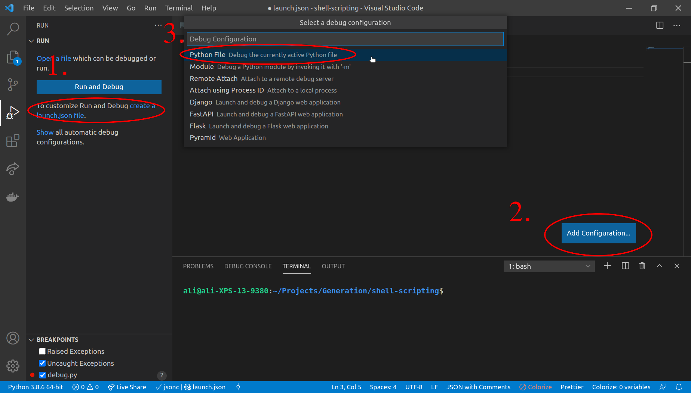
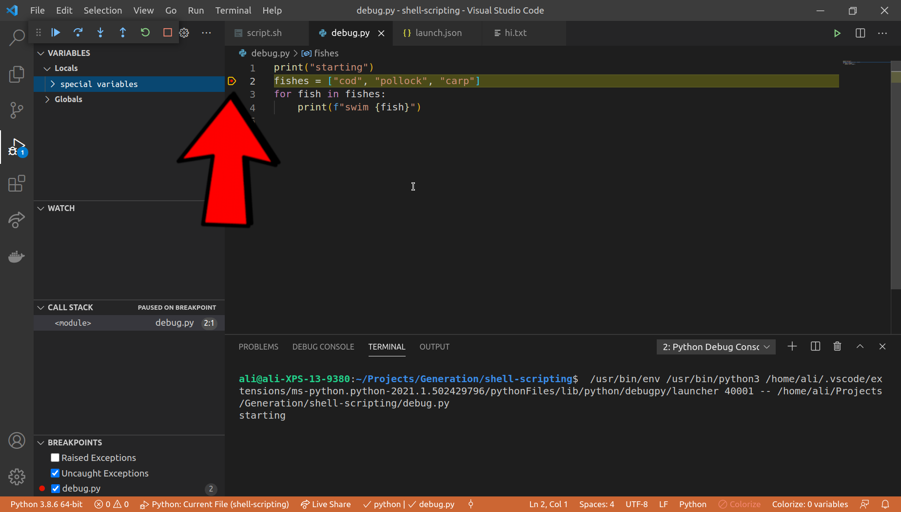
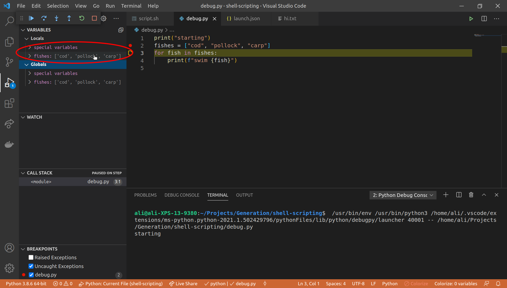

## Debugging

---

### Overview

- What is a bug?
- What is debugging?
- Debugging with VS Code

---

### Learning Objectives

- Identify what debugging is
- Explain how to debug in VS Code

---

### What is a bug?

- Humans make mistakes, when we make mistakes in code they're called bugs 🐛
- There are many [types of bugs](https://en.wikipedia.org/wiki/Software_bug#Types). Common causes could be an accidental mistake, a misunderstanding of how something works or a flaw in the logic of the code.
- Bugs can be fairly benign or they can cause [planes to drop out the sky](https://www.bbc.co.uk/news/technology-32810273) and [kill people](https://en.wikipedia.org/wiki/List_of_software_bugs)

```py
# Accidental mistake
prnt("Hello buggy software!")

# Misunderstanding of how something works
drinks_list = []
drinks_list = drinks_list.append("Coke")

# Flawed logic
age = int(input("What is your age?"))
minimum_drinking_age = 18
challenge_25_age = 25
if minimum_drinking_age < age < challenge_25_age:
    ask_for_ID()
else:
    server_alcoholic_drink()
```

---

### What is Debugging?

- Debugging is the process of removing bugs from your code
- You can try and find / isolate bugs in your code using debugging tools
- VS Code is capable of running your code line by line and displaying values of variables to you
- This can give you context for a bug and helps isolate the problem

---

### Debugging with VS Code

Before you can debug you need to configure your debugger. Luckily VS Code makes this super easy (as usual!)

1. Open the debugging Window `Ctrl + Shift + D`
1. Create a launch.json file
1. Add a configuration
1. Select Python from the dropdown

<!-- .element: class="centered" -->

---

### Launch Config File

This will create a `launch.json` file which contains the configuration for debugging.

```json
{
  "configurations": [
    {
      "name": "Python: Current File",
      "type": "python",
      "request": "launch",
      "program": "${file}",
      "console": "integratedTerminal"
    }
  ]
}
```

---

### Let's Squash Some Bugs 🐛

1. Add a break point by clicking on the line
1. Run the debug configuration by click the green arrow in the debug VS Code tab or on Windows and Linux by pressing `F5`
1. Use the floating debug panel to control the debugger

## <!-- .element: class="centered" -->

---

### Variables

- You can view the values of your local and global variables in the left hand panel
- You can update the values of these variables as you debug

<!-- .element: class="centered" -->

---

### Exercise

Setup debugging and debug `buggy_restaurant.py`

---

### Overview - recap

- What is a bug?
- What is debugging?
- Debugging with VS Code

---

### Learning Objectives - recap

- Identify what debugging is
- Explain how to debug in VS Code

---

### Further Reading

- [VS Code Debugging Python](https://code.visualstudio.com/docs/python/debugging)

---

### Emoji Check:

On a high level, do you think you understand the main concepts of this session? Say so if not!

1. 😢 Haven't a clue, please help!
2. 🙁 I'm starting to get it but need to go over some of it please
3. 😐 Ok. With a bit of help and practice, yes
4. 🙂 Yes, with team collaboration could try it
5. 😀 Yes, enough to start working on it collaboratively

Notes:
The phrasing is such that all answers invite collaborative effort, none require solo knowledge.

The 1-5 are looking at (a) understanding of content and (b) readiness to practice the thing being covered, so:

1. 😢 Haven't a clue what's being discussed, so I certainly can't start practising it (play MC Hammer song)
2. 🙁 I'm starting to get it but need more clarity before I'm ready to begin practising it with others
3. 😐 I understand enough to begin practising it with others in a really basic way
4. 🙂 I understand a majority of what's being discussed, and I feel ready to practice this with others and begin to deepen the practice
5. 😀 I understand all (or at the majority) of what's being discussed, and I feel ready to practice this in depth with others and explore more advanced areas of the content
