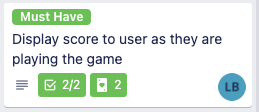

## Project Setup & Agile Events

### SoT 4 week project

---

### The Client


---

### Welcome to the team!


---

# Project Setup

& Agile Events

<aside class="notes">
  This session should follow "Team Project Inception" all-morning session.

  See the instructors README.md for more details.
</aside>

---

### Overview

- What do we need to get our project off the ground?
- Understanding and arranging your sprint rituals
- Organising your supporting services
- What to do next

<aside class="notes">
  If the teams have all this described over this session, the idea they can all hit the ground running.
</aside>

---

### Objectives

- Arrange your team's weekly rituals
- Understand what a good standup is
- Understand what a good retrospective is
- Understand what a good Sprint Planning session is
- Have a project Document and/or Whiteboard with the outcomes of your Inception session in it
- Have a Git Repository with a README with a link to your project docs
- Have a GitHub Projects board
- Know what to do next

<aside class="notes">
  If the teams have all this described over this session, the idea they can all hit the ground running.
</aside>

---

### Getting our project off the ground

In the previous session we made a start on some really useful things:

- An Elevator Pitch
- Success Flexes (Scope, Budget, Time, Quality)
- Initial MoSCoW items
- Success criteria (SMART goals)
- Some starting whiteboard illustrations of story boards (screen flows), wireframes (screen layouts) and tech stack ideas

...any questions on the previous artifacts?

<aside class="notes">
  Check if the teams have these things!
</aside>

---

### Getting our project off the ground

We also listed some useful things you will need to write up in Project time:

- Starting a Project Breakdown
- Create some Risk descriptions
- Create a rough Weekly Roadmap

...any questions on those?

<aside class="notes">
  These latter 4 things will not be done yet - they are for the team to do together.
</aside>

---

### Getting our project off the ground

Now, we'll go over (and get started on) a few more useful things:

- Agile rituals
- GitHub repo with starting README
- GitHub Projects board
- Project Whiteboard (E.g. Miro)
- Project Document (E.g. shared word doc, or items on the Miro board)

<aside class="notes">
  Some of this is in progress already (Project Document and/or Project Whiteboard)
</aside>

---

### Agile Rituals

There are some rituals each team needs to set up.

- Daily Standups
    - to check in with each other and organise your work
- Weekly Team Retrospectives
    - to check your progress and working practices
    - in addition to the weekly whole-Academy Retrospective
- Weekly Team Sprint Planning
    - To organise your backlog, check priorities, do estimates, and so on

Most production teams use a 2-weekly cadence of retrospectives and sprint planning. As we only have 4 weeks on this project, we need a faster feedback cycle - so we use 1 week sprints instead.

<aside class="notes">
  We'll detail these on the next slides
</aside>

---

### Standup

A standup generally happens daily and is a quick way for a team to assess the current pieces of work either being worked on or waiting to be worked on.

They are also a good opportunity to ask for assistance or inform the team of problems or blockers that might delay work.

<aside class="notes">
  N/A
</aside>

---

### A good standup

A good standup is:

- Around 15 minutes long
- Has the whole team including the Product Owner if possible
- Working from the right of the board to the left
- Short and punchy updates
    - what im doing
    - how far through it am I
    - do I need help?

<aside class="notes">
  N/A
</aside>

---

### A less than ideal standup

A less than ideal standup is:

- An opportunity to catch up on the weekend
- A chance to talk about the minute details of a ticket
- A place for a subset of people to discuss a topic
- A refinement session

<aside class="notes">
  N/A
</aside>

---

### Standups are flexible

Different teams like different stand ups and it should work for the team, but its important to understand that everyone's time is valuable.

As you have the whole team, anything specific should be arranged outside of standup time to make sure those who want to leave can do so.

A scrum master can help facilitate this and make sure the team do not go off topic.

<aside class="notes">
  N/A
</aside>

---

### An example of an update



`Started this ticket yesterday, have the score showing as they are playing but its still not updating properly, will look at fixing that today as well as the tests. Probably about 60% done.`

<aside class="notes">
  N/A
</aside>

---

### Whats good about this?

- `Started this ticket yesterday` - a quick bit of information about when you started the work
- `Have the score showing as they are playing but its still not updating properly, will look at fixing that today as well as the tests` - This indicates the progress and any issues being faced
- `Probably about 60% done` - this helps the Business Analyst and Product Owner manage delivery of the entire piece of work.

<aside class="notes">
  N/A
</aside>

---

### Emoji Check:

On a high level, do you think you understand the concept of a standup? Say so if not!

1. 😢 Haven't a clue, please help!
2. 🙁 I'm starting to get it but need to go over some of it please
3. 😐 Ok. With a bit of help and practice, yes
4. 🙂 Yes, with team collaboration could try it
5. 😀 Yes, enough to start working on it collaboratively

<aside class="notes">
    The phrasing is such that all answers invite collaborative effort, none require solo knowledge.

    The 1-5 are looking at (a) understanding of content and (b) readiness to practice the thing being covered, so:

    1. 😢 Haven't a clue what's being discussed, so I certainly can't start practising it (play MC Hammer song)
    2. 🙁 I'm starting to get it but need more clarity before I'm ready to begin practising it with others
    3. 😐 I understand enough to begin practising it with others in a really basic way
    4. 🙂 I understand a majority of what's being discussed, and I feel ready to practice this with others and begin to deepen the practice
    5. 😀 I understand all (or at the majority) of what's being discussed, and I feel ready to practice this in depth with others and explore more advanced areas of the content
</aside>

---

### What is a retrospective (retro)?

A retrospective is a session where the team looks back over a period of time and analyses it to see what can be improved and what is working.

This can be done in many ways but the key point is take to take actions out of it that can be actively worked on to improve your process.

<aside class="notes">
  N/A
</aside>

---

### The classic

One that can be used in all situations and obtain good results:

- What went well?
- What didn't go well?
- What did I learn?
- Actions to take

You have the team do post its of their experience since the last retro and at the end discuss anything you can do to improve what didn't go well.

<aside class="notes">
  N/A
</aside>

---

### Other formats

There are many formats that can achieve different goals - to save on time however here are some links for websites that list and explain a vast amount of them:

- [Easy Retro](https://easyretro.io/retrospective-ideas/)
- [Fun Retros](https://www.funretrospectives.com/)

Take some time and find one you like that you can do for your team.

<aside class="notes">
  N/A
</aside>

---

### Main Aim of a retro

In order for a retro to be valuable it needs to have actionable items at the end, these are some examples:

- Ensure we talk to the Product Owner before a ticket is worked on to ensure its correct
- Have at least 2 reviews on a pull request to ensure we don't merge mistakes
- Organize more socials to get the team to bond

Remember the aim is to be flexible and adjust where needed, these changes may not work in the long run but you can discuss that at the next retro (or earlier if its really not working!).

<aside class="notes">
  N/A
</aside>

---

### Emoji Check:

On a high level, do you think you understand the concept of a retrospective? Say so if not!

1. 😢 Haven't a clue, please help!
2. 🙁 I'm starting to get it but need to go over some of it please
3. 😐 Ok. With a bit of help and practice, yes
4. 🙂 Yes, with team collaboration could try it
5. 😀 Yes, enough to start working on it collaboratively

<aside class="notes">
    The phrasing is such that all answers invite collaborative effort, none require solo knowledge.

    The 1-5 are looking at (a) understanding of content and (b) readiness to practice the thing being covered, so:

    1. 😢 Haven't a clue what's being discussed, so I certainly can't start practising it (play MC Hammer song)
    2. 🙁 I'm starting to get it but need more clarity before I'm ready to begin practising it with others
    3. 😐 I understand enough to begin practising it with others in a really basic way
    4. 🙂 I understand a majority of what's being discussed, and I feel ready to practice this with others and begin to deepen the practice
    5. 😀 I understand all (or at the majority) of what's being discussed, and I feel ready to practice this in depth with others and explore more advanced areas of the content
</aside>

---

### Sprint Planning Sessions 1/2

During each sprint, we need to plan what is coming next. This involves, but isn't limited to;

- Check the right things are in our backlog
- Check the backlog is in priority order (highest at the top)
- Ensure the Epics we are about to do have enough detail to be broken into Stories
- Make sure the stories we are about to do are detailed enough to estimate

---

### Sprint Planning Sessions 2/2

- Estimate our upcoming stories (Fibonacci, T-Shirts)
- Pick enough stories to fill the working week, based on how much work we got done last week
    - The first few weeks, we have to guess!

We have a Sprint Planning Session to make sure this is up to date. Some of these activities can also be done continuously throughout the week as well.

<aside class="notes">
  Discuss who might work on these through the week - i.e. P.O, Scrum Master, Team Leader, Account Lead and so on.

  This can be revisited after the GitHub project board demo.
</aside>

---

### Emoji Check:

On a high level, do you think you understand the concept of a Sprint Planning session? Say so if not!

1. 😢 Haven't a clue, please help!
2. 🙁 I'm starting to get it but need to go over some of it please
3. 😐 Ok. With a bit of help and practice, yes
4. 🙂 Yes, with team collaboration could try it
5. 😀 Yes, enough to start working on it collaboratively

<aside class="notes">
    The phrasing is such that all answers invite collaborative effort, none require solo knowledge.

    The 1-5 are looking at (a) understanding of content and (b) readiness to practice the thing being covered, so:

    1. 😢 Haven't a clue what's being discussed, so I certainly can't start practising it (play MC Hammer song)
    2. 🙁 I'm starting to get it but need more clarity before I'm ready to begin practising it with others
    3. 😐 I understand enough to begin practising it with others in a really basic way
    4. 🙂 I understand a majority of what's being discussed, and I feel ready to practice this with others and begin to deepen the practice
    5. 😀 I understand all (or at the majority) of what's being discussed, and I feel ready to practice this in depth with others and explore more advanced areas of the content
</aside>

---

### Weekly Rituals

**Weekly Demos**

Now we are are doing Team Projects, we'll still have the weekly Academy demos - but now each Team will present. These will be at the same time as previous weeks. Now each Team needs to organise a ~10m presentation on what has been achieved this week (technical and non-technical!).

**Weekly retrospective**

We'll still have a separate whole Academy retrospective each week - your team retrospective is in addition to this.

<aside class="notes">
  N/A
</aside>

---

### Task: Plan your week - 10 mins

> We'll now do breakouts for each team, where you can discuss when you might have your Team weekly rituals

You don't need to make final decisions, but this is a chance for you to start some suggestions. Remember not to clash with the Academy demos and rituals!

Additionally, make sure everyone in the team is aware of the week's plan!

<aside class="notes">
  Check when the teams return they have a rough idea
</aside>

---

### Other common things

In a working team we are going to need things like

- A Git repository for our code and documents and illustrations, with a README linking to other documents and later local setup and (even later) aws setup instructions
- A GitHub Projects board with columns like Backlog, Sprint Backlog, In Progress, In Review and Done (there are many variations)
- A Project Document with things like our Elevator Pitch, Flexes, SMART goals
- A project Whiteboard with things like Story boards, Wireframes (e.g. in MS Whiteboard)

We can show you samples of each one. Each team will arrange things differently in each of these - for example, some like the MoSCoW items in the Whiteboard, some like the Elevator Pitch duplicated in the Git README, some have only a Whiteboard with all the Document stuff in there on panels, and so on.

<aside class="notes">
  We'll make sure each team has these on the following slides
</aside>

---

### Git Repository

We need somewhere to put our various documents, and later, our code and setup instructions!

The team might elect to put the documents in the repo, or link to them in the README, or a combination of both - you decide!

> We'll now show you some samples from previous teams

For example:

- [InfinGigs demo Repo](https://github.com/IW-Academy/infini-gigs-demo-project-ts)

<aside class="notes">
  Show a good one, for example https://github.com/IW-Academy/Infini-planets and https://github.com/IW-Academy/Infini-planets/blob/main/README.md
</aside>

---

### Breakout: Your Git Repo - 10 mins.

> In the GitHub organisation, as a team, make a new git repository

- Decide the name
- Include a `.gitignore` file with defaults for Python projects
- Include a License file (MIT, probably)
- Include a README (fill in the exhaustive details later)
- Put in a basic description - you can use an abbreviated Elevator Pitch, or something else
- Help everyone clone it locally
    - Any Product folk can do this offline another time, with help from the team.

<aside class="notes">
  Show a good one, for example https://github.com/IW-Academy/infini-gigs-demo-project-ts

  The product folks may need inviting to GitHub - needs Active Directory setting up, and an account, and an invite. Ask Mark & Rich.

  The product folks might need the whole AWS setup doing - needs Active Directory setting up
</aside>

---

### Cloud Formation noise

In the same way we always git ignore `__pycache__` or `.venv` folders, when we use CloudFormation later we will need this in our `.gitignore` files:

```sh
# ignore python dependency files so they don't get saved in github
bin
psycopg2*
# always include the python files
!*.py
```

Please add this now so we don't forget later.

<aside class="notes">
  Get this in early to avoid any mess later
</aside>

---

### GitHub Projects board - demo

> Instructor will demo a GitHub Projects board

<aside class="notes">
  Demo some of them, show the columns, members, labels, power-ups
</aside>

---

### GitHub Projects board

- Each team will have a GitHub Projects board
- These will be created for you in the git repository you made for your team

<aside class="notes">
  Check all the teams know where to find their GitHub projects board
</aside>

---

### Docs, Whiteboard and README

Between your Project Documents (like Google Docs) with your inception Elevator Pitch, your team Whiteboard and your github README file, you should have everything linked together and know where it is.

It's up to each team how you organise all that information - but make sure you do it soon!

> Exercise for later: discuss how to arrange your data, link these things together, move the different data you have where you want it

<aside class="notes">
  Check all the teams have an idea what to do
</aside>

---

### So what's next? 1/3

Here's a list of tasks to get your project going:

- Organise Docs, Whiteboard(s) and GitHub README
    - link all your docs to your README
    - Add tam details and pitch into README
- Post links to those in your teams channel
- Make some Risk descriptions

<aside class="notes">
  Check all the teams have an idea what to do
</aside>

---

### So what's next? 2/3

Then

- Do an initial breakdown of the Sprint 1 tickets
- Make a draft Weekly Roadmap

<aside class="notes">
  Check all the teams have an idea what to do
</aside>

---

### So what's next? 3/3

Then

- Decide how much fits into this first week (Wireframes? Storyboards? Data design?)
- And plan what to do at the next weekly Team Demo
    - Which might be "Put a ticket in GitHub Projects to plan the demo Friday first thing"

<aside class="notes">
  Check all the teams have an idea what to do.
</aside>

---

### Overview - recap

- What do we need to get our project off the ground?
- Understanding and arranging your sprint rituals
- What to do next

<aside class="notes">
  If the teams have all this described over this session, the idea they can all hit the ground running.
</aside>

---

### Objectives - recap

- Arrange your team's weekly rituals
- Understand what a good standup is
- Understand what a good retrospective is
- Understand what a good Sprint Planning session is
- Have a project Document and/or Whiteboard (or Miro) with the outcomes of your Inception session in it
- Have a Git Repository with a README with a link to your project docs
- Have a Github Projects board
- Have an idea what to do next

<aside class="notes">
  If the teams have all this described over this session, the idea they can all hit the ground running.
</aside>

---

### Emoji Check:

On a high level, do you think you understand the main concepts of this session? Say so if not!

1. 😢 Haven't a clue, please help!
2. 🙁 I'm starting to get it but need to go over some of it please
3. 😐 Ok. With a bit of help and practice, yes
4. 🙂 Yes, with team collaboration could try it
5. 😀 Yes, enough to start working on it collaboratively

<aside class="notes">
    The phrasing is such that all answers invite collaborative effort, none require solo knowledge.

    The 1-5 are looking at (a) understanding of content and (b) readiness to practice the thing being covered, so:

    1. 😢 Haven't a clue what's being discussed, so I certainly can't start practising it (play MC Hammer song)
    2. 🙁 I'm starting to get it but need more clarity before I'm ready to begin practising it with others
    3. 😐 I understand enough to begin practising it with others in a really basic way
    4. 🙂 I understand a majority of what's being discussed, and I feel ready to practice this with others and begin to deepen the practice
    5. 😀 I understand all (or at the majority) of what's being discussed, and I feel ready to practice this in depth with others and explore more advanced areas of the content
</aside>
