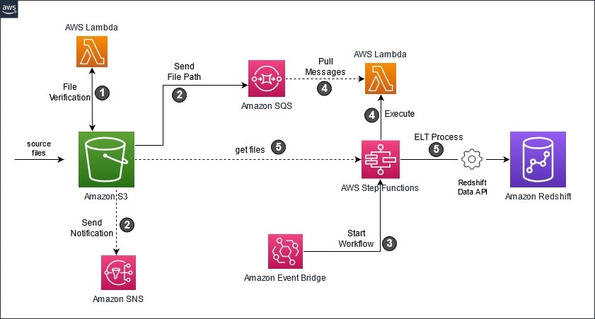

## Final Showcase Prep

### DE Team Project - final demo

---

### Presentations - Overview

- 15 minutes max to present, followed by 5 minutes max for Q&A -- be aware of timings as you prepare and during your actual presentation
- It's important that every team member present be directly involved in the presentation
- Use your slides as scaffolding and illustration -- keep text content brief and concise on the slides
- It should be more polished than your usual Friday morning demos, have a powerpoint style presentation available to show
- Don't show any code at this level - concentrate on a Client / product owner higher level

---

### Presentation Parts - Project Purpose

The showcase is a safe and supportive space for everyone. Its purpose is to highlight what you’ve learned and the incredible journey you’ve been on over the past 7 weeks. Strive for a balance between fun and professionalism — this is key, as there may be senior leaders from the business in attendance.

Most importantly, enjoy the experience! This marks the culmination of a significant journey you’ve all shared. It’s your time to shine and proudly present the amazing work you’ve accomplished.

---

### Presentation Parts - Project Purpose

Explain what your team was asked to build. Some things to consider:

- Theme
- Requirements
- Initial response to project task
- Level of flexibility in fulfilling the task

---

### Presentation Parts - How Your Team Started

Explain and illustrate what you did before you started to code. Some things to consider:

- MoSCoW
- Roadmap
- Other brainstorms
- Examples/images/screenshots can really help to illustrate

---

### Presentation Parts - Ways of Working

Explain and illustrate your team's ways of working & what resources you used to support your work. Some things to consider:

- How you established, assessed, improved, and followed through on your ways of working
- Ticketing tool - Trello / MS Planner / GitHub Projects / Jira / etc
- Storyboards
- Wireframes
- Whiteboards
- Other resources/ tools/ support

---

### Presentation Parts - Project Demo

There are pros and cons in doing a live demo of your team's project application. Some things to consider:

- Consider if it will be smoother / more reliable to use screenshots or a pre-recording instead of a live demo
- Does a live demo actually add anything to the presentation?
- Swapping who is sharing can disrupt the flow of the presentation, can one presenter share your slides and the demo (if you are doing one)?
- How will you make sure it goes smoothly? What prep can you do?
- Emphasise the ETL flow of the pipeline you've built, from source through to data visualisation
- Don't show any code
- Do some test runs -- the day before and on the day of your presentation

---

### Presentation Parts - Your Tech Stack

Provide a visual and explanation of the architecture used for your project. Some things to consider:

- Explain the flow of the ETL pipeline and data processed within the architecture
- Explain differences & similarities between your Local and AWS stacks
- Consider having a diagram of each
- https://app.diagrams.net/ is a useful (and free) tool for diagramming that provides various software icons (see an example diagram on next slide)

---

### Presentation Parts - Your Tech Stack

Example diagram:

<!-- .element: class="centered" -->

---

### Presentation Parts - What Didn't Work

Provide an explanation of problems/obstacles/challenges and things that didn't work. Some things to consider:

- How you attempted to overcome your obstacles
- What you wish you had spent less time doing
- What you abandoned
- Why certain things didn't work

---

### Presentation Parts - What Worked

An explanation of your wins/successes and learnings (individually and as a team). Some things to consider:

- Why certain things worked
- If you had more time for the project, what would you add, remove, and/or change?

---

### Presentation Parts - Anything else?

Offer anything else that you know to be relevant to your project and/or process.

---

### Presentation Parts - Q&A

Prepare for questions from the audience, which will be made up of remote and in-person Accenture colleagues with real client experience. Some things to consider:

- Put yourself in the audience's shoes -- what questions would you want to ask?
- What questions do you think the audience will actually ask?
- Collaborate on answers to these questions and practice answering them
- Have a few questions ready to ask yourselves if/when there is a lull during your Q&A -- this is another way to show that you've reflected on your experience as a team
- Max 5 minutes for Q&A
