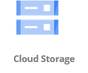
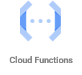

## GCP

---

### Overview

- What is GCP?
- GCP Console
- IAM (Identity and Access Management)
- GCP - Cloud shell
- GCE - Google compute engine
- GCS - Google cloud storage
- Cloud Functions

---

### Learning Objectives

- Define the role GCP plays in modern software development
- Identify the different use cases for the console, cloud SDK and Cloud Shell
- Implement services such as IAM, GCE, Cloud storage and Cloud Functions

---

### What is GCP?

**Google Cloud** **Platform** is a cloud computing platform.

Offerings encompass computing power, database storage, content delivery, logging and monitoring - if you need to do a
thing, there's an GCP product for it.

At last count, there were over 100 GCP products to choose from...

---

### Regions

- A physical location somewhere in the world where GCP data centers are clustered
- Each group of logical data centres is called an **Availability Zone**
- Multiple geographic Regions including Americas, Europe and Asia Pacific
- Regions have a code name, such as `eu-west-1` which represents the Belgium region and `eu-west-2` which represents the
  London region

---

### Availability Zones

- One (or more) discrete data center(s) in a GCP region
- Google cloud zones in a region are physically-separate, but within 100km of each other - high-bandwidth, low-latency
  networking
- Gives customers the ability to operate production applications and databases that are more highly available, fault
  tolerant, and scalable than would be possible from a single data center
- If an application is partitioned across zones, companies are better isolated and protected from issues such as power
  outages, lightning strikes, tornadoes, earthquakes, and more

Notes:
Data centres are just enormous buildings that operate a vast amount of computer machinery, with its own cooling and power setup.

At the time of creating this document, Google currently have 29 GCP regions, containing 88 zones.

This is a useful tool to visualise it: https://cloud.google.com/about/locations

---

### Exercise

Follow the _GCP Account Setup_ steps in the `gcp-exercise.pdf` handout.

---

### Emoji Check:

How did you get on with the exercise?

1. 😢 Haven't a clue, please help!
2. 🙁 I'm starting to get it but need to go over some of it please
3. 😐 Ok. With a bit of help and practice, yes
4. 🙂 Yes, with team collaboration could try it
5. 😀 Yes, enough to start working on it collaboratively

Notes:
The phrasing is such that all answers invite collaborative effort, none require solo knowledge.

The 1-5 are looking at (a) understanding of content and (b) readiness to practice the thing being covered, so:

1. 😢 Haven't a clue what's being discussed, so I certainly can't start practising it (play MC Hammer song)
2. 🙁 I'm starting to get it but need more clarity before I'm ready to begin practising it with others
3. 😐 I understand enough to begin practising it with others in a really basic way
4. 🙂 I understand a majority of what's being discussed, and I feel ready to practice this with others and begin to deepen the practice
5. 😀 I understand all (or at the majority) of what's being discussed, and I feel ready to practice this in depth with others and explore more advanced areas of the content

---

## IAM

<!-- .element: class="centered" height="350px" -->

---

### IAM

- **Identity** and **Access** **Management**
- Manage users and their level of access from cloud shell or console
- Manage roles permissions for the roles
- Manage authentication for users accessing GCP
- Free to use - you can create as many roles as you wish

---

### IAM Features

- Granular permission - user can access service X but not service Y
- Identity Federation (login with Facebook, Google, Active Directory etc.)
- MFA
- Password rotation policy
- Integrates with all different GCP services

---

### IAM Key Terms

- Users
- Service account
- Groups
- Roles
- Policies

We will dive into what each means.

---

### IAM - Users

- End users such as people, employees etc.
- Accounts with username and password
- Can define level of access to GCP services
- Manage the permissions of what the user can perform
- Manage their security credentials (MFA etc.)
- You are either the account owner (root) or an IAM user.

Notes:
Example: Each learner is an IAM user.

---

### IAM - Service Account

- Classed as resource
- Special kind of account used by an application or compute workload to authenticate
- Accounts with username but no password
- Service account can be default, user-managed service account and google-managed service account
- Service accounts do not have passwords, and cannot log in via browsers or cookies
- When resources or application outside the GCP projects uses service account, service account key is required
- You are either the account owner (root) or an IAM user.

Notes:
Example: Applications use service accounts to make authorized API calls.

---

### IAM - Groups

- A collection of users and service account, where you can define permissions for all of them in an easier way
- A group can contain many users and service , and a user can belong to multiple groups
- Groups don't have login credentials
- You cannot use Groups to establish identity to make a request to access a resource
- There's no default group that automatically includes all users in the GCP account

Notes:
Example: All learners will be in a group called Learners.

---

### IAM - Roles

- A role is a collection of permissions that can quickly be applied to a user or a group of users
- Provides temporary security credentials for the length of the session, as opposed to a username and password
- Specific permissions on GCP services and resources
- Policies are attached to roles to grant them access/privilege

Notes:
Example: Each learner assumes a role with their IAM user that gives them wider access to GCP services as opposed to the user itself.

---

### IAM - Policies

- You manage access in GCP by creating policies and attaching them to IAM identities (users, groups, roles) or GCP
  resources
- A policy is an object that, when associated with an identity/resource, defines their permissions
- These permissions determine if a request is allowed or denied
- Most policies are stored as JSON

Notes:
Example: The role/group the learners are in have policies associated to give them a certain amount of access to services.

---

### IAM - Best Practices

- Create **individual** users
- Manage permissions with groups
- Use IAM roles for as many actions
- Grant **least privilege** with permissions
- Configure a **strong** password policy
- Enable MFA for privileged users

---

### IAM - Best Practices

- Setup audits with GCP cloud audit logs.
- Cloud audit logs for exactly who did what, when, and from where
- Use IAM roles to allow users and services to share access to another service
- Rotate security credentials **regularly**
- Restrict privileged access further with conditions (for instance, only allowing a range of IPs that a request must
  come from)
- Reduce use of root account (mostly used for billing and locking down account securely)

Notes:
An example of a 'condition' you could impose would be, for example, allowing a user to use a certain service but only Mon - Fri.

Demo the IAM dashboard.

---

## GCP Cloud Shell

<!-- .element: class="centered" height="350px" -->

---

### GCP Cloud Shell

- We can interact with all GCP services through the cloud shell
- With Cloud Shell, the Cloud SDK gcloud command-line tool and other utilities you need are pre-installed
- If you can do it on the Console, you can do within cloud shell CLI - YAY!
- Cloud Shell comes with a built-in code editor with an integrated Cloud Code experience

---

### How cloud shell works

When you start Cloud Shell

- GCP provisions a Compute Engine virtual machine running a Debian-based Linux operating system
- Instances are provisioned on a per-user, per-session basis
- The VM is pre-configured but it can also be customised to have your preferred tools
- Available pre-install tools: https://cloud.google.com/shell/docs/how-cloud-shell-works#tools
- Cloud Shell provisions 5 GB of free persistent disk storage, the storage is on a per-user basis and is available
  across projects

```sh
Example: $ gcloud < command > < subcommand > [options and parameters]
```

---

### Quiz Time! 🤓

---

**What is an GCP Region?**

1. An GCP Infrastructure offering that's optimised for mobile edge computing applications.
1. A physical location somewhere in the world where GCP data centers are clustered.
1. A type of GCP infrastructure deployment that places GCP compute, storage, database, and other select services close
   to large population, industry, and IT centers.
1. One (or more) discrete data center(s) in an GCP region.

Answer: `2`<!-- .element: class="fragment" -->

---

**What are the four main areas of GCP IAM?**

1. Groups, Permissions, Roles, Users
1. Groups, Policies. Roles, People
1. Pools, Policies, Roles, Users
1. Groups, Policies, Roles, Users
1. Groups, Policies, Requirements, Users

Answer: `4`<!-- .element: class="fragment" -->

---

**What are policies used for in GCP IAM?**

1. An object that, when associated with an identity/resource, defines their permissions.
1. An object that provides temporary security credentials for the length of the session, as opposed to a username and
   password.
1. A document that is intended to be assumed by anyone or any service that needs it.
1. A document that defines a user permissions for one specific GCP service.

Answer: `1`<!-- .element: class="fragment" -->

---

## GCE

<!-- .element: class="centered" height="350px" -->

---

### GCE (Elastic Compute Cloud)

- Service that allows you to rent virtual computers on which you can run your own applications
- 'Elastic' because you pay by the second for what you use!
- You get control over the geographical location of your virtual computers

Before cloud computing, you'd need to put in a request for physical hardware which could take weeks to provision, now it
takes seconds, with a few clicks.

---

### GCE Pricing

**On Demand**:

Allows you to pay a fixed rate by the hour/minute/second with no commitment.

**Reserved**:

Provides you with a capacity reservation and a significant discount on the hourly charge of an instance. Locked into
contract terms of 1 or 3 years.

**Preemptible VMs**:

These instances are available at much lower price—a 60-91% discount—compared to the price of standard VMs. However,
Compute Engine might stop (preempt) these instances if it needs to reclaim those resources for other tasks. Preemptible
instances are excess Compute Engine capacity, so their availability varies with usage

---

### GCE Pricing

**Spot**:

Enables you to bid whatever price you want for instance capacity, making better savings if your applications have
flexible start/end times.

**Dedicated Hosts**:

Physical GCE server dedicated for your own use.

---

### GCE - Concepts

**Image**: what is being used to build an instance (similar to Docker)

**Instance**: the machine you're creating

**Security**: security groups, key management, network interfaces

Notes:

**Image** - essentially a sort of template that contains the software configuration required to launch your instance.

**Security Group** - a virtual firewall for your GCE instances to control incoming & outgoing traffic.

**Key management**: You use key pairs to connect to your GCE instances (public key is stored in .ssh directory of
instance).

**Network interface**: Configuring stuff like port numbers and network access.

---

### GCE Storage

Compute Engine offers several types of storage options for your instances. Each of the following storage options has
unique price and performance characteristics

- Zonal persistent disk: Efficient, reliable block storage.
- Regional persistent disk: Regional block storage replicated in two zones.
- Local SSD: High performance, transient, local block storage.
- Cloud Storage buckets: Affordable object storage.
- Filestore: High performance file storage for Google Cloud users.

Note the performance of your storage can be affected by the choice you make, check the difference in performance of the
storage options [here](https://cloud.google.com/compute/docs/disks#introduction)

Notes:
Local SSDs are physically attached to the server that hosts your VM instance while persistent disk are distributed network storage

---

### Persistent Storages

Persistent disks are durable network storage devices that instances can access like physical disks in a desktop or a
server. Key difference is that distributed across several physical disks.

Compute Engine manages its physical disks and the data distribution to ensure redundancy and optimal performance. They
can detach or move persistent disks to keep your data even after you delete your instances

---

### Disk Types

- **Standard persistent disks (pd-standard)** are backed by standard hard disk drives (HDD).
- **Balanced persistent disks (pd-balanced)** are backed by solid-state drives (SSD). They are an alternative to SSD
  persistent disks that balance performance and cost.
- **SSD persistent disks (pd-ssd)** are backed by solid-state drives (SSD).
- **Extreme persistent disks (pd-extreme)** are backed by solid-state drives (SSD). With consistently high performance for
  both random access workloads and bulk throughput, extreme persistent disks are designed for high-end database
  workloads. _Unlike other disk types, you can provision your desired IOPS_

---

### Exercise

Follow the _Google GCE_ steps in the `gcp-exercise.pdf` handout.

---

### Emoji Check:

How did you get on with the exercise?

1. 😢 Haven't a clue, please help!
2. 🙁 I'm starting to get it but need to go over some of it please
3. 😐 Ok. With a bit of help and practice, yes
4. 🙂 Yes, with team collaboration could try it
5. 😀 Yes, enough to start working on it collaboratively

Notes:
The phrasing is such that all answers invite collaborative effort, none require solo knowledge.

The 1-5 are looking at (a) understanding of content and (b) readiness to practice the thing being covered, so:

1. 😢 Haven't a clue what's being discussed, so I certainly can't start practising it (play MC Hammer song)
2. 🙁 I'm starting to get it but need more clarity before I'm ready to begin practising it with others
3. 😐 I understand enough to begin practising it with others in a really basic way
4. 🙂 I understand a majority of what's being discussed, and I feel ready to practice this with others and begin to deepen the practice
5. 😀 I understand all (or at the majority) of what's being discussed, and I feel ready to practice this in depth with others and explore more advanced areas of the content

---

### Quiz Time! 🤓

---

**You have created an instance in GCE, and you want to connect to it. What should you do to log in to the system for the
first time?**

1. Use the username/password combination you created within the GCE setup.
1. Use the key-pair combination you created within the GCE setup.
1. Generate a secure login from your GCP Secret Access Key.
1. Log in with your GCP username/password/MFA.

Answer: `2`<!-- .element: class="fragment" -->

---

**True or False: You can use the GCP Console to add a role to an GCE instance after that instance has been created and
powered up.**

Answer: `True`<!-- .element: class="fragment" -->

---

**True or False: When creating a new security group, all inbound traffic is allowed by default.**

Answer: `False`<!-- .element: class="fragment" -->

---

## Cloud Storage

<!-- .element: class="centered" height="350px" -->

---

### Cloud Storage - Simple Storage Service

- Secure, durable, global and highly scalable object store
- Can handle both structure and unstructured data
- Safe place to store files
- **Object**-based storage
- Files can be 0 bytes to 5TB
- **Unlimited** storage
- Files are stored in **buckets** (basically a folder)
- Globally distributed

---

### Cloud Storage - Objects

Cloud storage is object-based. Think of objects just like files. They consist of the following:

**Key**: The name of the object

**Value**: The sequence of bytes containing the data

**Version ID**: For versioning

**Metadata**: Data about data you're storing

---

### Cloud Storage Guarantee Model

- Up to 99.99% availability
- Up to 99.999999999% durability (11x 9s)

99.99% availability equates to 52.60 minutes of downtime per year.

99.999999999% durability means that if you store 10 million objects then you expect to lose an object of your data every
10,000 years.

---

### Cloud storage - Advanced Features

- Object versioning
- Storage class: trade durability/availability for cost
- Lifecycle policies: manage the lifetime of your files automatically
- Encryption at-rest
- MFA Delete
- Bucket policies to control who can access them

---

### Exercise

Follow the _GCP Cloud storage_ steps in the `gcp-exercise.pdf` handout.

---

### Emoji Check:

How did you get on with the exercise?

1. 😢 Haven't a clue, please help!
2. 🙁 I'm starting to get it but need to go over some of it please
3. 😐 Ok. With a bit of help and practice, yes
4. 🙂 Yes, with team collaboration could try it
5. 😀 Yes, enough to start working on it collaboratively

Notes:
The phrasing is such that all answers invite collaborative effort, none require solo knowledge.

The 1-5 are looking at (a) understanding of content and (b) readiness to practice the thing being covered, so:

1. 😢 Haven't a clue what's being discussed, so I certainly can't start practising it (play MC Hammer song)
2. 🙁 I'm starting to get it but need more clarity before I'm ready to begin practising it with others
3. 😐 I understand enough to begin practising it with others in a really basic way
4. 🙂 I understand a majority of what's being discussed, and I feel ready to practice this with others and begin to deepen the practice
5. 😀 I understand all (or at the majority) of what's being discussed, and I feel ready to practice this in depth with others and explore more advanced areas of the content

---

## Cloud Functions

<!-- .element: class="centered" height="350px" -->

---

### Cloud Functions

- 100% code, 0% infrastructure
- Run code without worrying about OS, patching, scaling, any physical hardware
- Never worry about capacity again
- Highly scalable
- Support multiple runtime e.g Node.js, Go, Java
- Cloud Functions run in response to events such as data changes in Cloud storage, DB record being inserted
- You can even call them from through HTTP requests, SDK, or the cloud shell

---

### Cloud Functions Triggers

A Cloud function is automatically invoked when one of its triggers is activated, either a HTTP trigger or an Event
trigger.

For example:

- When a record has been inserted into a DB table
- When a file has been uploaded to Cloud storage
- When a commit is pushed onto a repo hosted in CodeCommit (Git for GCP)
- When a monitoring alarm goes off

---

### Cloud Functions Pricing Model

**Number of requests:** First 2 million requests are free, $0.40 per 1 million after (cheap!)

**Duration:** Calculated from the time your code begins until it terminates, up to the millisecond. The price depends on
how much memory you allocate. Roughly $0.0000025 for every GB-second used. The first 400,000 are free.

Notes:
It used to be rounded to the nearest ms but is now at a per ms basis.

---

### Limitations

- Cold starts: Time it takes to kick off an instance (it's a container under the hood)
- Difficult to scale without understanding the concurrency execution model
- Tightly integrated to work with other GCP services so may have potential 'lock-in'
- Can be difficult to develop locally
- Unsuitable for tasks that take 540 seconds

---

### Use Cases

- Tasks that take less than 9 minutes to complete
- Asynchronous, event-driven workloads
- Consistent level of traffic

---

## Exercise

Follow the _GCP Cloud Functions_ steps in the `gcp-exercise.pdf` handout.

---

### Emoji Check:

How did you get on with the exercise?

1. 😢 Haven't a clue, please help!
2. 🙁 I'm starting to get it but need to go over some of it please
3. 😐 Ok. With a bit of help and practice, yes
4. 🙂 Yes, with team collaboration could try it
5. 😀 Yes, enough to start working on it collaboratively

Notes:
The phrasing is such that all answers invite collaborative effort, none require solo knowledge.

The 1-5 are looking at (a) understanding of content and (b) readiness to practice the thing being covered, so:

1. 😢 Haven't a clue what's being discussed, so I certainly can't start practising it (play MC Hammer song)
2. 🙁 I'm starting to get it but need more clarity before I'm ready to begin practising it with others
3. 😐 I understand enough to begin practising it with others in a really basic way
4. 🙂 I understand a majority of what's being discussed, and I feel ready to practice this with others and begin to deepen the practice
5. 😀 I understand all (or at the majority) of what's being discussed, and I feel ready to practice this in depth with others and explore more advanced areas of the content

---

### Quiz Time! 🤓

---

**Google cloud storage is which type of storage service?**

1. Object
1. Block
1. Network
1. SAN (Storage Area Network)

Answer: `1`<!-- .element: class="fragment" -->

---

**Google Cloud Storage offers developers which combination?**

1. Low scalability and high latency data storage infrastructure at high costs.
1. High scalability and low latency data storage infrastructure at high costs.
1. Low scalability and high latency data storage infrastructure at low costs
1. High scalability and low latency data storage infrastructure at low costs.

Answer: `4`<!-- .element: class="fragment" -->

---

**How can you trigger a Cloud Function?**

1. Manually in the console.
1. From a trigger, such as Cloud Storage.
1. A HTTP request.
1. All of the above.

Answer: `4`<!-- .element: class="fragment" -->

---

**How many minutes can a Cloud Function run for?**

1. 5
1. 10
1. 9
1. 20

Answer: `3`<!-- .element: class="fragment" -->

---

### Clean Up

Make sure to delete the following once you are done:

- Cloud Functions
- GCE instances
- GCS buckets

---

### Terms and Definitions - recap

**Cloud Computing**: The on-demand availability of computer system resources, especially data storage and computing
power, without direct active management by the user.

**Data Centre**: A building, dedicated space within a building, or a group of buildings used to house computer systems
and associated components, such as telecommunications and storage systems.

**Region**: A physical location somewhere in the world where data centers are clustered.

**Availability Zone**: One (or more) discrete data center(s) in a region.

---

### Terms and Definitions - recap

**IAM**: Defining and managing the roles and access privileges of individual users and the circumstances in which users
are granted (or denied) those privileges.

**GCE**: A web service that provides secure, resizable compute capacity in the cloud.

**Persistent Disk**: An easy to use, high-performance, block-storage service designed for use with Google GCE for both
throughput and transaction intensive workloads at any scale.

**Cloud Storage**: An object storage service that offers industry-leading scalability, data availability, security, and
performance.

**Cloud Functions**: A serverless compute service that lets you run code without provisioning or managing servers.

---

### Overview - recap

- What is GCP?
- GCP Console
- IAM (Identity and Access Management)
- GCP - Cloud shell
- GCE - Google compute engine
- GCS - Google cloud storage
- Cloud Functions

---

### Learning Objectives - recap

- Define the role GCP plays in modern software development
- Identify the different use cases for the console, cloud SDK and Cloud Shell
- Implement services such as IAM, GCE, Cloud storage and Cloud Functions

---

### Further Reading

- [GCP IAM Introduction](https://cloud.google.com/iam/docs/quickstarts?hl=en)
- [GCP Docs](https://cloud.google.com/docs?hl=en)

---

### Emoji Check:

On a high level, do you think you understand the main concepts of this session? Say so if not!

1. 😢 Haven't a clue, please help!
2. 🙁 I'm starting to get it but need to go over some of it please
3. 😐 Ok. With a bit of help and practice, yes
4. 🙂 Yes, with team collaboration could try it
5. 😀 Yes, enough to start working on it collaboratively

Notes:
The phrasing is such that all answers invite collaborative effort, none require solo knowledge.

The 1-5 are looking at (a) understanding of content and (b) readiness to practice the thing being covered, so:

1. 😢 Haven't a clue what's being discussed, so I certainly can't start practising it (play MC Hammer song)
2. 🙁 I'm starting to get it but need more clarity before I'm ready to begin practising it with others
3. 😐 I understand enough to begin practising it with others in a really basic way
4. 🙂 I understand a majority of what's being discussed, and I feel ready to practice this with others and begin to deepen the practice
5. 😀 I understand all (or at the majority) of what's being discussed, and I feel ready to practice this in depth with others and explore more advanced areas of the content
