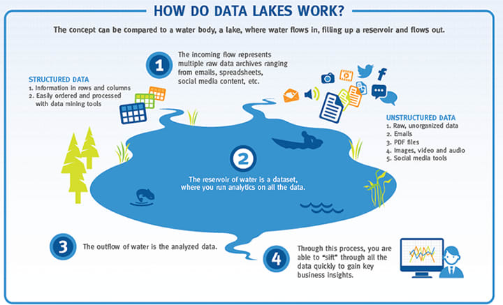
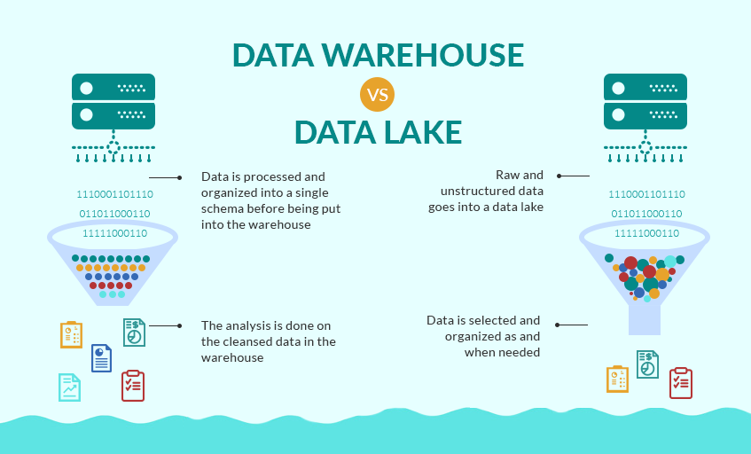
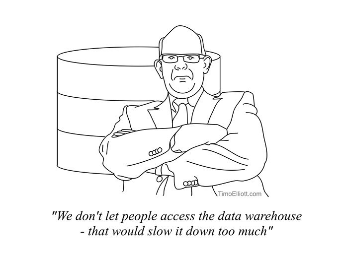
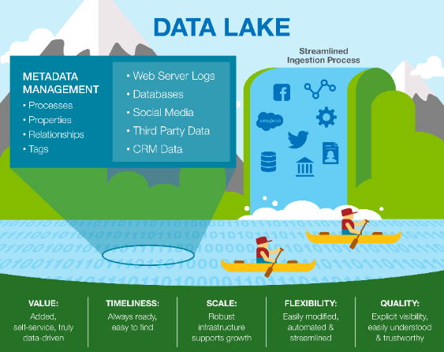
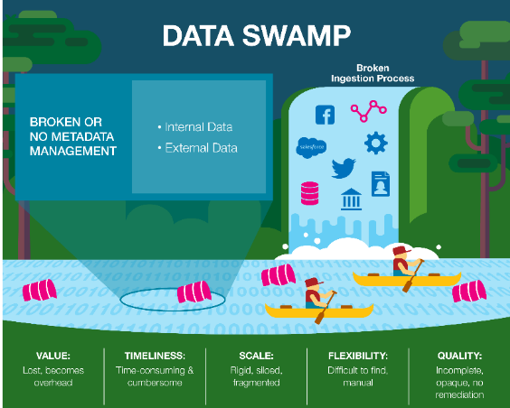
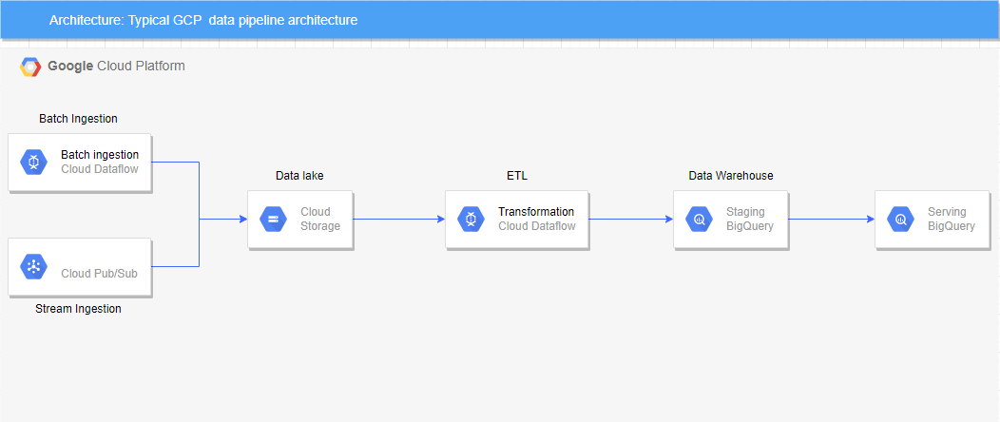

## Data Lakes

---

### Overview

- An introduction to Data Lakes
- Difference between a Data Lake and Data Warehouse
- Why we use Data Lakes
- Which tools facilitate Data Lakes
- The evolution of Data Lakes
- Cloud complexities

---

### Learning Objectives

- Gain insight into how a Data Lake works and why we use them
- Identify which tools facilitate Data Lakes
- Discover how and why Data Lakes evolved
- Become aware of some complexities when using the cloud
- Identify a typical GCP architecture

---

### What is a Data Lake?

- A store for structured and unstructured data at scale
- Data is often stored in its original format, without first structuring it (e.g. Excel files, csv or txt exports etc.)
- Data might be transformed into various forms with different schemas
- Data is often duplicated with this strategy
- Each transformation may be used for a separate analytical function

Notes:
example for last point:

- transforming postal addresses for analysis based on geography

---

### How do Data Lakes work?

<!-- .element: class="centered" height="70%" -->

Notes:
Read through each point 1 - 4

---

### I S A S A (Data Lake Principles)

**Ingest:** The ability to collect all the data you care about, making sure your systems can correctly/frequently ingest that data through APIs or other processes.

**Store:** Getting all the data in one place and breaking down silos of data, using scalable storage and access to that data.

**Analyse:** Using computer programmes and data science to matching the correct data points to the correct systems and finding the relations between all the data you've gathered.

---

### I S A S A (Data Lake Principles Cont.)

**Surface:** Using a simple method of displaying and analysing the data to make decisions on.

**Act:** A plan needs to be put in place to take the results of the data analysis and fit it into the business model.

---

### Why do we use Data Lakes?

- Business insights
- Application analytics
- Monitoring of platform and product
- Very flexible - Store early, analyse later, aligning with agile approach to software delivery
- Low cost of storage
- Many easy Platform as a Service offerings

---

### Data Warehouses vs Data Lakes

<!-- .element: class="centered"  height="85%" -->

---

### Data Warehouses vs Data Lakes

#### Data Warehouse

- Data is processed and only structured information is captured and organised in schemas

#### Data Lake

- Data is raw and all types structured, semi-structured, or unstructured is captured in its original form

---

### Users

#### Data Warehouse

- Ideal for operational users such as business professionals since the data is structured and easy to use

#### Data Lake

- Ideal for users who carry out deep analysis such as data scientists and need advanced analytical tools

---

### Storage Costs

#### Data Warehouse

- Storing data is time-consuming and costly

#### Data Lake

- Storing data is relatively inexpensive

---

### Accessibility

#### Data Warehouse

- Updates can be made quickly thus making it highly accessible

#### Data Lake

- Costly to make changes, thereby quite complicated

---

### Position of Schema

#### Data Warehouse

- Schema is defined before data is stored, thus offering performance and security

#### Data Lake

- Schema is defined after data is stored, thus making it highly agile

---

### Data Processing

#### Data Warehouse

- ETL (Extract Transform Load) process

#### Data Lake

- ELT (Extract Load Transform) process

---

### So how and why did Data Lakes Evolve?

<!-- .element: class="centered" height="50%" -->

At the root of all technology change is a desire to improve existing problematic systems and processes.

---

### So how and why did Data Lakes evolve?

Remote Storage (cloud storage for example) became:

- Cheaper
- Faster
- More reliable

As a result, duplication of data stored, transformed and used for different purposes was less of a concern.

Cloud offerings allowed us to create storage lakes in a matter of seconds with almost no capacity planning.

---

### Cloud Complexities

Things to be aware of when using the cloud:

**Hidden spiraling costs** - Always price and confirm your work (e.g. [GCP resource calculator](https://cloud.google.com/products/calculator)).

**Security and privacy of your data** - If you're using a public cloud your data could be stored on physical disks shared with other organisations.

**Vendor Lock** - High costs (time and money) to switch Cloud providers are designed keep you locked into the same provider.

---

### Metadata Management and Data Catalogues

At scale, keeping track of data is hard.

Data Catalogues are essentially the librarian of the Data Lake, which allow us to:

- Find data for a specific use case within the lake
- Grant granular, user-based access to data
- Tag data so that it may be grouped/searched
- Report on data metrics e.g. volume and usage
- Alerts when data that doesn't adhere to rules e.g. `yyyy-mm-dd` vs. `dd-mm-yy`

---

### The Data Swamp

A pretty dank name describing the result of...

- Not recording the location of Data within a lake
- Orphaned data floating within the lake
- Data that is inaccessible when needed or too "locked down"
- Data availability that is too open and leaking privacy data ([There are many famous cloud storage leaks](https://www.techradar.com/uk/news/google-cloud-server-left-a-billion-peoples-data-unsecured))
- Unclean, inconsistent or invalid Data
- Data that is intermingled with entirely unrelated data
- Data that is stored beyond it's contextual/legal relevancy (e.g. Removing data for GDPR compliance)

---

### The Data Lakes vs. Data Swamp

    
    

---

### Technology Options

A fully functional Data Lake needs a process for ingestion, storage, cataloging and querying/transformation.

    
    
    

---

### Self Managed Data Lake

- Kafka and custom application for ingestion
- Custom built HDFS (Hadoop Distributed File System) storage
- An application and database managing all data in and data out for cataloguing
- Hive/MapReduce for querying and processing data

---

### Self Managed Data Lake

- Kafka is an open source handler of high-throughput real-time data feeds that can move high- volumes of data
- For example, Kafka can inject data from a bunch of different data sources
- This data will land into HDFS for storage, think of HDFS as a cloud based storage system that - can handle high volumes of data
- There are a few tools to choose from for data cataloguing (Atlan, Aginity or Talend)
- We can then use MapReduce to process the data and Hive to query it using a SQL-like interface

---

### Emoji Check:

On a high level, do the concepts Data Lake, Warehouse and Swamp make sense now?

1. 😢 Haven't a clue, please help!
2. 🙁 I'm starting to get it but need to go over some of it please
3. 😐 Ok. With a bit of help and practice, yes
4. 🙂 Yes, with team collaboration could try it
5. 😀 Yes, enough to start working on it collaboratively

Notes:
The phrasing is such that all answers invite collaborative effort, none require solo knowledge.

The 1-5 are looking at (a) understanding of content and (b) readiness to practice the thing being covered, so:

1. 😢 Haven't a clue what's being discussed, so I certainly can't start practising it (play MC Hammer song)
2. 🙁 I'm starting to get it but need more clarity before I'm ready to begin practising it with others
3. 😐 I understand enough to begin practising it with others in a really basic way
4. 🙂 I understand a majority of what's being discussed, and I feel ready to practice this with others and begin to deepen the practice
5. 😀 I understand all (or at the majority) of what's being discussed, and I feel ready to practice this in depth with others and explore more advanced areas of the content

---

### Google Cloud Platform (GCP)

- Pub/Sub or Dataflow for ingestion
- Google cloud storage for storage
- Google data catalog for Data Cataloguing
- BigQuery for querying and processing

---

### Google Cloud Platform (GCP)

- We can do everything in the last slide within the GCP ecosystem
- GCP Pub/Sub and Dataflow can ingest and move data from within and outside the GCP ecosystem
- This will land in a cloud storage bucket, which functions as a cloud based data store
- The most effective way to catalog data for later use is with google data catalog
- Once the data is stored and catalogued BigQuery allows us to process and query it for analysis
- Better illustrated on the next slide...

---

### Typical GCP Architecture

<!-- .element: class="centered" -->

_More on next slide!_

---

### Typical GCP Architecture

- Pages view data is sent directly to a Pub/Sub
- The Pub/Sub outputs data raw into a cloud storage bucket
- Daily operation record is batched, and the batch ingested into another cloud storage bucket
- Dataflow extracts data from cloud storage, transforms it and loads it into BigQuery for analytic workload
- Data is then queried using BigQuery and visualised using Datalab/Lookers

---

### Emoji Check:

On a high level, does that GCP data flow make sense?

1. 😢 Haven't a clue, please help!
2. 🙁 I'm starting to get it but need to go over some of it please
3. 😐 Ok. With a bit of help and practice, yes
4. 🙂 Yes, with team collaboration could try it
5. 😀 Yes, enough to start working on it collaboratively

Notes:
The phrasing is such that all answers invite collaborative effort, none require solo knowledge.

The 1-5 are looking at (a) understanding of content and (b) readiness to practice the thing being covered, so:

1. 😢 Haven't a clue what's being discussed, so I certainly can't start practising it (play MC Hammer song)
2. 🙁 I'm starting to get it but need more clarity before I'm ready to begin practising it with others
3. 😐 I understand enough to begin practising it with others in a really basic way
4. 🙂 I understand a majority of what's being discussed, and I feel ready to practice this with others and begin to deepen the practice
5. 😀 I understand all (or at the majority) of what's being discussed, and I feel ready to practice this in depth with others and explore more advanced areas of the content

---

### Terms and Definitions - recap

- **Data Lake:** Data stored in a raw and all types structured, semi-structured, or unstructured is captured in its original form
- **Data Swamp:** Data lake that has become unwieldy and un-usable
- **Data Catalogues:** Allow us to maintain, organise and sort the data lake

---

### Overview - recap

- An introduction to Data Lakes
- Difference between a Data Lake and Data Warehouse
- Why we use Data Lakes
- Which tools facilitate Data Lakes
- The evolution of Data Lakes
- Cloud complexities

---

### Learning Objectives - recap

- Gain insight into how a Data Lake works and why we use them
- Identify which tools facilitate Data Lakes
- Discover how and why Data Lakes evolved
- Become aware of some complexities when using the cloud
- Identify a typical GCP architecture

---

### Further Reading

- [What is a data lake? (GCP)](https://cloud.google.com/learn/what-is-a-data-lake)
- [What is the difference between Database vs. Data lake vs. Warehouse? (Video)](https://www.youtube.com/watch?v=E49BFhThC3U)

---

### Emoji Check:

On a high level, do you think you understand the main concepts of this session? Say so if not!

1. 😢 Haven't a clue, please help!
2. 🙁 I'm starting to get it but need to go over some of it please
3. 😐 Ok. With a bit of help and practice, yes
4. 🙂 Yes, with team collaboration could try it
5. 😀 Yes, enough to start working on it collaboratively

Notes:
The phrasing is such that all answers invite collaborative effort, none require solo knowledge.

The 1-5 are looking at (a) understanding of content and (b) readiness to practice the thing being covered, so:

1. 😢 Haven't a clue what's being discussed, so I certainly can't start practising it (play MC Hammer song)
2. 🙁 I'm starting to get it but need more clarity before I'm ready to begin practising it with others
3. 😐 I understand enough to begin practising it with others in a really basic way
4. 🙂 I understand a majority of what's being discussed, and I feel ready to practice this with others and begin to deepen the practice
5. 😀 I understand all (or at the majority) of what's being discussed, and I feel ready to practice this in depth with others and explore more advanced areas of the content
