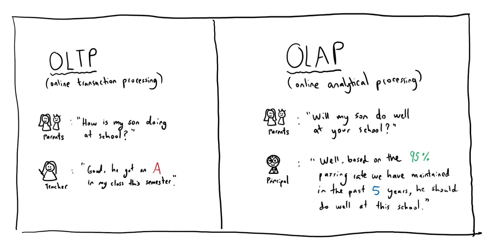
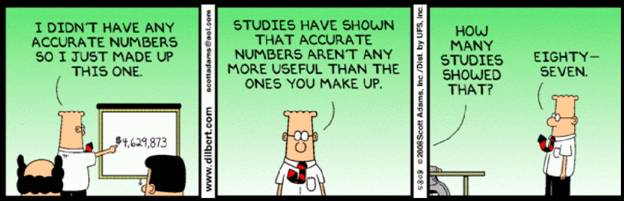
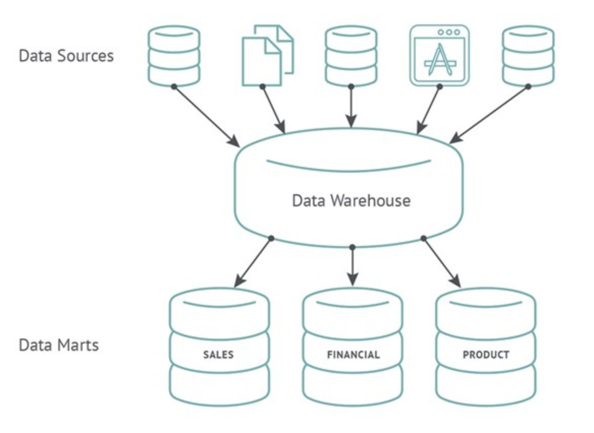
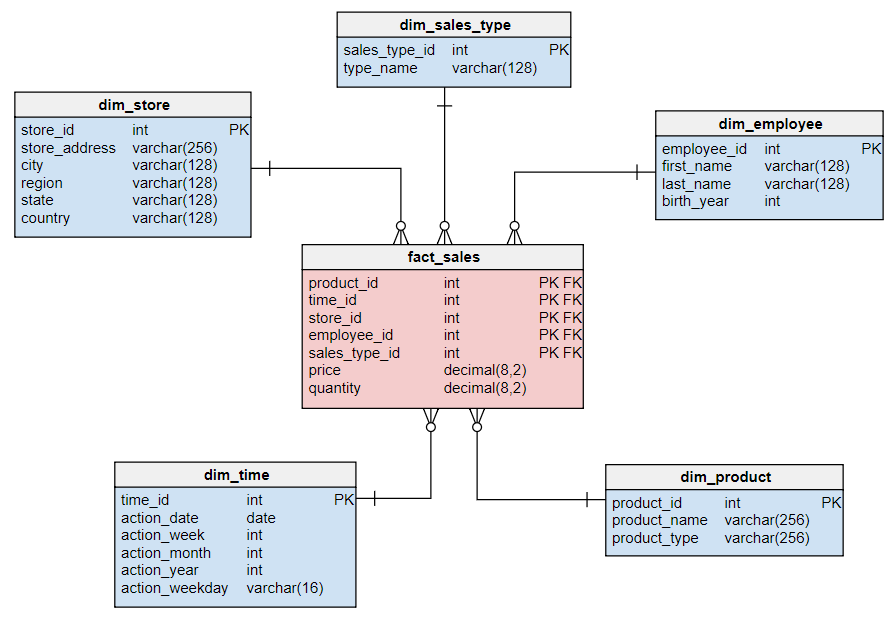
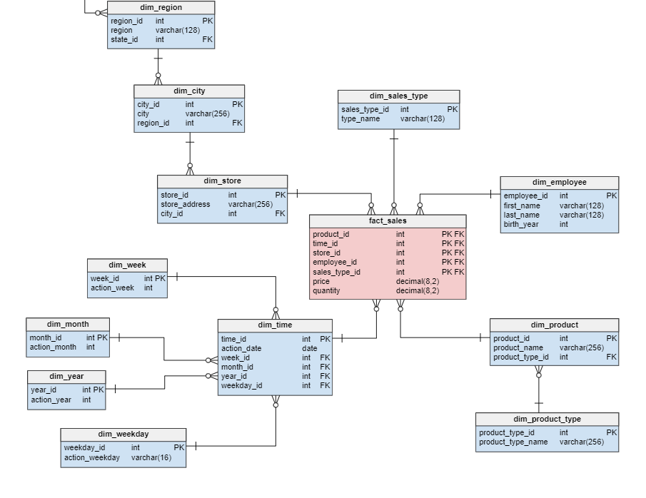
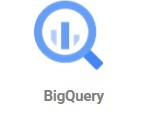
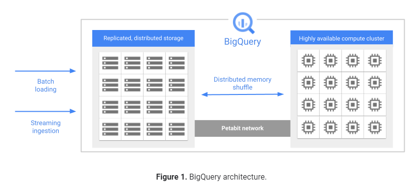

## Data Warehousing

So like a database but bigger?

---

### Overview

- History of data warehousing
- Data warehousing techniques
- GCP BigQuery

---

### Learning Objectives

- Clarify the difference between Databases and Data Warehouses
- Identify the different Data Warehouse schema types
- Explain how GCP BigQuery works

---

### OLTP vs. OLAP

- **OLTP (Database):** Online Transaction Processing Information systems facilitates and manages transaction-oriented applications

vs

- **OLAP (Data Warehouse):** Online Analytical Processing is an approach to answer multi-dimensional analytical queries swiftly

<!-- .element: class="centered" height="350px" -->

---

### Traditional Databases

- Store data in tables
- Use Online Transactional Processing (OLTP)
- Help perform the fundamental operations of a business
- Generally normalised - complex table joins

Notes:
In OLTP, systems typically facilitate & manage (database) transaction-oriented applications. High throughput and are insert- or update-intensive.

Business operations such as payments, orders, customer data etc.

---

## Data Warehouse

<!-- .element: class="centered" height="400px" -->

---

### Data Warehouse Architecture

**Data Sources:**

- Internal sources such as wages, personnel, or maintenance databases
- External sources are not being generated from within the organisation like markets, competitors, or demographics

**Bottom Tier:**

- Warehouse Database Server
- Uses various backing tools to extract data from different sources
- Cleanses data and transforms it before loading into a Data Warehouse

---

### Data Warehouse Architecture

**Middle Tier:**

- OLAP Server (**OnLine Analytical Processing**)
- Performs multi-dimensional analysis of business data
- Transforms the data into a format that we can perform complex calculations and data modelling on

**Top Tier:**

- Like a front-end client layer
- Holds different types of querying and reporting tools for which client applications can perform data analysis

Notes:
OLAP is more about complex queries, smaller volumes, business intelligence or reporting. Optimised for read only queries.

Denormalisation (leaving redundancy in) will serve to improve read performance (at expense of write performance).

With data warehousing, data is united from many tables into one.

---

### Emoji Check:

On a high level, is the difference between a traditional Database and a Warehouse staring to make sense?

1. 😢 Haven't a clue, please help!
2. 🙁 I'm starting to get it but need to go over some of it please
3. 😐 Ok. With a bit of help and practice, yes
4. 🙂 Yes, with team collaboration could try it
5. 😀 Yes, enough to start working on it collaboratively

Notes:
The phrasing is such that all answers invite collaborative effort, none require solo knowledge.

The 1-5 are looking at (a) understanding of content and (b) readiness to practice the thing being covered, so:

1. 😢 Haven't a clue what's being discussed, so I certainly can't start practising it (play MC Hammer song)
2. 🙁 I'm starting to get it but need more clarity before I'm ready to begin practising it with others
3. 😐 I understand enough to begin practising it with others in a really basic way
4. 🙂 I understand a majority of what's being discussed, and I feel ready to practice this with others and begin to deepen the practice
5. 😀 I understand all (or at the majority) of what's being discussed, and I feel ready to practice this in depth with others and explore more advanced areas of the content

---

### Business Intelligence

- Marketing
- Commercial Strategy
- Development Metrics... i.e. A/B Testing

---

Can you think of any others and examples?

<!-- .element: class="centered" -->

Notes:
e.g. Market Conditions, setting business objectives, identifying opportunities etc

---

### Observations and Trends

- Data sources can be pretty varied
- Data tends to be imported into staging tables as soon as possible for processing
    - **Staging tables:** Temporary tables containing data before it has been processed
- Often long chains of events that rely on previous stages completing exist
- Can you think of any potential issues occurring?

Notes:
Chain of events:
Ruth subscribes to a popular food delivery service.

Externally the service relies a food supply chain, the system needs to forecast what will be available for her to choose from next week. Relying on data from third parties - the food suppliers.

Internally, every week when her order is dispatched the system relies on her address and payment details being available before the order is dispatched.

---

### Data Marts

- Basically a condensed and more focused version of a data warehouse
- Each "Mart" contains a subset of the data warehouse, specifically oriented to a business sector or team
- They protect the data warehouse by decreasing the number of users
- Data Marts are intended to be **Read Only**

Notes:
Data marts are basically more condensed and more versions of data warehouses that reflect the process specifications of each business unit (accounting, marketing, sales etc) within an organisation.

Data marts can also be dedicated to specific regions.

The subset of data may still span across or all of an enterprise's areas.

---

### Data Marts

<!-- .element: class="centered" -->

---

### Organising Our Data

- There are two common schemas for storing data within Data Warehouses/Marts:
    - Star Schema
    - Snowflake Schema

---

### Star Schema

<!-- .element: class="centered" -->

Notes:
Read through:
One or more 'fact tables' (measurements, metrics or facts of a business process) referencing any number of 'dimension tables' (categorize facts and measures in order to enable users to answer business questions - provide filtering, grouping & labelling)

- A more complex approach, based on Star Schema
- Fact tables reference any number of Dimension Tables
- Tables are usually denormalised, allowing for writing simpler queries, involving less joins
- Because of this normalisation, data integrity is relaxed, which may allow for data anomalies

---

### Star Schema

- A more complex approach, based on Star Schema
- Fact tables reference any number of Dimension Tables
- Tables are usually denormalised, allowing for writing simpler queries, involving less joins
- Because of this normalisation, data integrity is relaxed, which may allow for data anomalies

---

### Snowflake Schema

<!-- .element: class="centered" -->

Notes:
The principle behind snowflaking is normalization of the dimension tables by removing low cardinality attributes and forming separate tables.

- The fact tables are connected to multiple dimensions
- More complex approach based on Star Schema
- Dimensions are normalised into multiple related tables
- Queries can become complex with a number of joins needed to retrieve all data
- Stricter data integrity leads to less anomalies like duplication, or missing relation data

---

### Snowflake Schema

- The fact tables are connected to multiple dimensions
- More complex approach based on Star Schema
- It strips out low cardinality attributes (unique values) and forms separate tables
- Dimensions are normalised into multiple related tables
- Queries can become complex with a number of joins needed to retrieve all data
- Stricter data integrity leads to less anomalies like duplication, or missing relation data

---

### Quiz Time! 🤓

---

**What data processing system does a traditional database use?**

1. OLAP
1. OLTA
1. OLTP
1. OLAT

Answer: `3`<!-- .element: class="fragment" -->

Bonus point if you can remember what it stands for!<!-- .element: class="fragment" -->

---

**What data processing system does a data warehouse use?**

1. OLAP
1. OLTA
1. OLTP
1. OLAT

Answer: `1`<!-- .element: class="fragment" -->

Bonus point if you can remember what it stands for!<!-- .element: class="fragment" -->

---

**Which tier in a traditional data warehouse architecture would this be in**?

_Cleanse data and transform it before loading into the data warehouse._

1. Data Sources
2. Bottom Tier
3. Middle Tier
4. Top Tier

Answer: `3`<!-- .element: class="fragment" -->

Notes:
The middle tier holds the OLAP server which performs this action.

---

## GCP BiGQuery

<!-- .element: class="centered" height="300px" -->

---

### Before BigQuery - Traditional Data Warehouses

- Time consuming to pull data from the large warehouses using traditional architecture
- Costly - hardware, setup, electricity, security, estate
- Maintenance costs often outweighed the benefits (upgrading systems due to more data being added)
- Performance issues
- Auto-scaling is not an easy concept

---

### BigQuery

- **Fully-managed** and **serverless enterprise** data warehouse
- Data is stored in a columnar data format called **Capacitor**
- Simple and cost-effective to analyse your data
- Up to 10x better performance than traditional
- Decoupled storage and compute, both scalable independently
- Manages, monitors and scales your system
- Encryption of data is standard for data at rest
- **Colossus** is the distributed file system used for persistence layer in BigQuery
- BigQuery support both schema types

---

### Architecture

<!-- .element: class="centered"  -->

---

### BigQuery Data Storage

- BigQuery stores table data in columnar format, meaning it stores each column separately
- Column-oriented databases are optimised for analytic workloads that aggregate data over a very large number of records
- Data not accessed for 90days is automatically moved into archive storage, saving on storage cost

Notes:
BigQuery does not support foreign keys

BigQuery operates directly on compressed data without decompressing the data

---

### Columnar Data Storage

- The data is still represented with rows and columns as normal
- However, the data is physically stored by column, instead of rows
- Because the data stored is the same type, you can achieve better data compression
- Number of I/O operations decreases
- Also means you can query/perform data analysis on similar types of data far quicker than row storage

---

### BigQuery Data Compute

- Dremel is the query engine used in bigquery
- One unit of compute is called slot
- Slot is made up CPU + RAM + Network

---

### Slot pricing model

**On demand:** You pay for the amount of byte scanned in query job, each project has a default 2000 slot per project.

**Flat Rate:** You purchase dedicated query processing capacity which offer predictable pricing.

---

### Choosing the right pricing model:

**Data capacity requirement:** Size of data required to be scanned

**Complexity of queries:** How many concurrent query will be run against the data

**Downstream systems:** ELT and BI requirement?

---

### Quiz Time! 🤓

**Which of the following best describes a Slot?**

1. How BigQuery store data.
1. A unique of compute made of CPU and Storage.
1. A unique of compute made of CPU, RAM and network.
1. Compute optimised and used to handle high performance/intensive workloads.

Answer: `3`<!-- .element: class="fragment" -->

---

**Which of the following best describe how data is stored in a columnar data format in BigQuery?**

1. Resistor.
1. Capacitor.
1. Transistor.
1. Generator.

Answer: `2`<!-- .element: class="fragment" -->

---

### Terms and Definitions - recap

- **OLAP:** Answers multi-dimensional analytical queries swiftly
- **Business Intelligence:** Applying data analytics to business practice
- **Data Marts:** Condensed, more focused version of a data warehouse
- **Star Schema:** One or more 'fact tables', referencing any number of 'dimension tables'
- **Snowflake Schema:** Normalised data in multiple related tables, whereas the star schema's dimensions are
  denormalised
- **BigQuery:** Fully managed and serverless data-warehouse, store and analyse large quantities of data

---

### BigQuery exercises

For this afternoons project time, there is a BigQuery exercise.

- The exercise oce is at [JLR-DE-Academy/JLR-bq-gcs-session](https://github.com/JLR-DE-Academy/JLR-bq-gcs-session)

> Instructors to give out file `exercises/gcp-bq-exercise.md`

---

### Overview - recap

- History of data warehousing
- Data warehousing techniques
- GCP BigQuery

---

### Learning Objectives - recap

- Clarify the difference between Databases and Data Warehouses
- Identify the different Data Warehouse schema types
- Explain how GCP BigQuery works

---

### References and Further Reading

- [When Data Warehouse builds go wrong](https://www.cooladata.com/data-warehouse)
- [BigQuery Spotlight](https://www.youtube.com/playlist?list=PLIivdWyY5sqLAbIdmcMwsxWg-w8Px34MS)
- [Demystifying BigQuery reservations](https://medium.com/google-cloud/demystifying-bigquery-reservations-5e3ac87a4ff8)
- [Explain By Example: OLTP vs. OLAP](https://medium.com/@michelle.xie/explain-by-example-oltp-vs-olap-d5603ac2038b)

---

### Emoji Check:

On a high level, do you think you understand the main concepts of this session? Say so if not!

1. 😢 Haven't a clue, please help!
2. 🙁 I'm starting to get it but need to go over some of it please
3. 😐 Ok. With a bit of help and practice, yes
4. 🙂 Yes, with team collaboration could try it
5. 😀 Yes, enough to start working on it collaboratively

Notes:
The phrasing is such that all answers invite collaborative effort, none require solo knowledge.

The 1-5 are looking at (a) understanding of content and (b) readiness to practice the thing being covered, so:

1. 😢 Haven't a clue what's being discussed, so I certainly can't start practising it (play MC Hammer song)
2. 🙁 I'm starting to get it but need more clarity before I'm ready to begin practising it with others
3. 😐 I understand enough to begin practising it with others in a really basic way
4. 🙂 I understand a majority of what's being discussed, and I feel ready to practice this with others and begin to deepen the practice
5. 😀 I understand all (or at the majority) of what's being discussed, and I feel ready to practice this in depth with others and explore more advanced areas of the content
