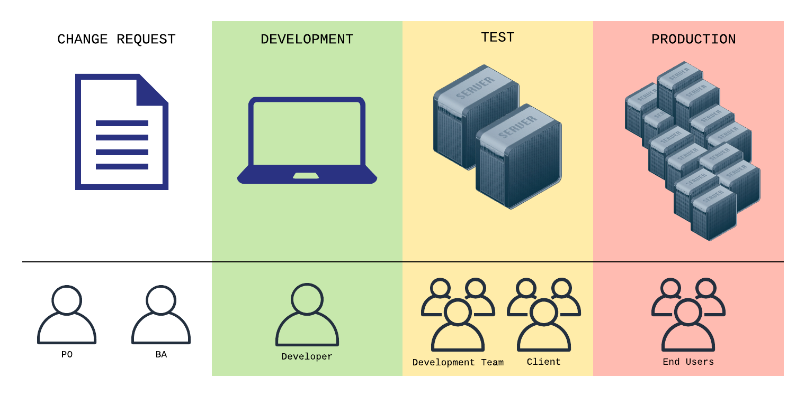
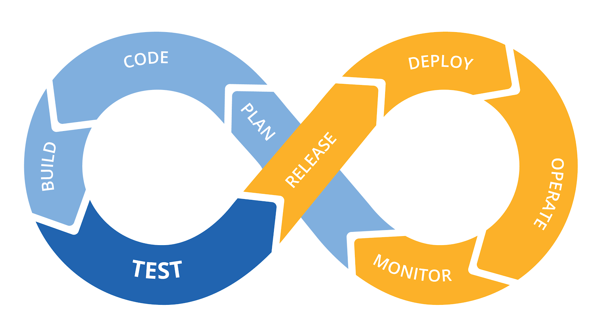
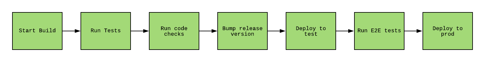
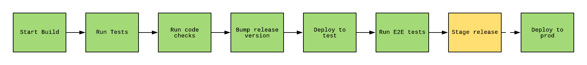
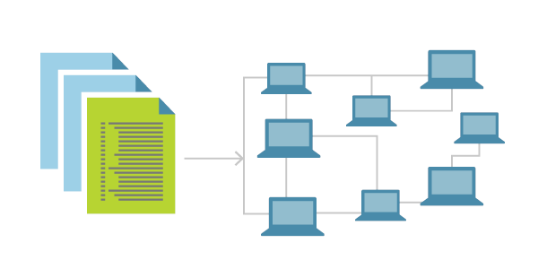
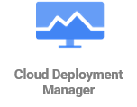

## DevOps

Development and Operations

---

### Overview

- Introduction to DevOps
- Continuous Integration / Continuous Delivery (CI/CD)
- Introduction to Infrastructure as Code (IaC)

---

### Learning Objectives

- Explain the role DevOps plays in modern software
- Identify the role CI/CD plays in modern software
- IaC to our projects

---

### DevOps - A History

Developers and IT Ops professionals had separate (and often competing) objectives, department leadership, key
performance indicators, and often worked on separate floors or even separate buildings.

Developers looked after building the system, IT Ops looked after supporting and monitoring the system.

This resulted in siloed teams concerned only with their processes and releases.

These silos often meant miscommunication, delayed deliveries and strains on morale and relationships.

---

### What is DevOps?

A combination of **culture, practises** and **tools** that increases an organisation's ability to deliver services at
high velocity.

More succinctly, it is a set of practices that combines software development (Dev) and IT operations (Ops).

Under a DevOps model, dev and ops are no longer siloed.

Both are merged into a single team where engineers work across the entire application lifecycle, from development and
test to deployment to operations, and develop a range of skills not limited to a single function.

---

### DevOps Culture

- **Increased collaboration** as a team as opposed to silos
- **Share responsibility** across the whole team so no one process is looked after by specific people, thus spreading
  the knowledge and pain
- **No silos** between development and operations
- Give power to **autonomous teams** to enable them to make their own decisions in order to collaborate effectively, and
  remove convoluted decision making processes
- **Build quality into the development process**
- **Value feedback** to continuously improve ways of working
- **Automate** as much as you can

---

### DevOps Practices

- Continuous Integration
- Continuous Delivery
- Infrastructure as Code
- Smaller Apps and Web Servers (services) that are decoupled
- Monitoring and Logging
- Communication and Collaboration

In this module, we will be looking into Continuous Integration (CI), Continuous Delivery (CD) and Infrastructure as Code (IaC).

Notes:
We/Everyone used to the term "Microservices" all the time but now we concentrate on "smaller apps / web services"

---

### DevOps Tools

- Source Control (Git)
- Collaboration / communication tools (Slack, Jira, Trello)
- Issue tracking (Jira, Trello, ZenDesk, MS Planner, GitHub Projects)
- Configuration tools (Puppet, Chef)
- Infrastructure as Code
- Continuous Integration (CI)
- Continuous Delivery (CD)
- And plenty more!

---

### Benefits of DevOps

**Speed**: Smaller apps and continuous delivery lets teams take ownership of services and then release updates to them
quicker.

**Rapid delivery**: Increase the frequency and pace of releases so you can innovate and improve your product faster.

The quicker you can release new features and fix bugs, the faster you can respond to your customers' needs and build
competitive advantage.

**Reliability**: Quality of application updates and infrastructure changes so you can reliably deliver at a faster pace
while maintaining a positive experience for end users.

**Better internal culture**: DevOps practises lead to better communication, increased productivity and agility.

Notes:
We/Everyone used to the term "Microservices" all the time but now we concentrate on "smaller apps / web services"

---

### Why does software need to change?

- Features
- Bug fixes
- Security patches
- Contract changes
- Performance optimisations

---

### What does software need to be able to operate?

- Server
- Database
- Cache
- Storage
- APIs
- Networking

---

### What is an environment?

An **environment** is the place where our software runs.

Environments are comprised of the resources and infrastructure that support the operation of a software system.

---

### Who needs access to an environment?

- Developers
- Operations
- Testers
- Product Owner
- Client's support team
- End users

---

### Software Lifecycle

<!-- .element: class="centered" -->

The development environment is usually the first thing you set up when working on a software project

---

## Types of environments

**Development**: maximise developer productivity, usually local.

**Testing**: hosted, similar to customer-facing environment, for more complex integration and E2E tests.

**UAT/Staging**: as stable and production-like as possible, used for customer demos and wider service integration.

**Production**: live, end-user-facing environment. _You must protect it at all costs_.

Different people scrutinising the product at various stages reduces the risk of severe defects.

---

### Promoting software through our environments

Having multiple environments helps find bugs in our software before it's released to the public.

Changes to the software require deployments up the chain, all the way to production.

---

### A recipe to deploy software reliably

- Make change
- Build code
- Run unit tests
- Run code quality metrics
- Install the required dependencies in the target environment
- Install our software in the target environment

---

### Maintaining environments is hard work

- Repetition without automation = more manual work
- Manual work = time wasted
- Manual work = potential differences in environments
- Differences in environments = constant breakage
- Constant breakage = downtime + longer wait to go live

How can we best alleviate this?

---

Quiz Time! 🤓

---

**Which statement best describes DevOps?**

1. Developers taking over all operations tasks.
1. Automating the process of software delivery and infrastructure changes.
1. The collaboration and communication of both software developers and other IT professionals while automating the
   process of software delivery and infrastructure changes.
1. The collaboration and communication of just software developers and operations staff while automating the process
   software delivery and infrastructure changes.

Answer: `3`<!-- .element: class="fragment" -->

---

**Complete the following sentence with the best matching answer.**

_One goal of DevOps is to establish an environment where..._

1. Change management does not control application releases.
1. Releasing more reliable applications faster and more frequently can occur.
1. Application development performs all operations tasks.
1. Releasing applications is valued over the quality of the released application.

Answer: `2`<!-- .element: class="fragment" -->

---

**Agile and DevOps are similar but differ in a few important aspects. Which statement is correct?**

1. Agile is a change of thinking, DevOps is a cultural change in an organisation.
1. Agile is cultural change in an organisation, DevOps is a change of thinking.
1. Agile is process driven, DevOps is role driven.
1. Agile is role driven, DevOps is process driven.

Answer: `1`<!--.element: class="fragment" -->

---

## Continuous Integration

<!-- .element: class="centered" -->

---

### What is CI?

> Continuous Integration (CI) is a development practice that requires developers to integrate code into a shared repository several times a day. Each check-in is then verified by an automated build, allowing teams to detect problems early. By integrating regularly, you can detect errors quickly, and locate them more easily.
>
> -- _ThoughtWorks_

CI has three stages of workflow.

Notes:
Bugs and regressions are minimised because they're detected early on and automatically.

---

### 1. Integrating changes to the main branch (every day)

- All about ensuring code gets into the main branch, as that branch is used for releasing software
- Easiest to do technically, hardest to do culturally
- Also known as [trunk-based development](https://trunkbaseddevelopment.com/5-min-overview/)
- Integrating code continually means branches are short-lived, which means code is going into main faster

Notes:
Feature flags can be used for pushing changes to production that aren't necessary ready.

---

### 2. Rely on automated tests

- Run an automated suite of tests on each integration to the main branch
- Instantly gives you information about failing tests, therefore failing software
- Can help spot bugs or errors
- Only run tests that are important, keep build time low

---

### 3. Prioritise broken builds

- If a build fails (code didn't compile, tests failed etc.), make fixing it the priority before doing any other tasks
- Everyone can see the same broken build which means better visibility of when something goes wrong

---

### The enemies of CI

- Knowledge silos
- Manual work
- Inconsistent environments
- Big PRs

Notes:

1. Knowledge silos means teams aren't communicating effectively
2. Manual work means more human errors
3. Inconsistency means it's hard to verify things work or don't work as intended
4. Big PRs means more time spent figuring out what the PR is doing, and easier for bugs to be introduced

---

### Emoji Check:

On a high level, does the idea of Continuous Integration start to make sense now?

1. 😢 Haven't a clue, please help!
2. 🙁 I'm starting to get it but need to go over some of it please
3. 😐 Ok. With a bit of help and practice, yes
4. 🙂 Yes, with team collaboration could try it
5. 😀 Yes, enough to start working on it collaboratively

Notes:
The phrasing is such that all answers invite collaborative effort, none require solo knowledge.

The 1-5 are looking at (a) understanding of content and (b) readiness to practice the thing being covered, so:

1. 😢 Haven't a clue what's being discussed, so I certainly can't start practising it (play MC Hammer song)
2. 🙁 I'm starting to get it but need more clarity before I'm ready to begin practising it with others
3. 😐 I understand enough to begin practising it with others in a really basic way
4. 🙂 I understand a majority of what's being discussed, and I feel ready to practice this with others and begin to deepen the practice
5. 😀 I understand all (or at the majority) of what's being discussed, and I feel ready to practice this in depth with others and explore more advanced areas of the content

---

## Continuous Deployment

<!-- .element: class="centered" -->

---

### What is CD?

- A way of getting your changes (features, bug fixes etc.) into production in a quick and sustainable way
- Code is checked to be in a deployable state by the CI stage

Notes:
These methodologies allow you to catch bugs and errors early in the development cycle, ensuring that all the code deployed to production complies with the code standards you established for your app. Big-bang releases which introduce risk and instability and make rollbacks harder.

---

### Principles of CD

**Frequent, small deployments**: Deploying smaller changes rather than an accumulation of changes means less chance of
something going wrong.

**Automation**: Computers are infinitely better at repetitive tasks. Deployment steps can be automated so that we reduce
human errors. Things like Infrastructure as Code (IaC) can help.

**Keep improving**: Always look to improve the deployment process. Are you manually doing anything that can be
automated?

**Shared responsibility**: Everyone in the team is responsible for creating safe, fast and deterministic delivery of the
deployed product, it shouldn't be siloed between devs and ops.

---

### Emoji Check:

On a high level, does the idea of Continuous Deployment start to make sense now?

1. 😢 Haven't a clue, please help!
2. 🙁 I'm starting to get it but need to go over some of it please
3. 😐 Ok. With a bit of help and practice, yes
4. 🙂 Yes, with team collaboration could try it
5. 😀 Yes, enough to start working on it collaboratively

Notes:
The phrasing is such that all answers invite collaborative effort, none require solo knowledge.

The 1-5 are looking at (a) understanding of content and (b) readiness to practice the thing being covered, so:

1. 😢 Haven't a clue what's being discussed, so I certainly can't start practising it (play MC Hammer song)
2. 🙁 I'm starting to get it but need more clarity before I'm ready to begin practising it with others
3. 😐 I understand enough to begin practising it with others in a really basic way
4. 🙂 I understand a majority of what's being discussed, and I feel ready to practice this with others and begin to deepen the practice
5. 😀 I understand all (or at the majority) of what's being discussed, and I feel ready to practice this in depth with others and explore more advanced areas of the content

---

## CI/CD Pipelines

<!-- .element: class="centered" -->

---

### What is a pipeline?

_A route, channel, or process along which something passes or is provided at a steady rate._

---

### Build Pipeline

- Provides a steady supply of changes to our end-users
- Automates the integration and delivery flow of your software

<!-- .element: class="centered" height="100px" -->

---

### Gated Releases

- A stage in the build pipeline that must be triggered manually to deploy to the next stage
- Allows you to ensure everything is how it should be in the stage before deploying to production

<!-- .element: class="centered" height="100px" -->

---

### CI/CD Terms

**Pipeline**: automated stream of work that verifies, integrates and deploys software.

**Build**: a full cycle through the pipeline, triggered when a change is merged into the repo's stable branch.

**Job**: an individual step in the pipeline that carries out one or more tasks.

**Task**: a script run in a job.

---

### CI/CD Software

- GitHub Actions
- CircleCI
- Jenkins
- Concourse
- And plenty more!

---

### YAML

**YAML Ain't a Markup Language**.

A markup language designed primarily for humans rather than computers.

Structurally similar to JSON, except indentation defines the structure, like in Python.

---

### Basic example

```yml
# Strings don't need quotes (this is a comment BTW)
key1: hello
key2:
    # You can nest keys
    subkey1: 1
    subkey2: hello
    # You can also make lists
    subkey3:
        - listitem1
        - listitem2
        - listitem3
```

---

### The structure of your CI config file

```yml
# Name your job/action
name: Python application
# When to run this job
on: [ push ]
jobs:
build:
    # Which operating system to test on - e.g. "macos-latest, ubuntu-latest, windows-latest"
    runs-on: [ operating system ]

    # The steps to run in the job
    steps:
        # Checkout code from github
        - uses: actions/checkout@v2

        # Install python
        - name: Set up Python
          uses: actions/setup-python@v1
          with:
              python-version: [ python version ]

        # Run pip to install all packages/dependencies
        - name: Install dependencies
          run: pip install -r requirements.txt
```

---

## Infrastructure as Code

<!-- .element: class="centered" -->

---

### What is IaC?

- The management of infrastructure (servers, databases, storage, networking etc.)
- Generates the exact same environment every time through a code file
- Used in conjunction with CD
- Without IaC, teams must maintain the settings of all environments individually
- Enables teams to test applications in production-like environments early on

---

### Why is IaC important?

- Repeatable process
- Self documenting system architecture
- Idempotent (creates the same environment every time)
- Can tear down and recreate easily
- Dynamic infrastructure
- As configuration is in a code file, it can be tracked with version control

---

### Emoji Check:

Does the idea that we can have files in our code repositories, that run our unit tests and deploy our software, start to make sense now?

1. 😢 Haven't a clue, please help!
2. 🙁 I'm starting to get it but need to go over some of it please
3. 😐 Ok. With a bit of help and practice, yes
4. 🙂 Yes, with team collaboration could try it
5. 😀 Yes, enough to start working on it collaboratively

Notes:
The phrasing is such that all answers invite collaborative effort, none require solo knowledge.

The 1-5 are looking at (a) understanding of content and (b) readiness to practice the thing being covered, so:

1. 😢 Haven't a clue what's being discussed, so I certainly can't start practising it (play MC Hammer song)
2. 🙁 I'm starting to get it but need more clarity before I'm ready to begin practising it with others
3. 😐 I understand enough to begin practising it with others in a really basic way
4. 🙂 I understand a majority of what's being discussed, and I feel ready to practice this with others and begin to deepen the practice
5. 😀 I understand all (or at the majority) of what's being discussed, and I feel ready to practice this in depth with others and explore more advanced areas of the content

---

## Cloud Deployment Manager

<div class="img-center-multiple">
    
</div>

---

## Cloud Deployment Manager

- GCP infrastructure deployment service - infrastructure as a code (IaC)
- Automatic creation and management of GCP resources  (Cloud storage, GCE, BigQuery etc.)
- Can be written in YAML or JSON

---

### Example - Cloud Function deployment template

```yaml
imports:
    - path: templates/cloud_function/cloud_function.py
      name: cloud_function.py

resources:
    - name: test-function
      type: cloud_function.py
      properties:
          region: <FIXME:region>
          entryPoint: <FIXME:entryPoint>
          sourceArchiveUrl: <FIXME:sourceArchiveUrl>
```

Notes:
Above template will create a cloud function with name: test-function, python type and other required settings
Describe what the snippet is doing below.

---

### Example - Cloud Storage bucket

```yaml

imports:
    - path: templates/gcs_bucket/gcs_bucket.py
      name: gcs_bucket.py

resources:
    - name: <FIXME:bucket_name>
      type: gcs_bucket.py
      properties:
          name: <FIXME:bucket_name>
          location: us-east1
          versioning:
              enabled: True
          labels:
              env: development
```

---

Quiz Time! 🤓

---

**What is meant by Continuous Integration?**

1. A way of getting code changes into production in a quick and sustainable way.
1. A way of releasing new changes to your customers quickly in a sustainable way.
1. A way of requiring developers to push code into a shared repository several times a day. Each check-in is then
   verified by an automated build.
1. An architectural style that integrates an application as a collection of small autonomous services.

Answer: `3`<!-- .element: class="fragment" -->

Notes:
Steer clear of saying that 1 is Continuous Delivery as that's the next question.

---

**What is meant by Continuous Deployment?**

1. A way of getting code changes into production in a quick and sustainable way.
1. A way of releasing new changes to your a user acceptance environment quickly in a sustainable way.
1. A way of releasing new changes into a development environment in a quick and sustainable way.
1. An architectural style that integrates an application as a collection of small autonomous services.

Answer: `1`<!-- .element: class="fragment" -->

---

**What is meant by Infrastructure as Code?**

1. Managing your IT infrastructure using configuration files.
1. Managing your IT cloud infrastructure using configuration files.
1. Managing your codebase from within IT infrastructure.
1. An GCS-specific resource that allows you to manage your IT infrastructure using configuration files.

Answer: `1`<!-- .element: class="fragment" -->

---

### Terms and Definitions - recap

**DevOps**: A set of practices that combines software development (Dev) and IT operations (Ops).

**Continuous Integration**: The practice of merging all developers' working copies to a shared mainline several times a
day.

**Continuous Delivery**: A software engineering approach in which teams produce software in short cycles, ensuring that
the software can be reliably released at any time and, when releasing the software, doing so automatically.

---

### Terms and Definitions - recap

**Environment**: A computer system in which a computer program or software component is deployed and executed.

**Build Pipeline**: The process of taking code from version control and making it readily available to users of your
application in an automated fashion.

**Infrastructure as Code**: The process of managing and provisioning computer data centers through machine-readable
definition files, rather than physical hardware configuration or interactive configuration tools.

---

### Overview - recap

- Introduction to DevOps
- Continuous Integration / Continuous Delivery (CI/CD)
- Introduction to Infrastructure as Code (IaC)

---

### Learning Objectives - recap

- Explain the role DevOps plays in modern software
- Identify the role CI/CD plays in modern software
- IaC to our projects

---

### Further Reading

- [DevOps Culture](https://martinfowler.com/bliki/DevOpsCulture.html)
- [State of DevOps Report 2020](https://puppet.com/resources/report/2020-state-of-devops-report/)
- [The Phoenix Project (DevOps Novel)](https://itrevolution.com/the-phoenix-project/)
- [Accelerate, The Science of Lean Software and DevOps: Building and Scaling High Performing Technology Organizations (Book)](https://itrevolution.com/book/accelerate/)

---

### Emoji Check:

On a high level, do you think you understand the main concepts of this session? Say so if not!

1. 😢 Haven't a clue, please help!
2. 🙁 I'm starting to get it but need to go over some of it please
3. 😐 Ok. With a bit of help and practice, yes
4. 🙂 Yes, with team collaboration could try it
5. 😀 Yes, enough to start working on it collaboratively

Notes:
The phrasing is such that all answers invite collaborative effort, none require solo knowledge.

The 1-5 are looking at (a) understanding of content and (b) readiness to practice the thing being covered, so:

1. 😢 Haven't a clue what's being discussed, so I certainly can't start practising it (play MC Hammer song)
2. 🙁 I'm starting to get it but need more clarity before I'm ready to begin practising it with others
3. 😐 I understand enough to begin practising it with others in a really basic way
4. 🙂 I understand a majority of what's being discussed, and I feel ready to practice this with others and begin to deepen the practice
5. 😀 I understand all (or at the majority) of what's being discussed, and I feel ready to practice this in depth with others and explore more advanced areas of the content
