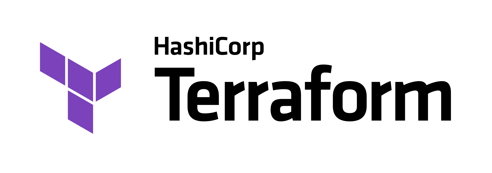

## Terraform

---

### Overview

- Infrastructure as Code
- Introduction to terraform
- Managing cloud infrastructure with Terraform

---

### Learning Objectives

- Explain the benefits of Infrastructure as Code
- Understand the structure of a Terraform file
- Describe the main Terraform commands
- Provision GCP resources using Terraform

---

### Infrastructure as Code

- The management of infrastructure (servers, databases, storage, networking etc.)
- Generates the exact same environment every time through a code file
- Without IaC, teams must maintain the settings of all environments individually
- Enables teams to test applications in production-like environments early on

Notes:
Discuss the general principle of IaC and the evolution from manual environment building
Currently the class has been creating resources using the console, which for this use case is generally OK but if they wanted to rebuild the environment how long would it take?
How can they be sure that they have all the services and resources configured correctly and to exact same specifications?

---

## Infrastructure as Code - Benefits

1. Single source of truth for your whole infrastructure
1. Easier to bring consistency (if you need a new server, you can often 'copy and paste' an existing one)
1. Version control! Can put your infra into GitHub for collaborative working, and to be able to redeploy from history if it goes wrong
1. State management - intelligently update your overall infrastructure only with changes

---

## Terraform

<!-- .element: class="centered" -->

---

### What is Terraform

Terraform is an open-source infrastructure as code software tool built by Hashicorp

Provides a consistent CLI workflow to manage cloud services

Terraform configuration is written in a declarative domain-specific language called Hashicorp Configuration Language (HCL) and denoted with the `.tf` file extension

---

### Hashicorp Configuration Language

Hashicorp Configuration Language (HCL) is used as a configuration file to describe infrastructure using blocks, arguments and expressions

Configuration files can also be expressed in JSON syntax but is harder for humans to read

The core concept of the language is Arguments and Blocks.

- Argument - assigns a value to a particular name
- Block - container for content (e.g. resource)

---

### Terraform CLI

Hashicorp provide CLI tooling for Terraform which supports the following main commands:

- `Init`: Initialises a working directory containing Terraform configuration, downloading providers, plugins and modules.
- `Plan`: creates an execution plan, which lets you preview the changes terraform plans to make.
- `Validate`: validates the configuration files in the directory.
- `Apply`: executes the actions proposed in a terraform plan.
- `Destroy`: destroys all remote objects managed by terraform configuration.

We will use these in the exercise a bit later.

Notes:
Plan - Compares the current configuration to the prior state and plans any differences.

Validate - Runs checks to verify whether a configuration is syntactically valid and internally consistent (this does not account for provided variables or existing state).

Apply - Apply will create a new execution plan if not supplied with one. It is possible to save the `plan` and supply the output to the `apply` step.

---

### How we use Terraform

We build the configuration `.tf` using the HCL syntax to describe our infrastructure

We then use the CLI to initialise the chosen provider then plan and provision / update our infrastructure

Terraform creates a state file which is maintained and updated by the CLI based on the configuration file.

Notes:
Creating resources with Terraform allows us to track changes to our infrastructure, we are also able to import existing resources

---

### Terraform provider

Terraform supports many cloud services, including the major players of GCP, AWS and Azure known as **Providers**.

A **provider** acts as a translation layer between HCL and the cloud API and is distributed separately from the Terraform CLI

Terraform will install a provider, giving access to a set of resource types and data sources to be managed

In total, Terraform has over 1700 providers which are created and maintained by either Hashicorp, cloud providers, or members of the dev community

Notes:

- Google Cloud Platform https://registry.terraform.io/providers/hashicorp/google/latest/docs
- The google provider is used to configure your GCP infrastructure
- Behind the scenes the GCP provider is utilising the gcloud API

---

### Terraform resources

A resource is a type of block in the HCL that describes infrastructure objects such as VPC, compute instance, object storage and more

A resource will have a number of arguments that relate to the configuration of the given object

Resources export one or more attributes that can be using in other resources as reference `resource_type.unique_name.attribute`

---

### Download Terraform

https://www.terraform.io/downloads

Can also be installed using homebrew

```sh
brew tap hashicorp/tap

brew install hashicorp/tap/terraform

terraform --version
```

Install the Terraform extension available for VS Code. Search for [HashiCorp Terraform](https://marketplace.visualstudio.com/items?itemName=HashiCorp.terraform)

Notes:
Get students to download terraform before moving on, so they can get straight into the exercise and allows you to deal with any issues as a class

---

### Demo - create a GCP resource with Terraform

Deploy a storage bucket to GCP using Terraform

- Create a new directory on your machine `devops_terraform`
- Create a new file called `exercise1.tf`

Notes:

Instruct the class not to do the exercise with you... just to watch and pay attention. They can have a go after.

---

### Demo - configuring a terraform file

Add the below to the `exercise1.tf`

```text
terraform {
  required_providers {
    google = {
      source  = "hashicorp/google"
      version = "3.5.0"
    }
  }
}
```

The `terraform` block contains Terraform settings stating that we will be using the google provider and the version of the provider.

---

### Demo - adding a provider

Add the provider block below

```text
provider "google" {
  project     = "<GCP_PROJECT_ID>"
  region      = "<REGION>"
}
```

The `provider` block contains settings for the provider, we have omitted the credentials argument as it is assumed you will have this configured on your terminal

- Replace <GCP_PROJECT_ID> with the project id from your GCP project
- Replace <REGION> with the region you are working in. e.g. "us-central1"

Notes:
If the user has service key downloaded and has not set the `GOOGLE_APPLICATION_CREDENTIALS` environment variable you can add a argument to the provider block called `credentials`

---

### Demo - adding a resource

Add the resource block below

```text
resource "google_storage_bucket" "code_bucket" {
  name     = "<UNIQUE_NAME>"
  location = "EU"
}
```

This `resource` will create a Google Storage Bucket and will be known or referenced in terraform as code_bucket.

- Replace <UNIQUE_NAME> with `your-name_devops_exercise1` (do not literally put your-name)

---

### Demo - initialise directory

We have finished the configuration for our bucket

Now we have to initialise. This will download the provider `hashicorp/google` from the registry giving us access to the available resources for the given version `3.5.0`

- Open your terminal in the directory where you have created exercise1.tf
- Run `terraform init` - this will initiate your project folder
- Run `terraform fmt` - this will format your file
- Run `terraform validate` - this will check for any errors in your file

Notes:
Ensure students have downloaded the latest version of terraform

---

### Demo - create the resources

In the same terminal window

- Run `terraform plan` - this will show you the execution plan detailing what will be created, updated or deleted

Once happy and you can see that a bucket will be created with the given name you have supplied

- Run `terraform apply` - this will apply the execution plan

Goto the console and validate you can see your bucket

Notes:
Now initialised we can now provision our infrastructure to our GCP project. Creating a storage bucket.

Student now have the foundations of the terraform file, we will update and expand on this on the exercise.

---

### Exercise

Refer to **Part 1 and 2** of the exercise handout in file `exercises/terraform-exercise.md`.

---

### Emoji Check:

How did you get on with the exercise?

1. 😢 Haven't a clue, please help!
2. 🙁 I'm starting to get it but need to go over some of it please
3. 😐 Ok. With a bit of help and practice, yes
4. 🙂 Yes, with team collaboration could try it
5. 😀 Yes, enough to start working on it collaboratively

Notes:
The phrasing is such that all answers invite collaborative effort, none require solo knowledge.

The 1-5 are looking at (a) understanding of content and (b) readiness to practice the thing being covered, so:

1. 😢 Haven't a clue what's being discussed, so I certainly can't start practising it (play MC Hammer song)
2. 🙁 I'm starting to get it but need more clarity before I'm ready to begin practising it with others
3. 😐 I understand enough to begin practising it with others in a really basic way
4. 🙂 I understand a majority of what's being discussed, and I feel ready to practice this with others and begin to deepen the practice
5. 😀 I understand all (or at the majority) of what's being discussed, and I feel ready to practice this in depth with others and explore more advanced areas of the content

---

### Terraform state

Terraform stores information about your managed resources in a **state file**, locally called `terraform.tfstate`.

When we run commands such as `plan`, `apply` and `destroy` it is the state file that is used to create the execution plan and make changes to your infrastructure.

Prior to any operation, terraform will make an update to the state file with any changes from the real infrastructure

Notes:
Prior to any operation, terraform will make an update to the state file with any changes from the real infrastructure. Meaning if you were to make a change in the console, this would be reflected in the next operation.
When Terraform creates a remote object in response to a change of configuration, it will record the identity of that remote object against a particular resource instance, and then potentially update or delete that object in response to future configuration changes.

---

### Terraform state

The state file stores the IDs and properties of the resource it manages, so that it can update or destroy them in future executions

The state file can contain sensitive information so this should be stored securely (Do not push to github!) and rarely shared.

You can inspect the current state by running `terraform show`

Notes:
The state file is a pivotal part of terraform as this maps the resource object in configuration against the real instance ID.
Run the terraform show, this will show the mapping between the resource name and the real instance id
For resources such as databases, this may contain initial passwords.

---

### Terraform backends

By default, Terraform stores the state file in the current working directory.

Working in a teams requires everyone to have access the same state data, meaning local storage is not ideal.

State files contain sensitive data, meaning we cannot store this in source-control. How can we share?

Notes:
Ask the class for some suggestions as how to collaborate with Terraform

  The answer is that we should store the statefile in a secure location such as a bucket.

---

### Terraform backends

**Remote state** enables terraform to write the state data to a remote data source.

Terraform can store state files in Terraform cloud, S3, GCS and more.

Storing the state in a secure bucket enables teams to work from a single state file.

To enable a remote state file implement a `backend` block within the `terraform` block

```text
terraform {
  backend "gcs" {
    bucket = <BUCKET_TO_STORE_STATE_FILE>
  }
}
```

Notes:
Terraform has a list of available builtin backend types. The example below is using the "gcs" backend.
When using remote state, state is only ever held in memory when used by Terraform. It may be encrypted at rest, but this depends on the specific remote state backend.
Terraform can also use state locking to prevent concurrent runs of terraform against the same state file.

---

### Exercise

Refer to **Part 3** of the exercise handout.

---

### Emoji Check:

How did you get on with the exercise?

1. 😢 Haven't a clue, please help!
2. 🙁 I'm starting to get it but need to go over some of it please
3. 😐 Ok. With a bit of help and practice, yes
4. 🙂 Yes, with team collaboration could try it
5. 😀 Yes, enough to start working on it collaboratively

Notes:
The phrasing is such that all answers invite collaborative effort, none require solo knowledge.

The 1-5 are looking at (a) understanding of content and (b) readiness to practice the thing being covered, so:

1. 😢 Haven't a clue what's being discussed, so I certainly can't start practising it (play MC Hammer song)
2. 🙁 I'm starting to get it but need more clarity before I'm ready to begin practising it with others
3. 😐 I understand enough to begin practising it with others in a really basic way
4. 🙂 I understand a majority of what's being discussed, and I feel ready to practice this with others and begin to deepen the practice
5. 😀 I understand all (or at the majority) of what's being discussed, and I feel ready to practice this in depth with others and explore more advanced areas of the content

---

### Terraform - variables

Terraform have additional blocks for requesting and publishing named values

**Input Variable**: parameters for a Terraform configuration, enables templated to be customizable removing the need to hardcode values

**Output Values**: Return values from a Terraform configuration

**Local values**: Assigns a name to an expression (local variable). Allow the expression to be reused without repeating the expression.

---

### Terraform - input variables

Input variables are similar to function arguments in Python. They allow options to be passed into the Terraform configuration.

To declare an input variable we use the `variable` block.

```shell
variable "bucket_name" {
  type = string
  default = "my-new-bucket"
  description = "bucket to do something with"
}

resource "google_storage_bucket" "my_exercise_bucket" {
  name     = "${var.bucket_name}"
  location = "EU"
}
```

The `variable` block has arguments that can be used, below are some of the key ones and they are optional. It is recommended to at least have `type`.

- **type**: Specifies the data type accepted for the variable
- **default**: The default value of the variable
- **description**: The input variables documentation

---

### Terraform - providing input variables

Input variables can be passed into a configuration either by command line, a variable definition file or environment variable.

**Command line**: Specifies individual variables using the `-var` option when running the `plan` and `apply` terraform commands

**Environment variable**: Terraform can search for variables defined with the following convention `TF_VAR_variable_name`

**Definition file**: A more convenient way of supplying values is a using a `.tfvars` or `.tfvars.json` file. The file will be key=value pairs.

Terraform will automatically load variable definition files if they are named exactly `terraform.tfvars` or if a file ends with `auto.tfvars`

---

### Terraform - output value

Output values can be related to the return values of a function in python.

They give information about your infrastructure to the command line or expose them to other configurations.

To create an output value, use the `output` block

```text
resource "google_storage_bucket_object" "code_object" {
  name   = "index.zip"
  bucket = "${google_storage_bucket.my_exercise_bucket.name}"
  source = "./hello.zip"
}

output "object_output_hash" {
  value = google_storage_bucket_object.code_object.md5hash
}
```

The `value` argument of the `output` block takes an expression that will be returned to the user.

In the above example we would return the md5hash attribute of our created bucket object

---

### Terraform - local value

A local value can be compared to a local variable in python function.

to define a local value, use the `locals` block

```text
locals {
  service_name = "cafe"
  owner        = "Data Engineering Team"
}
```

To reference a local in configuration use `local.service_name`.

The benefit of them is re-usability. If we need to change the service_name, we can make that change in a single place.

---

### Terraform - modules

Terraform `init` considers all files in the working directory with the `.tf` extension as configuration.

Common practice is to logically separate blocks into different files for readability, this will have no effect on the behaviour of Terraform.

example

```shell
example_iac
        |**main.tf
        |**outputs.tf
        |**variables.tf
```

The main working directory is known as the root module, sub-directories from here will be known as child modules.

---

### Terraform - modules

A module is a collection of `.tf` file in a given directory, any nested directory will be treated as separate modules and is excluded by default.

Terraform will treat all the configuration files in a module as a single configuration. In the below example `example_iac` would be known as the root module
whereas `frontend` and `infra` are child modules.

```shell
example_iac
      |**main.tf
      |**outputs.tf
      |**variables.tf
      |**frontend   # child module
           |**main.tf
           |**outputs.tf
           |**variables.tf
      |**app-cluster    # child module
           |**main.tf
           |**outputs.tf
           |**variables.tf
```

---

### Terraform - modules

A Terraform module can use the `module` block to reference a child module.

```shell
module "servers" {
  source = "./app-cluster" #relative path of module
  servers = 5 #input variable
}
```

Using the module within a `.tf` file will create all resources defined in that module, as well as any define in the current module.

`server` is an argument that will be passed into the `./app-cluster` as the variable value.

Modules are useful for re-usability and creating a consistent way to build resources.

---

### Terms and Definitions - recap

**Block**: Container for content

**Argument**: Assigns a value to a particular name

**HCL**: Hashicorp Configuration Language - configuration language used to define and describe infrastructure using blocks, arguments and expressions

---

### Terms and Definitions - recap

**State file**: Stores metadata about the infrastructure resources

**Provider**: A translation layer between a source API and terraform

**Resource**: A type of block that describes infrastructure objects for a provider

**Backend**: configuration for state file management

---

### Overview - recap

- Infrastructure as Code
- Introduction to terraform
- Managing cloud infrastructure with Terraform

---

### Learning Objectives - recap

- Explain the benefits of Infrastructure as Code
- Understand the structure of a Terraform file
- Describe the main Terraform commands
- Provision GCP resources using Terraform

---

### Further Reading

- [Google Provider](https://registry.terraform.io/providers/hashicorp/google/latest/docs)
- [GCP get started tutorial](https://learn.hashicorp.com/collections/terraform/gcp-get-started)
- [Terraform Recommended Practices](https://www.terraform.io/cloud-docs/guides/recommended-practices)
- [Terraform Tips and Tricks](https://upcloud.com/community/stories/terraform-best-practices-beginners/)

---

### Emoji Check:

On a high level, do you think you understand the main concepts of this session? Say so if not!

1. 😢 Haven't a clue, please help!
2. 🙁 I'm starting to get it but need to go over some of it please
3. 😐 Ok. With a bit of help and practice, yes
4. 🙂 Yes, with team collaboration could try it
5. 😀 Yes, enough to start working on it collaboratively

Notes:
The phrasing is such that all answers invite collaborative effort, none require solo knowledge.

The 1-5 are looking at (a) understanding of content and (b) readiness to practice the thing being covered, so:

1. 😢 Haven't a clue what's being discussed, so I certainly can't start practising it (play MC Hammer song)
2. 🙁 I'm starting to get it but need more clarity before I'm ready to begin practising it with others
3. 😐 I understand enough to begin practising it with others in a really basic way
4. 🙂 I understand a majority of what's being discussed, and I feel ready to practice this with others and begin to deepen the practice
5. 😀 I understand all (or at the majority) of what's being discussed, and I feel ready to practice this in depth with others and explore more advanced areas of the content
