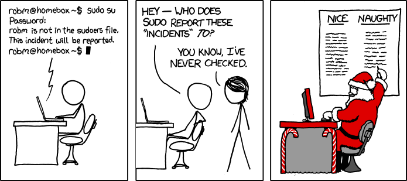
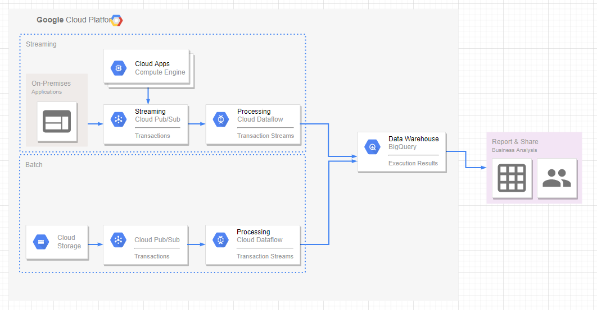
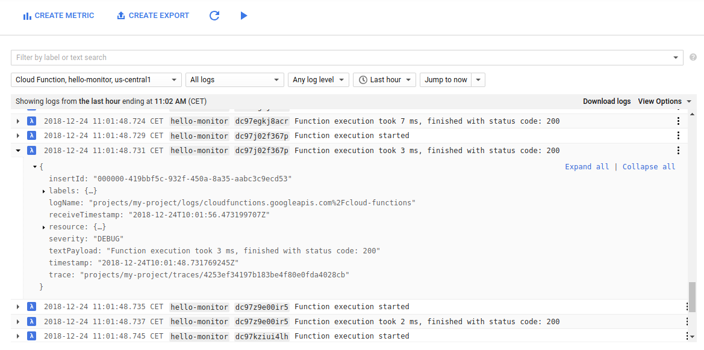
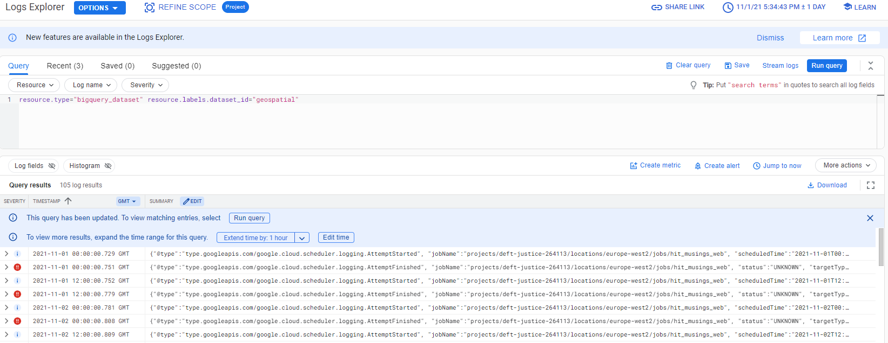
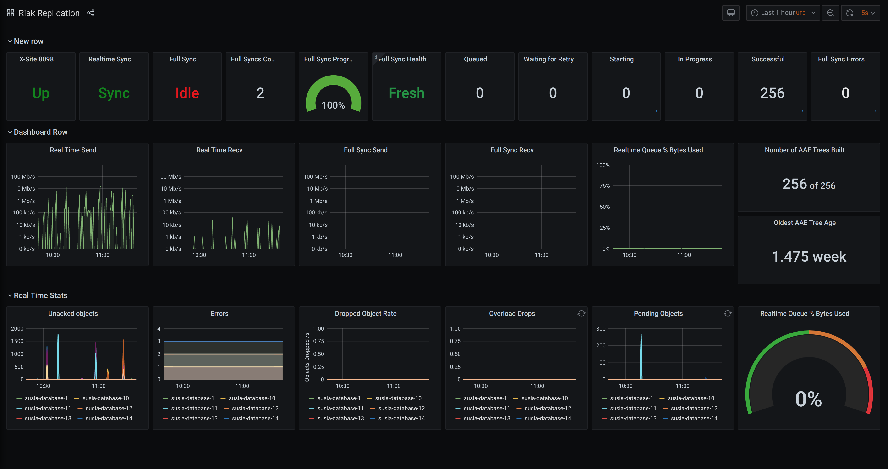
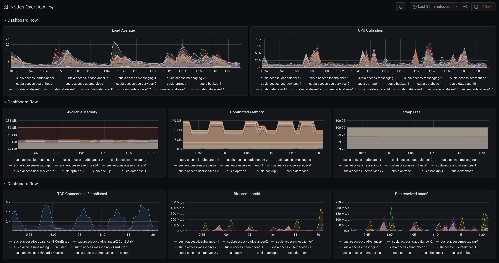

## Monitoring

---

### Overview

- What does software monitoring consist of?
- Why do we monitor software?
- Monitoring infrastructure
- Monitoring applications

---

### Learning Objectives

- Identify the features software monitoring
- Explain why and what we monitor
- Define logging and what logs are used for
- Detail the features of Cloud Monitoring and Grafana

---

### Monitoring our software

Monitoring software involves continuously examining a running system with two main aspects

1. Monitoring and measuring the performance of the system
2. Monitoring and auditing events that occur within the system

<!-- .element: class="centered" -->

---

### What do we track?

What kind of things do we track?

- Uptime
- Resource utilisation (CPU, memory, network)
- Performance (requests/s, ops/s)
- Errors
- Business KPIs
- User interactions

Notes:
These are several of things that we can monitor in a running system. Can you give any other examples of things we might track?

---

### Why do we monitor?

- To take action as soon as (or even before) things go wrong
- Understand actual application usage patterns
- Make more accurate business decisions
- Learn what normal looks like
- Assess the impact of our releases: performance degradation, regressions, downtime...
- Identify areas in our architecture to improve
- Make on-call work humanly possible

Notes:
Be proactive rather than reactive when it comes to managing the health of your application.
As full-stack, DevOps engineers deploying stuff to prod is only the beginning.
The service needs to be supported and managed afterwards. Identify pinch points. Also, on the release impact point, it allows us not only to smoke test our app post-release but also pre-release as we can deploy the same monitoring config to our test environments
Regression: a software bug that makes a feature stop functioning as intended after a certain event (e.g. system upgrade)

---

### What do we monitor?

- Infrastructure
- Applications
- Component interactions

Notes:
Component interaction monitoring is very important with distributed architectures, like micro-services. We won't talk about this one today, but this would be tools like X-Ray, Jaeger or service mesh built-ins, like istio & kali

---

### What can we monitor?

<!-- .element: class="centered" -->

Notes:
Point out components of this diagram that are worthwhile monitoring in some way: individual elements (hardware, infra), apps running in the EC2s and Lambdas, as well as communication channels (X-Ray, etc.)

---

## Monitoring Infrastructure

---

### Cloud Monitoring

Cloud monitoring is a monitoring and alerting managed service for GCP resources and offers the following:

- Service-level objectives (SLOs) monitoring for applications
- Alerts when SLO violations occur
- Log integration and Dashboards
- Alerts and system events

We will expand on Cloud Monitoring shortly.

---

### Alerting

Alerting gives timely awareness to problems in your cloud applications so you can resolve the problems quickly. It supports below notification channels.

- Email
- SMS
- Mobile app
- Pub/Sub
- PagerDuty
- Slack
- Webhooks

---

### Alerting - Concepts

Topic: In Cloud Monitoring, an alerting policy describes the circumstances under which you want to be alerted and how you want to be notified.

Subscription: Sets the receiver of a notification and also dictates how they'll receive it

---

## Monitoring applications

---

### Application Logs

A **log** is a message produced by a running application capturing some noteworthy information about its state or an event taking place at that point in time

Notes:
You can think of logs as your app's running journal

---

### Logging Levels

Logging statements are added at key areas of your codebase and can serve many different purposes

&#8505; Info: Document normal state changes in the app. They contain non-actionable information<!-- .element: style="color:green" -->

⚠ Warning: Non-fatal errors, the kind of events you can leave until the next morning<!-- .element: style="color:yellow" -->

🚨 Error: Fatal, the kind of events you'd be woken up in the middle of the night to resolve<!-- .element: style="color:red" -->

Notes:
Log Levels help to show how important an event is when you write your program.

When you write your programs, you may also use the DEBUG log level.

---

### What do we use logs for?

- Obtaining failure messages when our app crashes
- Tracing application flow
- Debugging our running application
- App health monitoring
- Timing stuff precisely

Notes:
Failure messages from your system can be generated by your log messages.

These can also be generated by the underlying system, if it encounters an error that you have not coded for.

---

### How do you log?

At it's simplest - write the message to stdout!

```py
# Python
try:
    div = 1 / 0
except Exception as e:
    print("ERROR: " + str(e))
```

---

### No, really, how do you log

Most languages now have logging libraries available.

These remove much of the boilerplate and setup required to produce manageable and standardised logs.

```py
# Import the built-in logging lib
import logging

# Create an app logger
logger = logging.getLogger(__name__)

try:
  div = 1 / 0
except Exception as e:
  # Log an exception, it will go to stdout by default
  logger.exception(e)
```

---

### Where do logs go?

By default all logs will be printed to stdout and stderr (usually terminal output) and will therefore disappear after a short while.

If we want to store our logs for future reference we need to send them to some persistent storage. eg. a file

```sh
# Redirect stdout to a file
$ python app.py > app.log

# Redirect stdout and stderr to a file
$ python app.py &> app.log
```

Notes:
stdout is useful if you are working directly on a program and want to know what is happening.

stdout is not useful for long running systems where hundreds or thousands of log messages can be generated every hour, especially if there was an issue last night and you're looking at it a day later.

---

### Writing Structured log

```py
import logging
import os

logging.basicConfig(filename = 'myapp.log',
                    level=os.environ.get("LOGLEVEL", "INFO"),
                    format = '%(asctime)s:%(name)s:%(levelname)s:%(message)s')
log = logging.getLogger("my_app")

log.debug('this is a debug message')
log.info('this is an info message')
log.error('this is an error message')
log.critical('this is a critical message')
```

Notes:
why structured? > query > log > metrics

---

### Downsides of log files

- Log files will keep growing if you keep logging
- Log files sent to stdout are only available on the server that produced them
- Log files are hard to search and query

Notes:
These are problems that occur when setting logs, although all of them have been solved. Can you come up with any ways in which that might have happened.

Growing logs - rotating logs by hour/day

Local log files - log shipping to other servers

Hard to search - formatted log files and log parsers.

---

## GCP Logs Explorer & Monitoring


---

### What are GCP Logs Explorer & Monitoring?

- It is a suite of products to provide logging, monitoring and advanced observability e.g. trace, debug and profiler.
- Allows you to monitor GCP Services in near-real-time.
- Most services are automatically configured to provide logs.
- Can also send your own application logs and custom metrics to Cloud Monitoring for observability.
- Keep track of your application performance, resource use, operational issues, and constraints.
- Helps organizations resolve technical issues and streamline operations.

---

### Cloud Monitoring

Cloud Monitoring provides metrics, visualisation (dashboard) and alerting features for your infrastructure and application.

Some of the features are provided by default and you can add custom parts by yourself.

---

### Cloud Logging

Cloud Logging can collate and store all of your logs and integrates with GCP buckets for archival, BigQuery for analytics and Pub/Sub for routing to third party.

Most of the services forward all logs automatically to Cloud Logging, where you'll be able to search and query them.

---

### Logs Example

<!-- .element: class="centered" height="350px" -->

---

### Cloud Monitoring Logs Simple Queries

Cloud Monitoring logs can be queried by filtering on specific parameters:

```sh
resource.type="cloud_function"
resource.labels.function_name="<your-function-name>"
severity=ERROR
```

- `severity` refers to the log level is set by your logger of choice. Examples include `Critical`, `Error`, `Warning`, `Info`, `Debug` or `Default`.
- `resource.type` refers to the Service/Application that raised the log.

You can also query by dates and other factors.

Notes:
Interactive Demo of the Cloud Logging Service

Cloud logging is the service for looking at infrastructure or application logs, and perhaps making a quick filter to look on them.

It enables you to interactively search and analyze your log data. You can perform queries to help you more efficiently and effectively respond to operational issues.

If an issue occurs, you can use logs to identify potential causes and validate deployed fixes.

The purpose-built query language is simple but powerful. There are sample queries, command descriptions, query autocompletion, and log field discovery to help you get started.

It also automatically discovers fields in logs for any application or custom log that emits log events as JSON.

---

### Query example

<!-- .element: class="centered" height="350px" -->

---

### Cloud Monitoring Metrics

Metrics are the fundamental concept in Cloud Monitoring. A metric represents a time-ordered set of data points that are published to Cloud Monitoring.

Think of a metric as a variable to monitor, and the data points as representing the values of that variable over time.

For example, the CPU utilisation of a particular VM instance is one metric provided by default. The data points themselves can come from any application or business activity from which you collect data.

---

### Monitoring GCP cloud functions

With Cloud Monitoring you can get a pre-built cloud functions monitoring dashboard and start tracking your function metrics.

Some of the core metrics that it gathers on cloud functions are:

- **Execution count**: The number of times your function is invoked.
- **Execution times**: How long your function runs.
- **Active Instances**: The number of functions that are currently running.
- **Network egress**: The amount of data transferred out during the function execution.
- **Memory usage**: The amount of memory used by the function during execution.

---

### Cloud Monitoring Alerts

An alert watches a single metric over a specified time period, and performs one or more specified actions, based on the value of the metric relative to a threshold over time.

You can use an alert to automatically initiate actions on your behalf.

The alert is a notification that can be sent to an email, sms or pager etc and/or is visible on a monitoring dashboard.

Alerts invoke actions for sustained state changes maintained for a specified duration. An example is a VM instance's CPU utilisation being over 90% for 5 minutes.

Alerts can also be triggered for a single data point if required

---

Speaking of monitoring dashboards...

---

## Grafana

<!-- .element: class="centered" -->

---

### What is Grafana?

Grafana is an open source monitoring dashboard application with lots of features which make it easy to use, and is both flexible very powerful!

It pulls in data from supported data sources to create dashboards including databases and Cloud Monitoring metrics.

Notes:
Grafana can pull in data from a wide range of sources and create dashboards from them.

---

### What does it look like? [demo](https://play.grafana.org/d/krY2rty7z/citibike-example-overview?orgId=1)

<!-- .element: class="centered" -->

---

### What does it look like? [demo](https://play.grafana.org/d/krY2rty7z/citibike-example-overview?orgId=1)

<!-- .element: class="centered" -->

---

### Running Grafana

Grafana can be run using a docker container to make life easier:

```sh
$ docker run -d -p 3000:3000 grafana/grafana
```

Then open a browser window on http://localhost:3000 to see the Grafana front page.

Notes:
Once the learners have opened the window, run the random data generation and display it in a dashboard.

The user/pass is admin/admin.

There is a later exercise to set up and use Grafana with the local TestDB.

---

### docker-compose

Or you can use a docker-compose.yml file for added configuration:

```yml
version: "2"
services:
  grafana:
    image: grafana/grafana:5.4.3
    ports:
      - "3000:3000"
    volumes:
      - grafana:/var/lib/grafana
volumes:
  grafana:
```

---

### Exercise prep

Instructor to distribute exercises from the `exercises/monitoring-exercises.pdf` file.

---

### Exercise part one - GCP

Do the _Cloud Logging_ and the _Cloud Monitoring_ sections from the `exercises/monitoring-exercises.pdf` file.

---

### Emoji Check:

How did you get on with the GCP sections?

1. 😢 Haven't a clue, please help!
2. 🙁 I'm starting to get it but need to go over some of it please
3. 😐 Ok. With a bit of help and practice, yes
4. 🙂 Yes, with team collaboration could try it
5. 😀 Yes, enough to start working on it collaboratively

Notes:
The phrasing is such that all answers invite collaborative effort, none require solo knowledge.

The 1-5 are looking at (a) understanding of content and (b) readiness to practice the thing being covered, so:

1. 😢 Haven't a clue what's being discussed, so I certainly can't start practising it (play MC Hammer song)
2. 🙁 I'm starting to get it but need more clarity before I'm ready to begin practising it with others
3. 😐 I understand enough to begin practising it with others in a really basic way
4. 🙂 I understand a majority of what's being discussed, and I feel ready to practice this with others and begin to deepen the practice
5. 😀 I understand all (or at the majority) of what's being discussed, and I feel ready to practice this in depth with others and explore more advanced areas of the content

---

### Exercise part two - Grafana

Do the _Grafana_ section from the `exercises/monitoring-exercises.pdf` file.

---

### Emoji Check:

How did you get on with the Grafana section?

1. 😢 Haven't a clue, please help!
2. 🙁 I'm starting to get it but need to go over some of it please
3. 😐 Ok. With a bit of help and practice, yes
4. 🙂 Yes, with team collaboration could try it
5. 😀 Yes, enough to start working on it collaboratively

Notes:
The phrasing is such that all answers invite collaborative effort, none require solo knowledge.

The 1-5 are looking at (a) understanding of content and (b) readiness to practice the thing being covered, so:

1. 😢 Haven't a clue what's being discussed, so I certainly can't start practising it (play MC Hammer song)
2. 🙁 I'm starting to get it but need more clarity before I'm ready to begin practising it with others
3. 😐 I understand enough to begin practising it with others in a really basic way
4. 🙂 I understand a majority of what's being discussed, and I feel ready to practice this with others and begin to deepen the practice
5. 😀 I understand all (or at the majority) of what's being discussed, and I feel ready to practice this in depth with others and explore more advanced areas of the content

---

### Overview - recap

- What does software monitoring consist of?
- Why do we monitor software?
- Monitoring infrastructure
- Monitoring applications

---

### Learning Objectives - recap

- Identify the features software monitoring
- Explain why and what we monitor
- Define logging and what logs are used for
- Detail the features of Cloud Monitoring and Grafana

---

## Further Reading and Credits

- [Cloud Monitoring Docs](https://cloud.google.com/monitoring)
- [Cloud Logging Docs](https://cloud.google.com/logging)
- [Cloud Monitoring - Query Builder](https://cloud.google.com/logging/docs/view/logs-viewer-interface#query-builder)
- [Grafana Docs](https://grafana.com/docs/)

---

### Emoji Check:

On a high level, do you think you understand the main concepts of this session? Say so if not!

1. 😢 Haven't a clue, please help!
2. 🙁 I'm starting to get it but need to go over some of it please
3. 😐 Ok. With a bit of help and practice, yes
4. 🙂 Yes, with team collaboration could try it
5. 😀 Yes, enough to start working on it collaboratively

Notes:
The phrasing is such that all answers invite collaborative effort, none require solo knowledge.

The 1-5 are looking at (a) understanding of content and (b) readiness to practice the thing being covered, so:

1. 😢 Haven't a clue what's being discussed, so I certainly can't start practising it (play MC Hammer song)
2. 🙁 I'm starting to get it but need more clarity before I'm ready to begin practising it with others
3. 😐 I understand enough to begin practising it with others in a really basic way
4. 🙂 I understand a majority of what's being discussed, and I feel ready to practice this with others and begin to deepen the practice
5. 😀 I understand all (or at the majority) of what's being discussed, and I feel ready to practice this in depth with others and explore more advanced areas of the content
