## Message Queues

---

### Overview

- Messaging Queues
- Event Driven Design
- Pub/Sub Model

---

### Learning Objectives

- Understand what a Pub/Sub
- Understand how system design can change to utilise queues
- Understand the pub/sub model, and its use cases
- Publish a message to a Pub/Sub topic and retrieve the message

Notes:
You can implement Queues in our final project

Aa a data engineer, know the basics

The scope of your project is small and maybe it does not need a queue, but it will be a good practice

Where? How? > your challenge

---

### Modern Apps

<!-- .element: class="centered" -->

Notes:
When you are creating modern app in cloud there are three main pillars:

- compute: ec2, lambda, ...
- Database: rds, ...
- Messaging

Messaging is the topic of today and it's some kind of Glue that connects the pieces together, when we are talking about messaging the most important thing is the message itself, let's see.

---

### What is a message?

- The data transported between the sender and the receiver application. It could be:
    - A binary blob
    - Encoded data (e.g. JSON/XML etc.)
    - Could include different attributes (key/values)

Notes:
'Message' is a broad definition - it can refer generally to any data sent between a sending and receiving service (or a 'producing' and 'consuming' service).

message in it's essence is any data that goes from A to B!

BLOB stands for a “Binary Large Object,” a data type that stores binary data. Binary Large Objects (BLOBs) can be complex files like images or videos, unlike other data strings that only store letters and numbers.

A BLOB will hold multimedia objects to add to a database; however, not all databases support BLOB storage. Because of their complex nature, BLOBs will also not be easily readable by most databases. These file types are better comprehended by humans instead of software. The complexity of a BLOB both gives it its value, but also can make it difficult to utilise.

---

### What is a message queue?

Conceptually you can think of them in the same way as a physical queue where in most cases the items in the queue are processed in the order they joined.


Notes:
Queue is a durable buffer for our messages.

A message queue is a form of asynchronous service-to-service communication used in serverless and microservices architectures.

Messages are stored on the queue until they are **processed** and **deleted**. (implementation hint: Acknowledge)

Each message is processed only once, by a single consumer.

producer (publisher) vs. consumer (subscriber)

Message queues can be used to decouple heavyweight processing, to buffer or batch work, and to smooth spiky workloads.

A producing service will send a message to a queue, where it will 'wait' to be consumed by a consuming service. Additional messages may be sent while the first message is still waiting, and they will queue up behind it. Usually, once the first message has been consumed, it will be removed from the queue, and the next message moves to the 'front' of the queue to be consumed.

---

### Producer and Consumer Pattern

A Producer creates a message and puts it on a queue


...and a Consumer takes messages off the queue to process

Notes:

Types of message queues

- Point-to-Point (sender > potential-receiver)
- Publish/Subscribe

Messages are stored on the queue until they are processed and deleted. Usually message should be processed only once to maintain data integrity.

A message queue provides a lightweight buffer which temporarily stores messages, and endpoints that allow software components to connect to the queue in order to send and receive messages

---

### Producer and Consumer Pattern

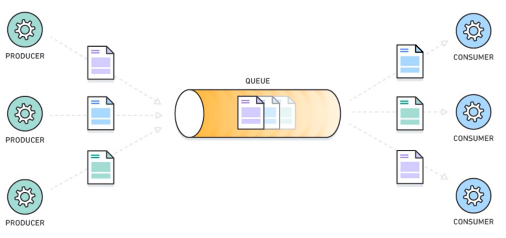

Notes:
Many producers and consumers can use the queue, but each message is processed only once, by a single consumer. For this reason, this messaging pattern is often called one-to-one, or point-to-point, communications. When a message needs to be processed by more than one consumer, message queues can be combined with Pub/Sub messaging in a fanout design pattern

---

### Practice `code-along`

Create a python class named `Queue` and the following methods - keep FIFO (First In, First Out) principle in mind

```py
class Queue:
    def __init__(self):
        self.items = []

    def produce(self, value):
        pass

    def consume(self):
        pass
```

Notes:
Do not use any library

---

### Practice `code-along`

Usage:

```py
my_queue = Queue()
my_queue.produce(5)
my_queue.produce(8)

print(my_queue.consume()) # 5
print(my_queue.consume()) # 8
print(my_queue.consume()) # None
```

Notes:
Do not use any library

---

### Why do we use them?

We now know what a message and a queue are, but why are they useful?

- Indirect one way communication
- Process-intensive applications can be decoupled to prevent impact on other services
- Easier to replace services without changing dependent services

Notes:

indirect one-way communication channel between the Consumer and Producer. This can be especially useful for **decoupling heavyweight processing application** to prevent them impacting other applications in the system.

decoupling: as a producer I don't care which service is going to use this data, as a consumer I don't care who created this data

This makes it much easier to totally replace components in a system without having to amend its dependencies.

A > queue > B

A out of service

C > queue > B

B didn't even noticed (we do not change anything in B config)

Queue: help us create services **modular**

---

### Service Decoupling

Service A does not need to know anything about Service B and likewise for Service B

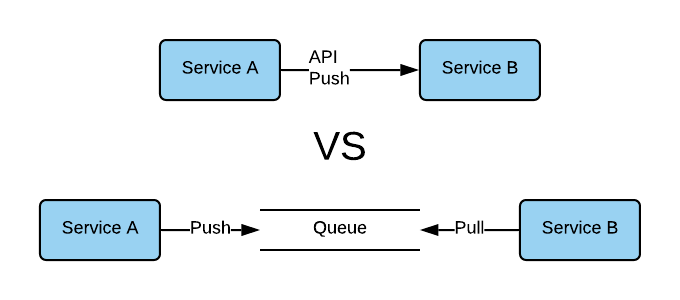<!-- .element: class="centered" -->

Decoupled service-to-service communication makes it simpler to replace components without requiring changes to other
components.

Notes:
If Service A pushes to Service B directly - it needs to route to the correct endpoint, use proper protocols, headers etc.

Where we use a queue instead - Service A can send a message to the queue without having to know about these things.
Service B can also consume the message from the queue without having any real knowledge of Service A.

In practice, it makes sense to maintain the contract between services even with a queue in the middle. If Service A
changes the structure of the messages it sends to the queue, Service B will still consume these, but may not be able to
process them. So the consuming Service should have some knowledge of the message format being sent by the producing
service. Testing can help to make sure both stay in sync.

This design also makes it much easier to replace components - you could replace Service A with a completely new service
that sends a similarly formatted message to the queue, and Service B would never even notice.

---

### Quiz Time! 🤓

---

**Which of the following would be a valid message to send as a topic?**

1. `"I am a message!"`
1. `{"date": "01/01/2021", "content": "I am a message!"}`
1. `11011000 10101101 10001101 100110001`
1. `All of the above`

Answer: `4`<!-- .element: class="fragment" -->

---

**A Publisher will...**

1. Send a messages to a topic
1. Take a message from a topic
1. Both of the above
1. Neither of the above

Answer: `1`<!-- .element: class="fragment" -->

---

**A Subscriber will...**

1. Send a messages to a topic
1. Take a message from a topic
1. Both of the above
1. Neither of the above

Answer: `2`<!-- .element: class="fragment" -->

---

### What is Google Pub/Sub?

Google Cloud Pub/Sub, which stands for Publisher/Subscriber, is designed to provide reliable, asynchronous messaging
between applications

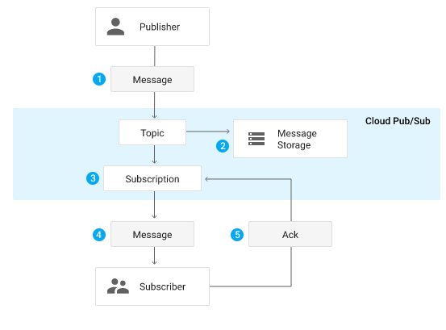<!-- .element: class="centered" -->

Notes:

Pub/Sub consists of two services

- Pub/Sub service: It offers the highest reliability and largest set of integrations
- Pub/Sub Lite service: A separate but similar messaging service built for low cost

---

### Pub/Sub Core concepts

- **Topic:** A named resource to which messages are sent by publishers
- **Subscription:** A named resource representing the stream of messages from a single, specific topic, to be delivered
  to the subscribing application
- **Message:** The combination of data and (optional) attributes that a publisher sends to a topic and is eventually
  delivered to subscribers
- **Message attribute:** A key-value pair that a publisher can define for a message

---

### Pub/Sub Core concepts

- **Publisher:** An application that creates and sends messages to a topic(s)
- **Subscriber:** An application with a subscription to a topic(s) to receive messages from it
- **Acknowledgement (or "ack"):** A signal sent by a subscriber to Pub/Sub after it has received a message successfully.

Notes:
Messages are stored on the message storage until they are processed and deleted or reached its retention period which is maximum of 7days.</br>
Usually message should be processed only once to maintain data integrity.

---

### Publisher-subscriber relationships Pattern

- One-to-One
- One-to-Many (fan-out)
- Many-to-One (fan-in)
- Many-to-Many

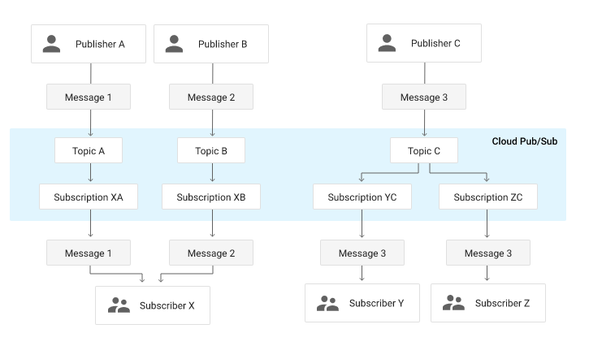<!-- .element: class="centered" height="300px" -->

Notes:
Messages can be delivered either as push or pull method - we shall discuss more later

---

### Key Features of Pub/Sub

- At least once delivery
- No provisioning
- Scale responsively and automatically
- Support multi-cloud and hybrid applications on open architecture
- Globally by default
- Open API

---

### When to use Pub/Sub?

We now know what Pub/Sub is, but when are they commonly used?

- Ingestion of user interaction and server events
- Real-time event distribution
- Replicating data among databases
- Parallel processing and Asynchronous workflows
- Data streaming from IoT devices
- Refreshing distributed caches
- Load balancing for reliability

Notes:
Pub/Sub is intended for service-to-service communication. This can be especially useful for decoupling processing applications to prevent them impacting other applications in the system.

This makes it much easier to totally replace components in a system without having to amend its dependencies.

---

### Emoji Check:

Do the hight level ideas of Pub/Sub start to make more sense now?

1. 😢 Haven't a clue, please help!
2. 🙁 I'm starting to get it but need to go over some of it please
3. 😐 Ok. With a bit of help and practice, yes
4. 🙂 Yes, with team collaboration could try it
5. 😀 Yes, enough to start working on it collaboratively

Notes:
The phrasing is such that all answers invite collaborative effort, none require solo knowledge.

The 1-5 are looking at (a) understanding of content and (b) readiness to practice the thing being covered, so:

1. 😢 Haven't a clue what's being discussed, so I certainly can't start practising it (play MC Hammer song)
2. 🙁 I'm starting to get it but need more clarity before I'm ready to begin practising it with others
3. 😐 I understand enough to begin practising it with others in a really basic way
4. 🙂 I understand a majority of what's being discussed, and I feel ready to practice this with others and begin to deepen the practice
5. 😀 I understand all (or at the majority) of what's being discussed, and I feel ready to practice this in depth with others and explore more advanced areas of the content

---

### Let's have some hands on

- We will use the GCP console
- We'll create a topic
- Add a Subscription
- We'll publish a message to the topic
- And we'll pull the message from the subscription

---

### Demo `one-to-one` Pub-Sub

> Publish and then consume messages with a pull subscriber

_First the instructor will demo the task, then you can code-along on the following slides._

Notes:
Go to the console and Demo Exercise 1 "Basic Messaging App" to the class. Once complete give them an opportunity to do it themselves (see following slides).

- You can use the `solutions/gcp-07-pub-sub-session` folder as an example
- The code is also at [JLR-DE-Academy/gcp-07-pub-sub-session](https://github.com/JLR-DE-Academy/gcp-07-pub-sub-session)

---

### Go to GCP console

Navigate to the Pub/Sub product from the menu

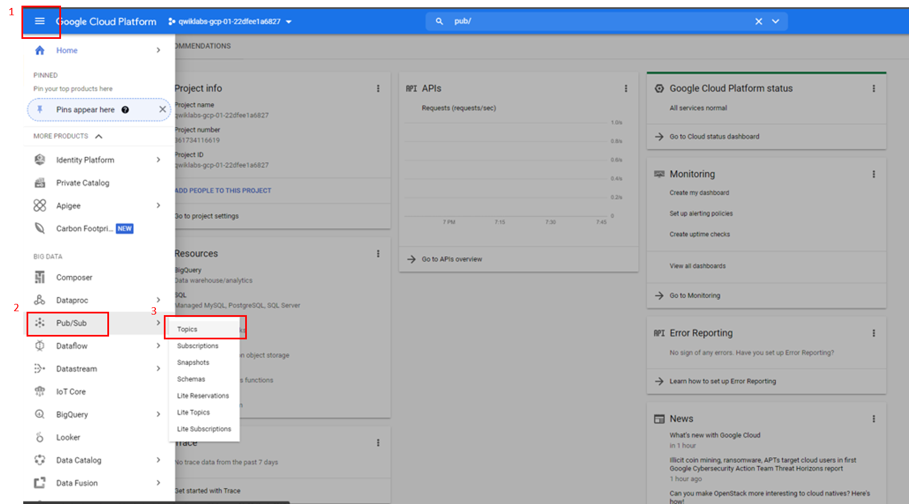<!-- .element: class="centered" height="300px" -->

---

### Create a Topic

On the Pub/Sub topics page, Click **Create a topic**

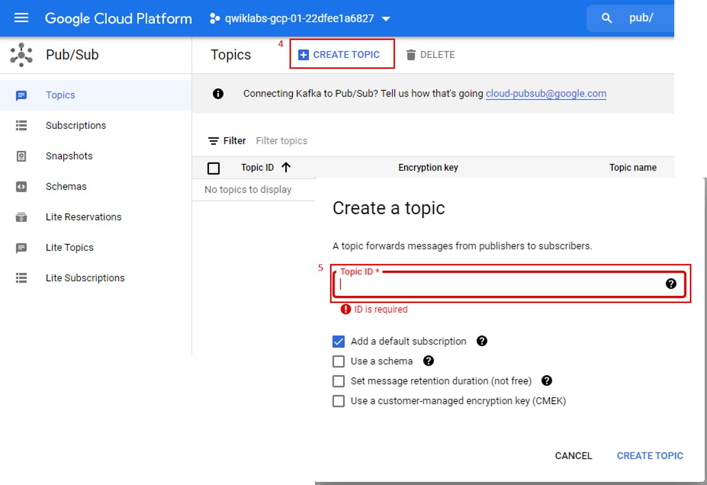<!-- .element: class="centered" height="300px" -->

- In the **Topic ID** field, provide a unique _topic name_, for example, `temp-2022-jlr-de-topic-<your-name>`
- **Uncheck** the Add a default subscription item
- Click **CREATE TOPIC**

---

### Add a subscription

Once created, you will be in your topic view, if not navigate to your topic from the topics list.

In the subscriptions tab -> **Create subscription**

In the **Add subscription** to topic dialog

- Type a name for the subscription, such as `temp-2022-jlr-de-subscription-<your-name>`
- Set the Delivery Type to **Pull**
- Leave all other options at the default values

Click **Create**

Your subscription should be listed in the Subscription list

Notes:
A topic can have multiple subscriptions, but a given subscription belongs to a single topic

---

### Publish a message to the topic

At the bottom of the **Topics details** page, click **MESSAGES** tab and then click **PUBLISH MESSAGE**

Enter _Hello World_ in the **Message** field and click **Publish**

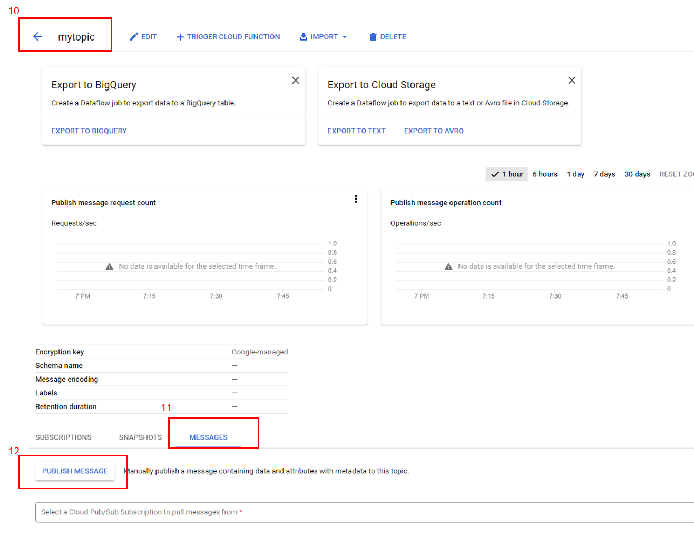<!-- .element: class="centered" height="350px" -->

---

### View the message

On the subscription Page

Click on **your subscription**, click **Messages** and then click **Pull**

If **Enable ack message** is checked, the pull message send acknowledgement to the subscription

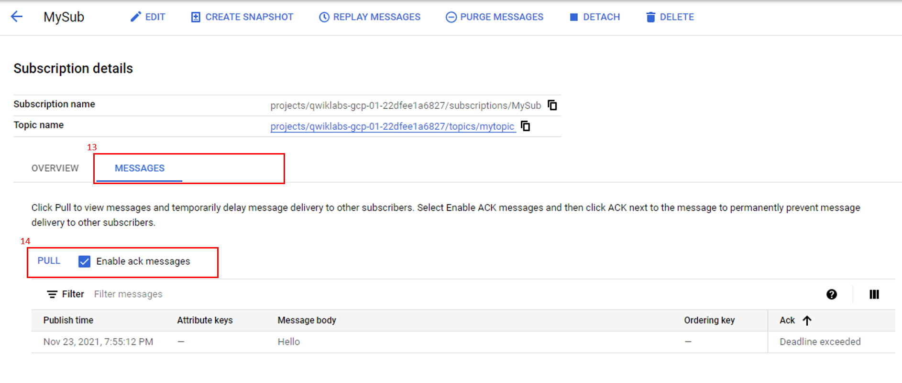<!-- .element: class="centered" height="300px" -->

---

### Demo - publish using python `code along`

Sample code is [here for GCP](https://cloud.google.com/pubsub/docs/publish-receive-messages-client-library#pubsub-client-libraries-python)

```py
from google.cloud import pubsub_v1

# TODO (change it to yours)
project_id = "jlr-dl-cat-training"
topic_id = "temp-2022-jlr-de-topic-<your-name>"

publisher = pubsub_v1.PublisherClient()
topic_path = publisher.topic_path(project_id, topic_id)

for n in range(1, 10):
    data_str = f"Message number {n}"
    # Data must be a bytestring
    data = data_str.encode("utf-8")
    # When you publish a message, the client returns a future.
    # to learn more visit https://docs.python.org/3/library/asyncio-future.html
    future = publisher.publish(topic_path, data)
    print(future.result())

print(f"Published messages to {topic_path}.")
```

---

### Demo - subscribe using python `code along`

Sample code is [here for GCP](https://cloud.google.com/pubsub/docs/publish-receive-messages-client-library#pubsub-client-libraries-python)

subscriber app

```py
from concurrent.futures import TimeoutError
from google.cloud import pubsub_v1

# TODO(developer)
project_id = "jlr-dl-cat-training"
subscription_id = "temp-2022-jlr-de-subscription-<your-name>"
timeout = 5.0
subscriber = pubsub_v1.SubscriberClient()
subscription_path = subscriber.subscription_path(project_id, subscription_id)

def callback(message: pubsub_v1.subscriber.message.Message) -> None:
    print(f"Received {message}.")
    message.ack()

streaming_pull_future = subscriber.subscribe(subscription_path, callback=callback)
print(f"Listening for messages on {subscription_path}..\n")

with subscriber:
    try:
        streaming_pull_future.result(timeout=timeout)
    except TimeoutError:
        streaming_pull_future.cancel()
        streaming_pull_future.result()

```

---

### Understanding Key concept about Pub/Sub?

---

## At-Least-Once delivery

Pub/Sub delivers each published message at least once for every subscription, however there are some exceptions to this at-least-once behavior.

Notes:

- a message is deleted if undelivered within the maximum retention time of 7 days
- A messages published before a given subscription will usually not be delivered
- Pub/Sub will repeatedly attempt to deliver any message that has not been acknowledged
- Pub/Sub tries not to deliver it to any other subscriber on the same subscription, while message is outstanding
- A message is considered outstanding once it has been sent out for delivery and before a subscriber acknowledges it.

Note that you can configure message retention duration (the range is from **10 minutes** to **7 days**)
... ackDeadline -_Limited time to acknowledge the outstanding message_- can also be configured

---

## Pull or push delivery

A subscription can use either the pull or push mechanism for message delivery. Pull is on default, however the mechanism can be configured at any time.

Pull subscription Push subscription

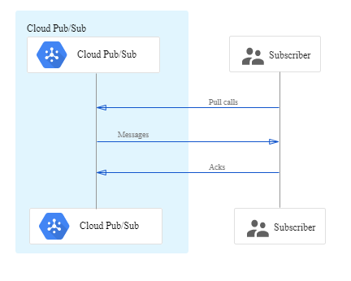<!-- .element: class="Left" height="300px" -->
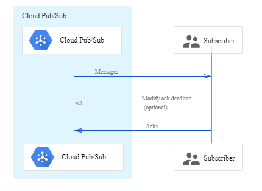<!-- .element: class="Right" height="300px" -->

---

## Choosing Appropriate Delivery

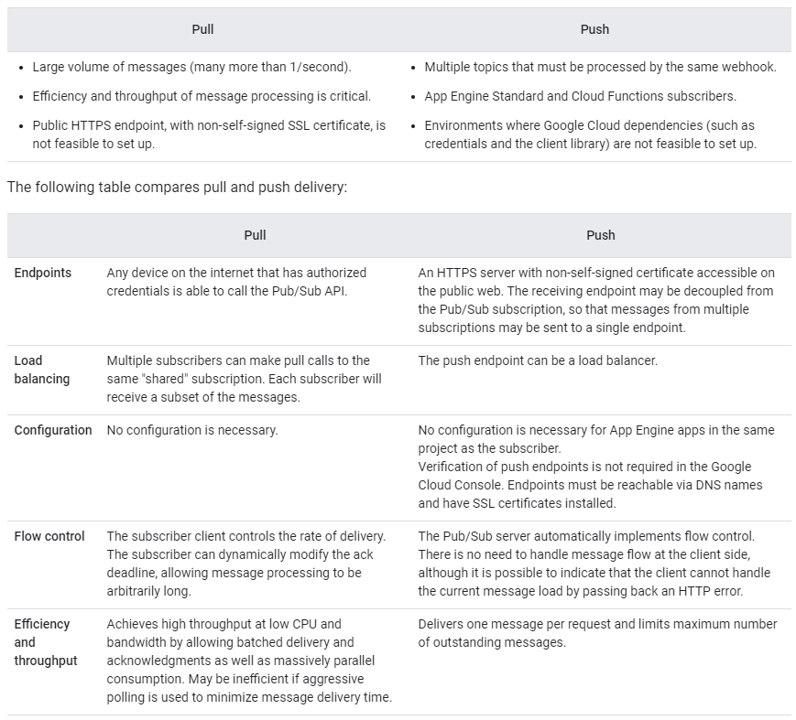<!-- .element: class="centered" -->

Notes:

Depending on the demands on the system, you can scale the number of Consumers and Producers independently. These can grow and shrink as the workload requires.

---

### Handling message failure

What happens if the message cannot be processed?

Pub/Sub handles message failures by setting a subscription retry policy or forwarding undelivered messages to a
dead-letter topic

Notes:

- Pub/Sub will retry sending the message. By default, Pub/Sub will try resending the message immediately

- With _exponential backoff_ configured, after the first delivery failure, Pub/Sub will wait for a minimum backoff time before retrying
- Maximum and minimum delay backoff intervals can be configured (between 0 and 600sec)
- After the maximum retry, it can be forwarded to dead-letter topic if configured

Dead-letter topics option is available when creating/updating subscription with delivery attempt set between 5 and 100

---

### Replaying and Purging messages

By default, a Pub/Sub topic discards messages as soon as they are acknowledged by all subscriptions attached to the
topic. To seek back in time to alter the acknowledgement state of a message in bulk, with message retention on the topic
or configuring subscription to retain acknowledged messages.

We can;

- Seek to a timestamp
- Seek to a snapshot

Notes:
Example use cases of seeking: Recovering from an unexpected subscriber problems, in cases where subscriber problems are
not associated with a specific deployment event, you might not have a relevant snapshot. In this case, if you have
enabled acknowledged message retention for a subscription, seeking to a time in the past gives you a way to recover from
the error

---

### Idempotency/Duplication

Duplicate messages could occur in cases of, for example, where a temporary issue prevents a message being properly
accepted by the subscriber, and if there is a retry policy set then a second message is later sent. Then, for whatever
reason, the original message is successfully accepted.

Notes:
Touch briefly on idea of idempotency - certain requests are idempotent in that having them execute multiple times has
the same results, while some do not (consider a GEt vs POST request). If a message is processed multiple times and the
outcome is a non-idempotent operation

To remediate this, Dataflow can be used to stop both deduplicate and idempotency messages

```sh
Dataflow is a managed cloud-based data processing service on GCP used for both batch and real-time data streaming applications
```

---

### Pub/Sub Lite

A separate but similar messaging service built for low cost. It offers zonal storage and requires you to pre-provision and manage storage and throughput capacity.

---

## Pub/Sub Vs Pub/Sub Lite

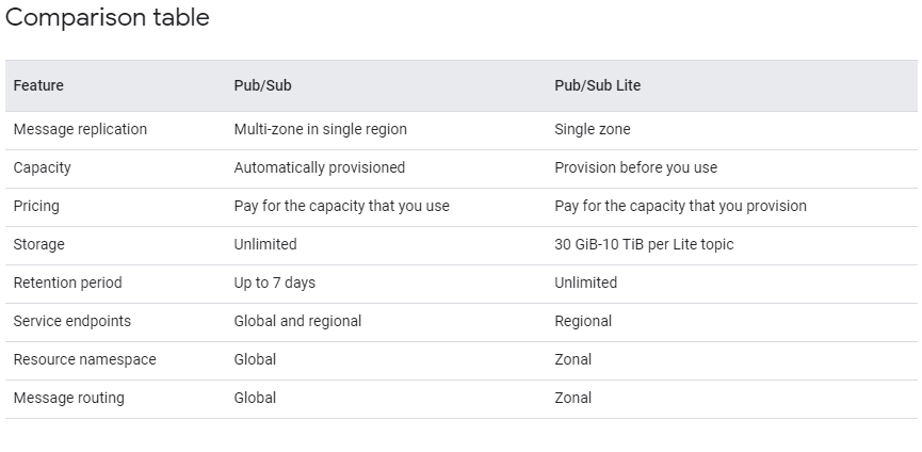

---

### All supported client Libraries

- C++
- C#
- Go
- Java
- Node.js
- PHP
- Python
- Ruby

---

### Pub/Sub Exercise

Basic Messaging App

For every group (based on microsoft teams room number), let's create a many-to-many pub/sub messaging app:

- Question 1: How many topics is needed for every group/member?
- Question 2: How many subscriptions is needed for every group/member?
- If someone sends a message to the group's topic, everyone should be able to see it.
- Use python to publish and subscribe messages.

---

### Emoji Check:

How did you get on with the exercise?

1. 😢 Haven't a clue, please help!
2. 🙁 I'm starting to get it but need to go over some of it please
3. 😐 Ok. With a bit of help and practice, yes
4. 🙂 Yes, with team collaboration could try it
5. 😀 Yes, enough to start working on it collaboratively

Notes:
The phrasing is such that all answers invite collaborative effort, none require solo knowledge.

The 1-5 are looking at (a) understanding of content and (b) readiness to practice the thing being covered, so:

1. 😢 Haven't a clue what's being discussed, so I certainly can't start practising it (play MC Hammer song)
2. 🙁 I'm starting to get it but need more clarity before I'm ready to begin practising it with others
3. 😐 I understand enough to begin practising it with others in a really basic way
4. 🙂 I understand a majority of what's being discussed, and I feel ready to practice this with others and begin to deepen the practice
5. 😀 I understand all (or at the majority) of what's being discussed, and I feel ready to practice this in depth with others and explore more advanced areas of the content

---

### Terms and Definitions - recap

**Message**: A broad term for data passed between services.

**Publisher**: Service that creates and sends messages to a topic

**Subscriber**: service with a subscription to a topic to receive messages from it

**Decoupling**: removing dependencies between services, e.g. by using a Pub/Sub

**Fault Tolerance**: A system's ability to gracefully handle and recover from failure of a component

**Dead-letter topic**: A topic where you can send messages that couldn't be processed

---

### Overview - recap

- Messaging Queues
- Event Driven Design
- Pub/Sub Model

---

### Learning Objectives - recap

- Understand what a Pub/Sub
- Understand how system design can change to utilise queues
- Understand the pub/sub model, and its use cases
- Publish a message to a Pub/Sub topic and retrieve the message

Notes:
You can implement Queues in our final project

Aa a data engineer, know the basics

The scope of your project is small and maybe it does not need a queue, but it will be a good practice

Where? How? > your challenge

---

## Further Reading

- [Intro to Pub/Sub](https://cloud.google.com/pubsub/docs/overview)
 -[Google Cloud Pub/Sub Ordered Delivery](https://medium.com/google-cloud/google-cloud-pub-sub-ordered-delivery-1e4181f60bc8)
- [PubSub message filter](https://medium.com/google-cloud/pubsub-message-filter-small-feature-for-big-improvements-3d2d690b94a2)
- [Google Pub/Sub Lite for Kafka Users](https://medium.com/google-cloud/google-pub-sub-lite-for-kafka-users-dec8a7cfc5e5)
 -[YouTube Pub/Sub Made Easy](https://www.youtube.com/hashtag/pubsubmadeeasy)

---

### Emoji Check:

On a high level, do you think you understand the main concepts of this session? Say so if not!

1. 😢 Haven't a clue, please help!
2. 🙁 I'm starting to get it but need to go over some of it please
3. 😐 Ok. With a bit of help and practice, yes
4. 🙂 Yes, with team collaboration could try it
5. 😀 Yes, enough to start working on it collaboratively

Notes:
The phrasing is such that all answers invite collaborative effort, none require solo knowledge.

The 1-5 are looking at (a) understanding of content and (b) readiness to practice the thing being covered, so:

1. 😢 Haven't a clue what's being discussed, so I certainly can't start practising it (play MC Hammer song)
2. 🙁 I'm starting to get it but need more clarity before I'm ready to begin practising it with others
3. 😐 I understand enough to begin practising it with others in a really basic way
4. 🙂 I understand a majority of what's being discussed, and I feel ready to practice this with others and begin to deepen the practice
5. 😀 I understand all (or at the majority) of what's being discussed, and I feel ready to practice this in depth with others and explore more advanced areas of the content
