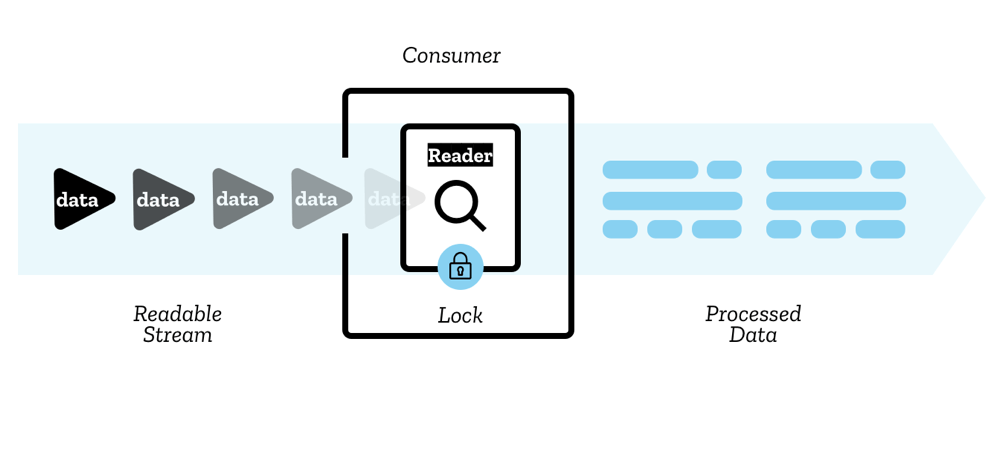
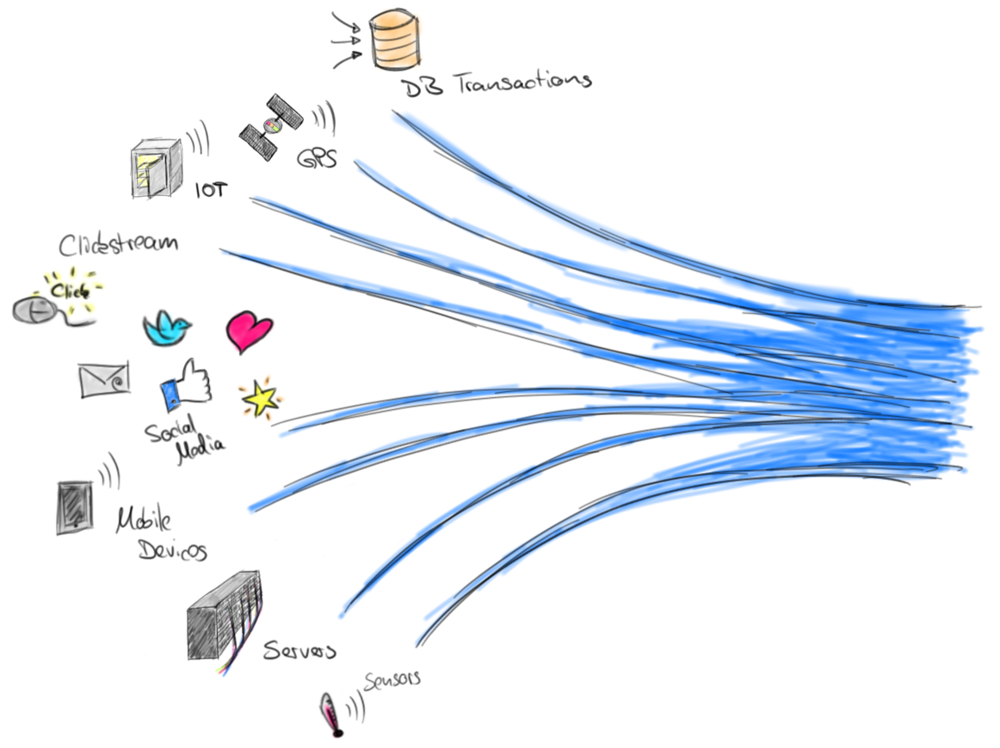
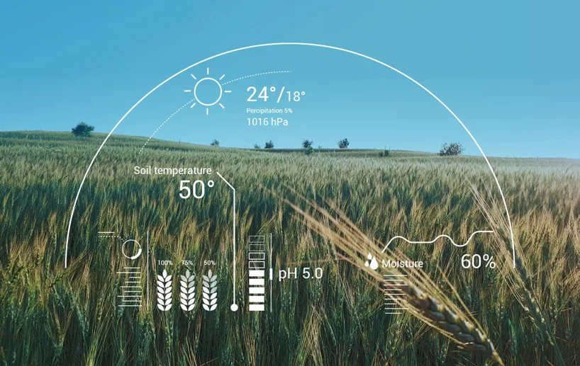
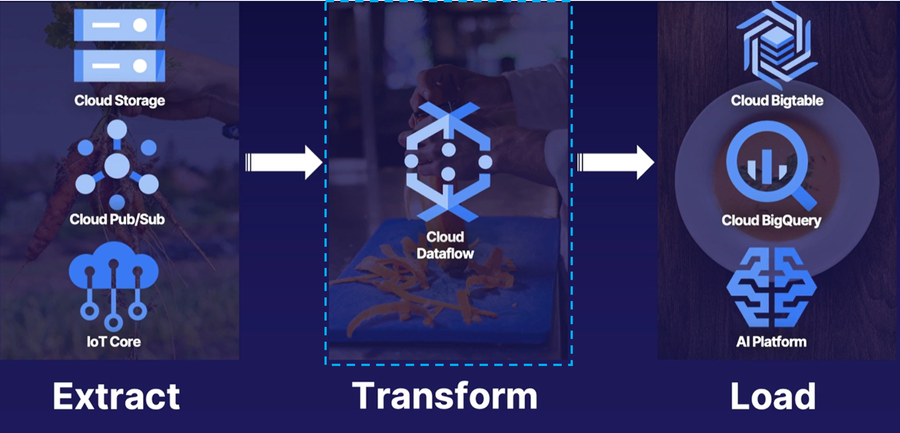
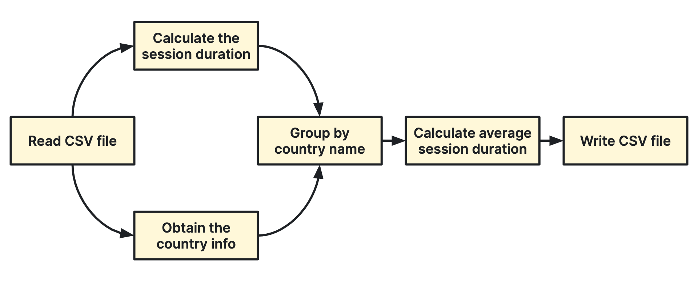

## Data Streams

---

### Overview

- Streamed data and sources
- Streaming data vs batch processing
- Challenges with streaming data
- GCP dataflow

---

### Learning Objectives

- Gain an understanding of what streamed data is
- Appreciate cases where use of streamed data may be appropriate
- Identify similarities and differences between stream processing and batch processing
- Discover the challenges of working with streaming data
- Gain a basic understanding of dataflow

---

### What is streamed data?

<!-- .element: class="centered" -->

- Data that is generated continuously, usually from a number of sources
- Often many data records created simultaneously
- Generally data is small in size, often just a few kilobytes

---

### What does a data stream look like?

<!-- .element: class="centered" -->

Data is sent in lots of smaller chunks which may be put together into a readable result at the destination, or processed
in individual chunks.

---

### What is data streaming?

Using data streaming, we process the incoming data on a record-by-record basis, or over a sliding time window.

Notes:
Now that we have an idea what a data stream is, we introduce the term 'data streaming' which describes how we process streamed data.

Broadly, when we employ data streaming, we are processing the data points in real-time, as we receive them. They can be
processed as individual data points, or something aggregated with others in a moving time window.

The concept is relatively simple, but at this point you might wonder why you would do this. Throughout this module we
will see some use cases for data streaming, as well as some of the advantages and challenges inherent to data streaming.

---

### Data Sources

<!-- .element: class="centered" -->

Here are some examples of sources of data streams.

> Can you think of any others?

Notes:
Here we have an illustration showing some examples of data sources from which we might received streaming data. As you can see, it is a wide range of potential sources.

In the image, all of the individual streams coalesce into one larger stream of data. In reality, this may or may not be
the case. Depending on how you want to do data streaming, you could process each individual source separately, or
process an entire stream of different sources at once. Each individual use case will require a different approach.

---

### Data Sources

- Purchases
- Financial trades
- IoT device telemetry
- Gaming
- Machinery sensors
- Log files

Notes:
Instructor can expand on some of the above with more details:

- An e-commerce site tracks purchases in real-time to manage stock and potentially special offers
- A financial institution tracks changes in the stock market in real time, computes value-at-risk, and automatically
  re-balances portfolios based on stock price movements
- An online gaming company collects streaming data about player-game interactions, and feeds the data into its gaming
  platform.
- Sensors in transportation vehicles, industrial equipment, and farm machinery send data to a streaming application. The
  application monitors performance, detects any potential defects in advance, and places a spare part order
  automatically
- A fintech company constantly processes log files to look for potential indicators of fraud

---

### Why do we use data streams?

- Near-real-time processing
- Concurrent application patterns with "fan out" architecture
- Quick feedback cycles
- Processing can be distributed and doesn't require a single powerful machine
- New algorithms can be added without affecting existing performance
- Many technology offerings can "micro batch" data

Notes:

- Near-real-time processing - data is processed as it is received, and whatever output comes from the processing is also updated rapidly
- Concurrent application patterns with 'fan out' architecture - allows processing of data from multiple sources concurrently, and also output to multiple 'sinks' (storage)
- Quick feedback cycle - processing and output happens with very low latency, allows for speedy intervention as required.
- Processing can be distributed - in fact in many cases, given the amount of data and variety of sources involved in data stream processing, it can be strongly recommended to use distributed processing so that the load is spread across multiple machines
- New algorithms can be added - the atomic nature of analysis makes it easier to expand functionality, versus if huge chunks of data are analysed at once

---

### Data Streaming vs Batch Processing

What is batch processing?

We process data in 'blocks' which have already been stored.

Example - a retail company stores records of all transactions, then does some weekly processing of all transactions made
by customers in the past week. At this point, the data could be millions of records, and is all processed as one batch.

---

### Data Streaming vs Batch Processing

How do data streaming and batch processing compare?

<!-- .element: class="centered" -->

---

### So batch may be more effective when...

- You want to process a whole data set anyway. Perhaps looking at yesterdays shopping data...
- There really isn't any time pressure
- Very complex algorithms are required

---

### Quiz Time! 🤓

---

ACME bank wants to conduct a detailed analysis of customer transactions which happened in the last year, utilising a
large number of factors to design improvements to its mobile application. Which approach to data processing may be more
suitable here?

1. Stream Processing
1. Batch Processing

Answer: `2`<!-- .element: class="fragment" -->

Notes:
Key here is the volume of data and the complexity of the analysis.

---

The investment arm of ACME bank needs to process the last week of data relating to performance of its investments. This
was a request from the taxman, who needs to see some output in 2 months' time. Which approach to data processing may be
more suitable here?

1. Stream Processing
1. Batch Processing

Answer: `2`<!-- .element: class="fragment" -->

Notes:
While it is much lower volume than the previous question, the key here is that they don't need any real-time output due to the relaxed deadline, so batch processing still probably a good approach.

---

ACME bank has a serious commitment to protecting its customers from identity theft. It wants to process transaction data
to instantly identify suspicious transactions, and freeze a user's account until the bank has had a chance to call them.
Which approach to data processing may be more suitable here?

1. Stream Processing
1. Batch Processing

Answer: `1`<!-- .element: class="fragment" -->

Notes:
Key here is the requirement to process the data in real-time.

---

### An Example

Have a look at the below image - what data sources could be involved here, and and how is the data being used?

<!-- .element: class="centered" -->

Notes:
Might be worth asking a few questions to learners here to open discussion and get them thinking about a real-world application of data streaming.

Perhaps first ask what are the various things being measured? Answers could include - moisture, acidity, soil temp, air
temp, precipitation, air pressure.

Also worth asking what are the likely sources of data here - answers may include various sensors being used to measure
moisture or acidity. What about the air temperature and pressure - perhaps another stream of weather data is being
pulled.

A further question might be why this is being done? If I am a farmer, what are the things I might want to be alerted
about? Perhaps if soil acidity gets too high my wheat will grow slower, or if moisture drops too low, the crop might
wither.

---

### An Example

- Sensors in agricultural fields send data to a streaming application
- The application monitors levels of environment data over windows of time such as hourly, daily, weekly and monthly
- It detects any degradation in factors such as nitrogen levels benchmarked against older data
- When this happens the farmer is notified and nitrogen supplicants are ordered ready for dispersion

---

### Challenges with Streaming Data

Streaming data processing requires two layers: a storage layer and a processing layer.

Notes:
At a high level, architecture for data streaming can be boiled down to two layers sitting between the data sources and the eventual destination - these are the processing layer and the storage layer. There are some considerations that need to be taken in designing each layer, however, to optimise how the data streaming system operates.

---

### Storage Layer

We want to ensure that our storage layer can **support record ordering** and that it provides **strong consistency**

With this in mind we need to decide how to store our data in order to enable fast, inexpensive, and replayable read/write of large streams of data.

Notes:
Record ordering is important mainly because when we are processing near real-time, order matters. If we want to replay the data points in a stream, we will want to preserve this ordering.

Strong consistency reflects the notion that at a given time, the system reflects all inputs that have happened up to that time. So any views or queries made to the data will always consistently reflect and return all relevant data at that time. This is in contrast to eventual consistency, which only guarantees that a system will eventually reflect all updated data. Strong consistency comes at a cost of scalability, performance and expense

---

### Processing Layer

The processing layer...

- consumes data from the storage layer
- carries out required operations on the data
- may persist data again in various locations
- may instruct the storage layer to delete data which is no longer needed

---

### Stream architecture

All of this requires a lot of management and forethought in both layers in order to...

- Scale effectively
- Ensure data remains consistent
- Critical errors don't affect uptime or data retention

These challenges are not easily solved. Thankfully a number of tools have emerged which can
help...<!-- .element: class="fragment" -->

---

### Technology Options

#### Streaming

- Apache Kafka
- Pub/Sub
- Spark Streaming

#### Processing Streaming

- Kinesis Data Firehose
- Apache Flink
- Apache Beam (Dataflow)

Notes:
Some of these tools are all relatively young, and we will not go into much detail on each of them - we will just go on to focus more on GCP Dataflow and discuss when dataproc (alternate data pipeline product) might be preferred.

---

### Dataflow

Dataflow is a managed, unified and serverless data processing service with Apache Beam as its underlying code engine for
data processing pipelines.

    

> Dataflow can handle any number of transformations and Dataflow can send that data or load it into any number of destinations.

Notes:

Dataflow was developed using the [Apache Beam SDK](beam.apache.org), it is a serverless offering that lets you focus on expressing the business logic of your data pipelines (using python and Java) while removing or simplifying many infrastructure and operational tasks.

---

### Dataflow

What does unified data processing pipeline means?

> One dataflow pipeline can handle both streaming and batch job

- Batch data-processing pipelines
- Streaming data-processing pipelines

---

### Key Dataflow Terminology

- **Pipeline**: applied to the whole process from start to finish
- **PCollection**: short for pipeline collection
- **Transform**: processing operations that changes any and all your data
- **ParDo**: function enables the core parallel processing operation
- **Pipeline I/O**: Apache Beam I/O connectors let you read data into your pipeline and write output data from your
  pipeline
- **Runner**: Runners are the software that accepts a pipeline and executes it

> Other advance terminology can be found [here](https://cloud.google.com/dataflow/docs/concepts/beam-programming-model#advanced_concepts)

Notes:

- **Pipeline**: applied to the whole process from start to finish:getting the data, applying any desired transformations
  and then outputting it to its destination

- **PCollection**: short for pipeline collection, represents a potentially distributed, multi-element dataset, that acts as the pipeline's data. PCollection exists for every step of the pipeline, every time a group of data is modified, that is a new PCollection

- **Transform**: are cumulative processing operations that changes any and all your data

- **ParDo**: function enables the core parallel processing operation in Dataflow with 3 key characteristics

    - Used for calling your own custom functions
    - Can output zero, one or more than one entries for each and every data item encountered
    - Items are all processed independently and if necessary, in parallel

- **Pipeline I/O**: Apache Beam I/O connectors let you read data into your pipeline and write output data from your pipeline. An I/O connector consists of a source and a sink. All Apache Beam sources and sinks are transforms that let your pipeline work with data from several different data storage formats. You can also write a custom I/O connector

- **Runner**: Runners are the software that accepts a pipeline and executes it, in python runner can be set to either dataflow or DataflowRunner

---

### Emoji Check:

On a high level, do you feel you understand the key concepts so far?

1. 😢 Haven't a clue, please help!
2. 🙁 I'm starting to get it but need to go over some of it please
3. 😐 Ok. With a bit of help and practice, yes
4. 🙂 Yes, with team collaboration could try it
5. 😀 Yes, enough to start working on it collaboratively

Notes:
The phrasing is such that all answers invite collaborative effort, none require solo knowledge.

The 1-5 are looking at (a) understanding of content and (b) readiness to practice the thing being covered, so:

1. 😢 Haven't a clue what's being discussed, so I certainly can't start practising it (play MC Hammer song)
2. 🙁 I'm starting to get it but need more clarity before I'm ready to begin practising it with others
3. 😐 I understand enough to begin practising it with others in a really basic way
4. 🙂 I understand a majority of what's being discussed, and I feel ready to practice this with others and begin to deepen the practice
5. 😀 I understand all (or at the majority) of what's being discussed, and I feel ready to practice this in depth with others and explore more advanced areas of the content

---

### Demo 1 - batch pipeline

<!-- .element: class="centered" -->

The demo code is at [JLR-DE-Academy/gcp-dataflow-session](https://github.com/JLR-DE-Academy/gcp-dataflow-session)

---

### Emoji Check:

On a high level, did the Batch Pipeline demo make sense?

1. 😢 Haven't a clue, please help!
2. 🙁 I'm starting to get it but need to go over some of it please
3. 😐 Ok. With a bit of help and practice, yes
4. 🙂 Yes, with team collaboration could try it
5. 😀 Yes, enough to start working on it collaboratively

Notes:
The phrasing is such that all answers invite collaborative effort, none require solo knowledge.

The 1-5 are looking at (a) understanding of content and (b) readiness to practice the thing being covered, so:

1. 😢 Haven't a clue what's being discussed, so I certainly can't start practising it (play MC Hammer song)
2. 🙁 I'm starting to get it but need more clarity before I'm ready to begin practising it with others
3. 😐 I understand enough to begin practising it with others in a really basic way
4. 🙂 I understand a majority of what's being discussed, and I feel ready to practice this with others and begin to deepen the practice
5. 😀 I understand all (or at the majority) of what's being discussed, and I feel ready to practice this in depth with others and explore more advanced areas of the content

---

### Demo 2 - stream pipeline

The demo code is at [JLR-DE-Academy/gcp-dataflow-session](https://github.com/JLR-DE-Academy/gcp-dataflow-session)

---

### Emoji Check:

On a high level, did the Stream Pipeline demo make sense?

1. 😢 Haven't a clue, please help!
2. 🙁 I'm starting to get it but need to go over some of it please
3. 😐 Ok. With a bit of help and practice, yes
4. 🙂 Yes, with team collaboration could try it
5. 😀 Yes, enough to start working on it collaboratively

Notes:
The phrasing is such that all answers invite collaborative effort, none require solo knowledge.

The 1-5 are looking at (a) understanding of content and (b) readiness to practice the thing being covered, so:

1. 😢 Haven't a clue what's being discussed, so I certainly can't start practising it (play MC Hammer song)
2. 🙁 I'm starting to get it but need more clarity before I'm ready to begin practising it with others
3. 😐 I understand enough to begin practising it with others in a really basic way
4. 🙂 I understand a majority of what's being discussed, and I feel ready to practice this with others and begin to deepen the practice
5. 😀 I understand all (or at the majority) of what's being discussed, and I feel ready to practice this in depth with others and explore more advanced areas of the content

---

### Terms and Definitions - recap

**Data stream / Streamed data**: Data continuously generated, often from multiple sources

**Data streaming**: Processing of incoming data streams on a record-by-record basis or using a moving window

**Batch processing**: Splitting stored records into batches and processing an entire batch at once

---

### Overview - recap

- Streamed data and sources
- Streaming data vs batch processing
- Challenges with streaming data
- GCP dataflow

---

### Learning Objectives - recap

- Gain an understanding of what streamed data is
- Appreciate cases where use of streamed data may be appropriate
- Identify similarities and differences between stream processing and batch processing
- Discover the challenges of working with streaming data
- Gain a basic understanding of dataflow

---

### Further Reading

[Batch Processing vs Stream Processing](https://medium.com/@gowthamy/big-data-battle-batch-processing-vs-stream-processing-5d94600d8103)

[What is Dataflow](https://www.youtube.com/watch?v=KalJ0VuEM7s)

[Dataflow Prime: bring unparalleled efficiency and radical simplicity to big data processing](https://cloud.google.com/blog/products/data-analytics/simplify-and-automate-data-processing-with-dataflow-prime)

---

### Emoji Check:

On a high level, do you think you understand the main concepts of this session? Say so if not!

1. 😢 Haven't a clue, please help!
2. 🙁 I'm starting to get it but need to go over some of it please
3. 😐 Ok. With a bit of help and practice, yes
4. 🙂 Yes, with team collaboration could try it
5. 😀 Yes, enough to start working on it collaboratively

Notes:
The phrasing is such that all answers invite collaborative effort, none require solo knowledge.

The 1-5 are looking at (a) understanding of content and (b) readiness to practice the thing being covered, so:

1. 😢 Haven't a clue what's being discussed, so I certainly can't start practising it (play MC Hammer song)
2. 🙁 I'm starting to get it but need more clarity before I'm ready to begin practising it with others
3. 😐 I understand enough to begin practising it with others in a really basic way
4. 🙂 I understand a majority of what's being discussed, and I feel ready to practice this with others and begin to deepen the practice
5. 😀 I understand all (or at the majority) of what's being discussed, and I feel ready to practice this in depth with others and explore more advanced areas of the content
