## AI, ML, Deep Learning and the latest developments

---

### Overview

- General AI space
- Machine Learning (ML)
- Deep Learning
- Generative AI
- Large Language Models (LLM)
- Application of LLMs - Demo

---

### Learning Objectives

- Understand the general AI space and its applications
- Understand the basics of Machine Learning and Deep Learning
- Understand the concept of Generative AI and its use cases
- Learn about Large Language Models and their augmentations
- Go through a Demo on applications of LLMs

---

### General AI Space

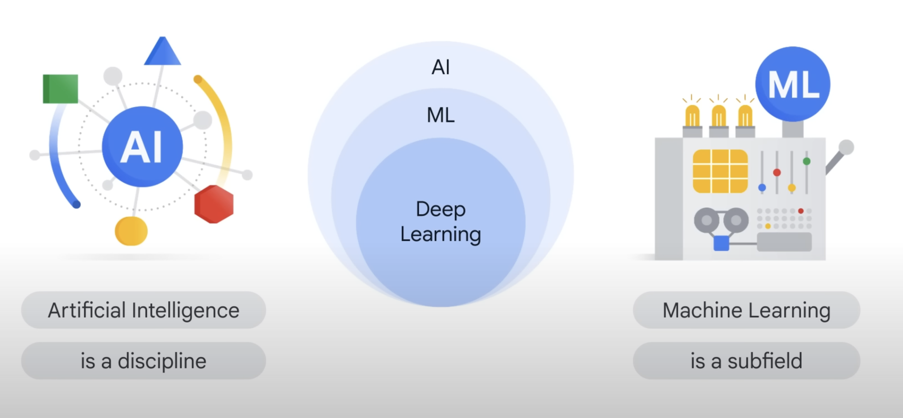<!-- .element: class="centered" -->

>Artificial Intelligence (AI) is a broad field that aims to create machines that can perform tasks that would typically require human intelligence.
>
>[Introduction to Generative AI - Google](https://youtu.be/G2fqAlgmoPo)

Notes:
Artificial Intelligence (AI) is a broad field that aims to create machines that can perform tasks that would typically require human intelligence. It includes various sub-fields and techniques, such as Machine Learning, Deep Learning, and Generative AI.

In this presentation, we will explore these topics and understand their applications and how they work together.

---

### Machine Learning (ML)

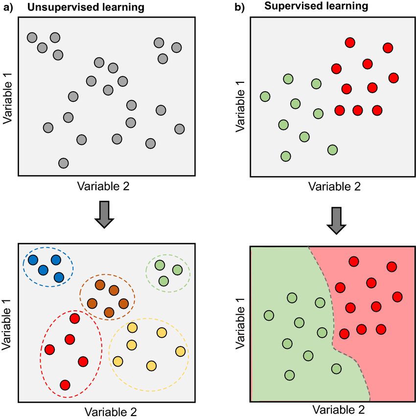

- Subset of AI that enables machines to learn from data
- Algorithms "learn" patterns and make predictions or decisions
- Supervised and Unsupervised Learning

Notes:
Machine Learning is a subset of AI that focuses on developing algorithms that can learn from data to make predictions or decisions.

There are two main types of machine learning: supervised learning, where the algorithm is trained on a labelled dataset (i.e., with input-output pairs), and unsupervised learning, where the algorithm learns patterns from an unlabelled dataset.

Examples of machine learning applications include image recognition, natural language processing, and recommendation systems.

---

### ML Python Libraries

- Scikit-learn: General-purpose machine learning library
- Pandas: Data manipulation and analysis
- NumPy: Numerical computing and linear algebra
- Matplotlib: Data visualization

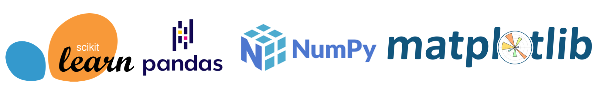

Notes:
There are several popular Python libraries for machine learning and related tasks:

1. Scikit-learn is a general-purpose machine learning library that provides simple and efficient tools for data mining and data analysis. It includes various classification, regression, and clustering algorithms.

2. Pandas is a powerful library for data manipulation and analysis. It provides data structures like DataFrames and Series, which make it easy to clean, analyze, and visualise data.

3. NumPy is a library for numerical computing in Python. It provides support for arrays, matrices, and linear algebra operations, which are essential for many machine learning algorithms.

4. Matplotlib is a data visualization library that allows you to create various types of plots and charts to better understand your data and the results of your machine learning models.

---

### Emoji Check:

How did you find the concepts of AI & ML?

1. 😢 Haven't a clue, please help!
2. 🙁 I'm starting to get it but need to go over some of it please
3. 😐 Ok. With a bit of help and practice, yes
4. 🙂 Yes, with team collaboration could try it
5. 😀 Yes, enough to start working on it collaboratively

Notes:
The phrasing is such that all answers invite collaborative effort, none require solo knowledge.

The 1-5 are looking at (a) understanding of content and (b) readiness to practice the thing being covered, so:

1. 😢 Haven't a clue what's being discussed, so I certainly can't start practising it (play MC Hammer song)
2. 🙁 I'm starting to get it but need more clarity before I'm ready to begin practising it with others
3. 😐 I understand enough to begin practising it with others in a really basic way
4. 🙂 I understand a majority of what's being discussed, and I feel ready to practice this with others and begin to deepen the practice
5. 😀 I understand all (or at the majority) of what's being discussed, and I feel ready to practice this in depth with others and explore more advanced areas of the content

---

### Deep Learning

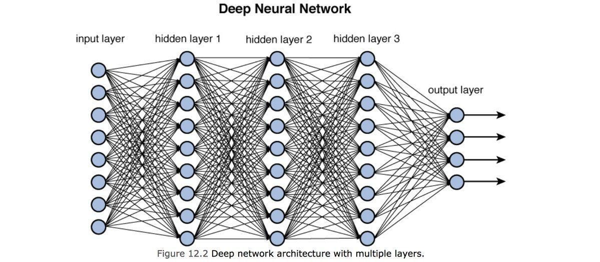

- Subset of Machine Learning
- Neural networks with multiple layers
- Can process large amounts of complex data

Notes:
Deep Learning is a subset of machine learning that focuses on using neural networks with multiple layers (also known as deep neural networks) to process large amounts of complex data.

These neural networks can automatically learn to extract features from the data and make predictions or decisions based on these features.

Examples of deep learning applications include speech recognition, image recognition, and game playing (e.g., AlphaGo).

---

### Example: Deep Learning with MNIST

- MNIST: Handwritten digits dataset (0-9)
- Goal: Classify images into corresponding digit classes
- Deep learning approach: Convolutional Neural Network (CNN)

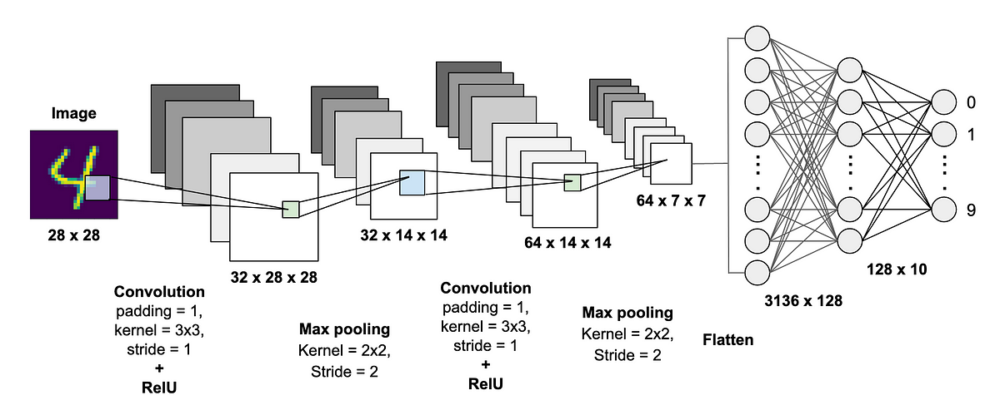

Notes:
In this slide, we will look at an example of deep learning using the famous MNIST dataset.

The MNIST dataset consists of handwritten digits ranging from 0 to 9. The goal is to classify each image into its corresponding digit class.

A common deep learning approach to tackle this problem is by using a Convolutional Neural Network (CNN). CNNs are especially effective for image classification tasks because they can automatically learn to extract relevant features from the images and use them for classification.

In this example, we would train a CNN to learn the patterns in the handwritten digits and then use the trained model to classify new, unseen images of handwritten digits.

---

### Deep Learning Python Libraries

- TensorFlow: Open-source ML framework by Google
- Keras: High-level neural networks API (part of TensorFlow)
- PyTorch: Open-source ML framework by Facebook

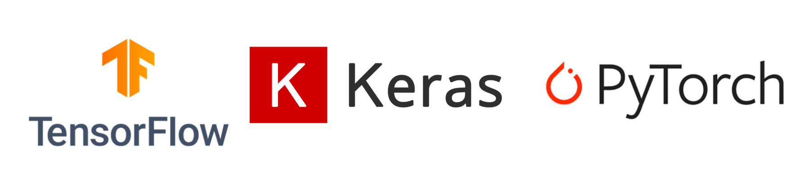

Notes:
There are several popular Python libraries for deep learning:

1. TensorFlow is an open-source machine learning framework developed by Google. It provides a flexible platform for defining, training, and deploying deep learning models.

2. Keras is a high-level neural networks API that is now part of TensorFlow. It provides an easy-to-use interface for building and training deep learning models and supports various backend engines, including TensorFlow.

3. PyTorch is an open-source machine learning framework developed by Facebook. It provides a dynamic computation graph, which makes it easier to build and debug deep learning models.

---

### Emoji Check:

How did you find the concept of Deep Learning?

1. 😢 Haven't a clue, please help!
2. 🙁 I'm starting to get it but need to go over some of it please
3. 😐 Ok. With a bit of help and practice, yes
4. 🙂 Yes, with team collaboration could try it
5. 😀 Yes, enough to start working on it collaboratively

Notes:
The phrasing is such that all answers invite collaborative effort, none require solo knowledge.

The 1-5 are looking at (a) understanding of content and (b) readiness to practice the thing being covered, so:

1. 😢 Haven't a clue what's being discussed, so I certainly can't start practising it (play MC Hammer song)
2. 🙁 I'm starting to get it but need more clarity before I'm ready to begin practising it with others
3. 😐 I understand enough to begin practising it with others in a really basic way
4. 🙂 I understand a majority of what's being discussed, and I feel ready to practice this with others and begin to deepen the practice
5. 😀 I understand all (or at the majority) of what's being discussed, and I feel ready to practice this in depth with others and explore more advanced areas of the content

---

### Generative AI: Advanced Models

- AI systems that generate new content: text, images, music, or videos
- Advanced models: GPT-4, DALEE 2, Midjourney, etc.
- Built on large-scale neural networks and advanced techniques

Notes:
Generative AI refers to AI systems that can generate new content, such as text, images, music, or videos.

Advanced models, such as GPT-4, DALEE 2, and Midjourney, represent the cutting edge of generative AI technology. These models are built on large-scale neural networks and advanced techniques, enabling them to generate high-quality and diverse content.

Examples of applications for these advanced generative AI models include highly realistic text generation, image synthesis, style transfer, music composition, and more. These models continue to push the boundaries of AI capabilities and open up new possibilities for creative and practical applications.

---

### Introduction to Predictive NLP Models

- Predictive NLP: Anticipating the next word, phrase, or sentence
- Basic concept: Train models on text data to predict future language patterns
- Examples: Autocomplete, text suggestions, language generation
- Applications: Chatbots, machine translation, content generation
- Usually utilised a variation on a Recurrent Neural Network (RNN)

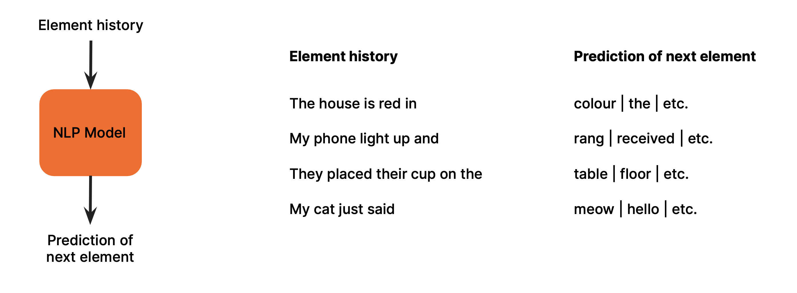

Notes:
Predictive NLP is a subfield of Natural Language Processing that focuses on anticipating the next word, phrase, or sentence given the context.

The basic concept behind predictive NLP models is to train them on large amounts of text data to learn the patterns and relationships between words and phrases. This knowledge allows the models to predict future language patterns based on the given context.

Examples of predictive NLP models include autocomplete systems, text suggestions, and language generation tools.

Some popular applications of predictive NLP models are chatbots, machine translation, and content generation. These models can enhance the capabilities of AI systems, making them more effective in understanding and generating human-like language.

---

### Large Language Models (LLM)

#### Generative Pretrained Transformer (GPT)

- Changed the model architecture to a Transformer
- Trained on vast amounts of text data
- Can generate human-like text, and other text e.g. code
- Examples: GPT-4, BERT, OpenAI Codex

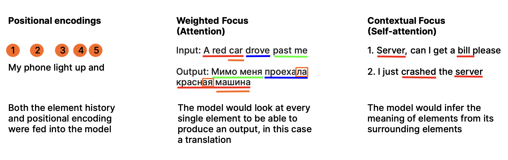

Notes:
Large Language Models are a type of AI model that is trained on vast amounts of text data and can generate human-like text.

These models are typically based on deep learning techniques and can understand and generate text with high accuracy and fluency.

Examples of large language models include GPT-3, BERT, and OpenAI Codex. They are used in applications like chatbots, translation, and code generation.

---

### Model Augmentations

Or what I like to call LLMs on steroids...
 
 

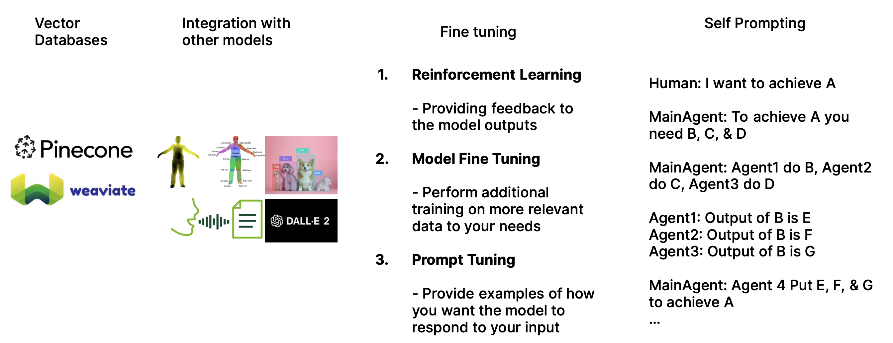

Notes:
Large Language Models can be further augmented to improve their performance and adapt to specific tasks or domains.

Some of the augmentations include incorporating vector databases for long-term memory, integrating with other models (e.g., image recognition models), fine-tuning the model for specific tasks, and using self-prompting got get the model to prompt itself.

These augmentations can lead to more effective and specialised AI systems that can better understand and generate content based on specific requirements or domains.

---

### Vector DBs for Long-Term Memory

- Store in location based on the encoding
- Improve LLM to utilise it as Long-Term Memory
- Store and retrieve information more efficiently, in certain applications
- Allows us to store data by semantic meaning

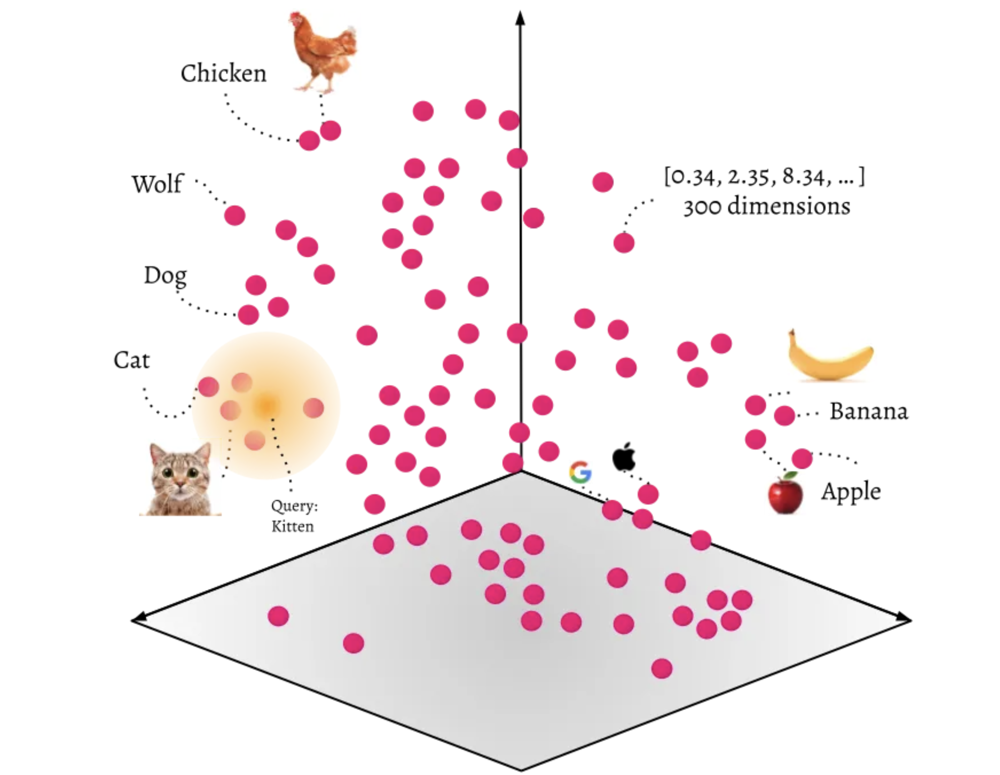

Notes:
Vector databases can be used to improve a model's long-term memory capabilities, allowing the model to store and retrieve information more efficiently.

This can enhance the performance of the model in specific tasks, such as question-answering or knowledge retrieval, by enabling the model to access relevant information more quickly and accurately.

---

### Vector DBs for Long-Term Memory

- Store in location based on the encoding
- Improve LLM to utilise it as Long-Term Memory
- Store and retrieve information more efficiently, in certain applications
- Allows to store data by semantic meaning

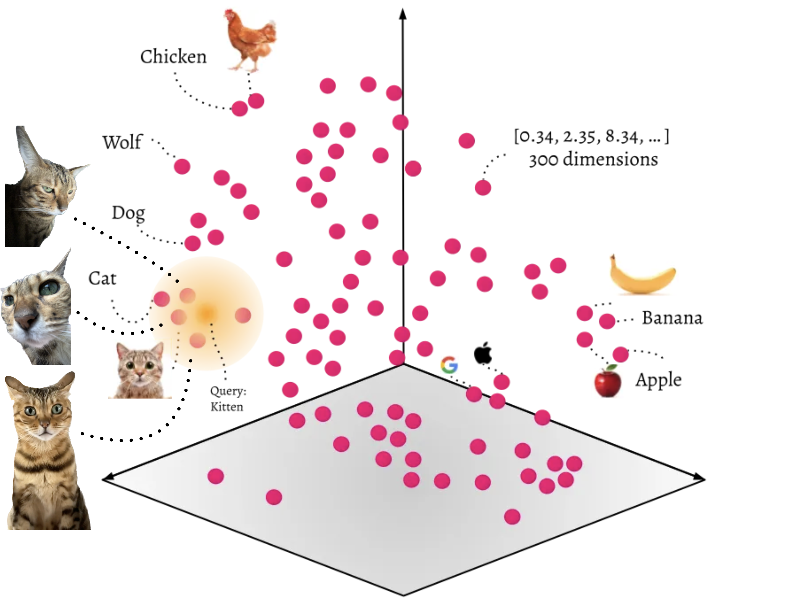

Notes:
So if I were to add my cat to a Vector Database, she would appear near all of the other cats.

---

### LangChain: A Framework for Developing LLM-Powered Applications

- Open-source framework for creating applications powered by Large Language Models (LLMs)
- Supports data-aware and agent powered applications with LLM interactions
- Provides core abstractions and building blocks for LLM-powered applications
- Offers standard, extendable interfaces and external integrations
- Ideal for NLP tasks like autonomous agents, personal assistants, chatbots, and more

Notes:
LangChain is an open-source framework designed for developing applications powered by Large Language Models (LLMs). It supports the creation of data-aware and agent powered applications with LLM interactions, providing core abstractions and building blocks for LLM-powered applications.

With LangChain, you can easily work with popular LLMs like GPT-4, BERT, and OpenAI Codex, using standard, extendable interfaces and external integrations to quickly build powerful NLP applications.

Ideal for NLP tasks such as autonomous agents, personal assistants, chatbots, and more, LangChain offers modules like Models, Prompts, Memory, Indexes, Chains, Agents, and Callbacks, which are essential components in building LLM-powered applications.

---

### Emoji Check:

How did you find the concepts of Large Language Models and Vector Databases?

1. 😢 Haven't a clue, please help!
2. 🙁 I'm starting to get it but need to go over some of it please
3. 😐 Ok. With a bit of help and practice, yes
4. 🙂 Yes, with team collaboration could try it
5. 😀 Yes, enough to start working on it collaboratively

Notes:
The phrasing is such that all answers invite collaborative effort, none require solo knowledge.

The 1-5 are looking at (a) understanding of content and (b) readiness to practice the thing being covered, so:

1. 😢 Haven't a clue what's being discussed, so I certainly can't start practising it (play MC Hammer song)
2. 🙁 I'm starting to get it but need more clarity before I'm ready to begin practising it with others
3. 😐 I understand enough to begin practising it with others in a really basic way
4. 🙂 I understand a majority of what's being discussed, and I feel ready to practice this with others and begin to deepen the practice
5. 😀 I understand all (or at the majority) of what's being discussed, and I feel ready to practice this in depth with others and explore more advanced areas of the content

---

### Quiz Time! 🤓

---

#### 1. What are the two main types of Machine Learning?

1. Supervised and Unsupervised Learning
2. Supervised and Reinforcement Learning
3. Unsupervised and Reinforcement Learning
4. Supervised and Deep Learning

Answer: `1`<!-- .element: class="fragment" -->

---

#### 2. What type of neural network is commonly used for image classification tasks?

1. Feedforward Neural Network
2. Recurrent Neural Network (RNN)
3. Convolutional Neural Network (CNN)
4. Radial Basis Function Network

Answer: `3`<!-- .element: class="fragment" -->

---

#### 3. In the context of Predictive NLP models, what is the primary goal?

1. Anticipating the next word, phrase, or sentence
2. Classifying text into categories
3. Sentiment analysis
4. Extracting key phrases from text

Answer: `1`<!-- .element: class="fragment" -->

---

#### 4. What is the primary benefit of using vector databases for long-term memory in LLMs?

1. Reduce the size of the model
2. Store and retrieve information more efficiently
3. Improve the model's performance in image classification tasks
4. Decrease the model's training time

Answer: `2`<!-- .element: class="fragment" -->

---

## Demo

> This demo will shows how you can utilise LLMs to summarise pdf documents, and how to use LLMs in conjunction with a Vector DB to ask pdf documents questions
Notes:
The demo shows how you can utilise LLMs to summarise pdf documents and how to use LLMs in conjunction with a Vector DB to ask pdf documents questions. Check session README.md for set up information.

---

### Emoji Check:

How did you find the Demo?

1. 😢 Haven't a clue, please help!
2. 🙁 I'm starting to get it but need to go over some of it please
3. 😐 Ok. With a bit of help and practice, yes
4. 🙂 Yes, with team collaboration could try it
5. 😀 Yes, enough to start working on it collaboratively

Notes:
The phrasing is such that all answers invite collaborative effort, none require solo knowledge.

The 1-5 are looking at (a) understanding of content and (b) readiness to practice the thing being covered, so:

1. 😢 Haven't a clue what's being discussed, so I certainly can't start practising it (play MC Hammer song)
2. 🙁 I'm starting to get it but need more clarity before I'm ready to begin practising it with others
3. 😐 I understand enough to begin practising it with others in a really basic way
4. 🙂 I understand a majority of what's being discussed, and I feel ready to practice this with others and begin to deepen the practice
5. 😀 I understand all (or at the majority) of what's being discussed, and I feel ready to practice this in depth with others and explore more advanced areas of the content

---

### Terms and Definitions - recap

**AI**: Artificial Intelligence, a broad field aiming to create machines that perform tasks requiring human intelligence

**ML**: Machine Learning, a subset of AI where algorithms learn from data to make predictions or decisions

**Deep Learning**: A subset of ML, using neural networks with multiple layers to process complex data

**Generative AI**: AI systems that generate new content, such as text, images, music, or videos

**LLM**: Large Language Models, AI models trained on vast text data to generate human-like text

**Vector Database**: A database that uses an encoding to store data in vector space.

---

### Terms and Definitions - recap

**Predictive NLP Model**: A model that anticipates the next word, phrase, or sentence given context in Natural Language Processing

**GPT**: Generative Pretrained Transformer, a large language model architecture based on Transformers

**Neural Network**: A computational model inspired by the human brain, used in deep learning

**CNN**: Convolutional Neural Network, a type of deep learning model used for image classification tasks

**RNN**: Recurrent Neural Network, a neural network for processing sequential data with "memory" of previous inputs. Commonly used in natural language processing and time series analysis.

---

### Further Reading

[Machine Learning](https://towardsdatascience.com/machine-learning-basics-part-1-a36d38c7916)

[Deep Learning](https://medium.com/intro-to-artificial-intelligence/deep-learning-series-1-intro-to-deep-learning-abb1780ee20)

[Introduction to Generative AI - Google](https://youtu.be/G2fqAlgmoPo)

[Transformers, explained: Understand the model behind GPT, BERT, and T5](https://youtu.be/SZorAJ4I-sA)

[Vector databases are so hot right now. WTF are they?](https://youtu.be/klTvEwg3oJ4)

---

### Emoji Check:

On a high level, do you think you understand the main concepts of this session? Say so if not!

1. 😢 Haven't a clue, please help!
2. 🙁 I'm starting to get it but need to go over some of it please
3. 😐 Ok. With a bit of help and practice, yes
4. 🙂 Yes, with team collaboration could try it
5. 😀 Yes, enough to start working on it collaboratively

Notes:
The phrasing is such that all answers invite collaborative effort, none require solo knowledge.

The 1-5 are looking at (a) understanding of content and (b) readiness to practice the thing being covered, so:

1. 😢 Haven't a clue what's being discussed, so I certainly can't start practising it (play MC Hammer song)
2. 🙁 I'm starting to get it but need more clarity before I'm ready to begin practising it with others
3. 😐 I understand enough to begin practising it with others in a really basic way
4. 🙂 I understand a majority of what's being discussed, and I feel ready to practice this with others and begin to deepen the practice
5. 😀 I understand all (or at the majority) of what's being discussed, and I feel ready to practice this in depth with others and explore more advanced areas of the content
