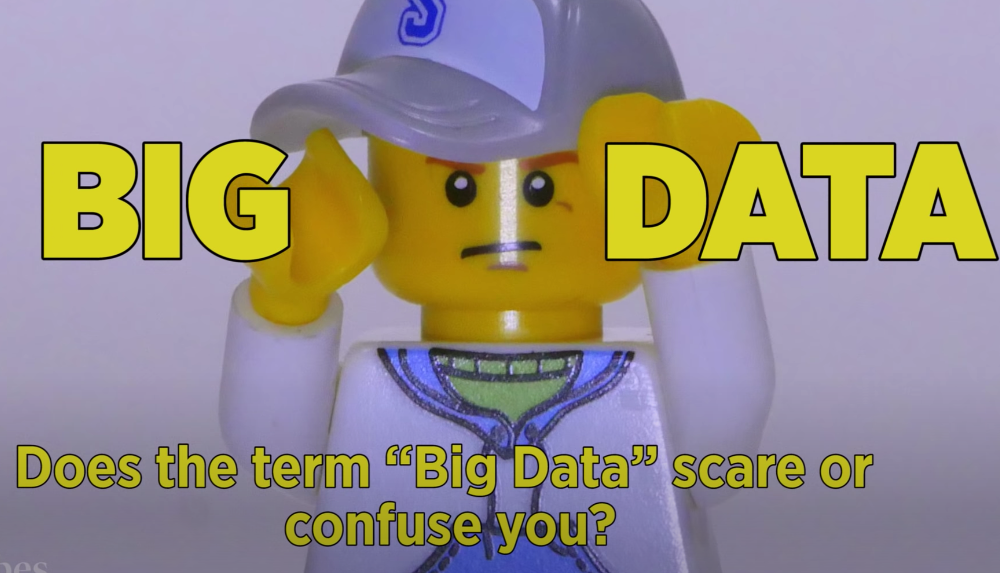

<!-- markdownlint-disable blanks-around-headings -->
## Introduction to
## Big Data
<!-- markdownlint-enable blanks-around-headings -->

---

### Overview

- What is Big Data
- Key concepts and terms

---

### Learning Objectives

- Understand what big data is and how it's used
- Some of the tools used to understand big data

---

### What is Big Data?

What does the term **"Big Data"** mean to you?

When did you last interact with Big Data?

---

### It's Everywhere!

<!-- .element: class="centered" -->

[
View video
](https://www.youtube.com/watch?v=jGhRiwGHh30 "What is Big Data Video")

---

### Three V's

#### Volume:

- Most obvious
- Estimates 2.5 quintillion bytes of data created every day
- Approximately 40 zettabytes created by 2020 (40,000,000,000,000,000,000,000 bytes)
- That's 300x more than 2005!

---

### Three V's

#### Velocity:

- How fast is data coming in?
- Real-time data? Regular Intervals? Fits and starts?
- Platforms experience incoming data at different paces
- It's important to consider the availability of all data before data analysis

---

### Three V's

#### Variety:

- Sources of data
- Formats of data
- Usefulness of data
- Greater data variety = more analytical tools to decipher

---

### Our Job as Data Engineers?

Make the data manageable and allow it to work.

<!-- .element: class="centered" -->

---

### Overview - recap

- What is Big Data
- Key concepts and terms

---

### Learning Objectives - recap

- Understand what big data is and how it's used
- Some of the tools used to understand big data

---

### Further Reading

- [What is Big Data? (Oracle)](https://www.youtube.com/watch?v=jGhRiwGHh30)
- [Big data is better data (Ted Talk)](https://www.ted.com/talks/kenneth_cukier_big_data_is_better_data?language=en)
- [What is Big Data? (Medium)](https://medium.com/@zhenwu93/what-is-big-data-a9a19d6314fb)

---

### Emoji Check:

On a high level, do you think you understand the main concepts of this session? Say so if not!

1. 😢 Haven't a clue, please help!
2. 🙁 I'm starting to get it but need to go over some of it please
3. 😐 Ok. With a bit of help and practice, yes
4. 🙂 Yes, with team collaboration could try it
5. 😀 Yes, enough to start working on it collaboratively

Notes:
The phrasing is such that all answers invite collaborative effort, none require solo knowledge.

The 1-5 are looking at (a) understanding of content and (b) readiness to practice the thing being covered, so:

1. 😢 Haven't a clue what's being discussed, so I certainly can't start practising it (play MC Hammer song)
2. 🙁 I'm starting to get it but need more clarity before I'm ready to begin practising it with others
3. 😐 I understand enough to begin practising it with others in a really basic way
4. 🙂 I understand a majority of what's being discussed, and I feel ready to practice this with others and begin to deepen the practice
5. 😀 I understand all (or at the majority) of what's being discussed, and I feel ready to practice this in depth with others and explore more advanced areas of the content
