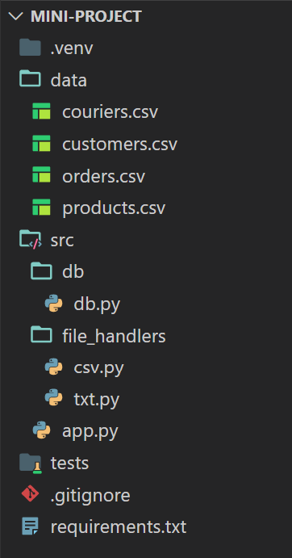

## Mini Project

---

### Overview

Your client has launched a pop-up café in a busy business district. They are offering home-made lunches and refreshments to the surrounding offices. As such, they require a software application which helps them to log and track orders.

Notes:
This is the scope of your new project.

Each week will cover some of the requirements and look to you to build an app to meet them.

---

### Requirements

As a business:

- I want to maintain a collection of `orders`, `products`, and `couriers`
- When a customer makes a new `order`, I need to create this on the system
- I need to be able to update the status of an `order` i.e: `preparing`, `out-for-delivery`, `delivered`
- When I exit my app, I need all data to be persisted and not lost
- When I start my app, I need to load all persisted data
- I need to be sure my app has been tested and proven to work well
- I need to receive regular software updates

Notes:
This may look scary, but these are the kinds of functionality that will be learned in the first six weeks.

We will be covering a little part of it each week based on what you have just learned.

And each week will build on top of the work you have already done.

---

## Purpose

This mini-project serves as a guided exercise to bring together learning from the different taught sessions over a period of weeks.

Over the first few weeks of the course, we will teach a variety of python skills, which you can use to incrementally add features to your project.

---

## Technical Specifications

---

### User Interface

You will be building a program that runs on the command line (CLI).

- The UI will be text-based in your terminal
- The UI should be logical, clear, and simple to navigate
- It should display a menu of options, with other nested menus beneath the main one
- There should be the option to exit / return to main menu
- It should handle invalid input

Notes:
We are not expecting a fully functional web page with a form.

As you have already seen, there is more than one way to get a user to interact with a program.

---

### Data Persistence

You can start off with lists and dictionaries in memory.

You can then incrementally adopt three methods to persist data between user sessions:

- `txt`: Initially we'll store our data in plain-text files
- `csv`: As our data changes shape, we'll need to switch to the CSV format
- `SQL`: Ultimately, we'll finish up using a database

Notes:
Don't worry now about what each of them are, we will cover each of them and their usages in time.

---

### Testing

Python has some basic testing functionality built-in which we'll use to test the quality of our code. This will allow us to be confident that our app works as we intended it to.

Initial testing will be manual (by running the app lots of times!) but then later you can add Unit Testing (after we have taught it!).

Notes:
Remember, programming is more than just writing code, it's about being confident in delivering something proven to work.

---

### Data Visualisation (Optional)

We'll optionally want to build some bar charts to help our client better understand the business. For this we'll use:

- `Jupyter Notebooks`
- `Matplotlib`

Data Visualisation appears as a stretch goal in Phase 6.

---

### Suggested Project Structure

<!-- .element: class="centered" -->

---

### Method

- You will be allotted enough time each week to work on your project
- Your instructor can brief you any time you want on the phases of the project
- You should each produce your own app, however pairing up with a colleague for help is encouraged
- It is strongly recommended to have a regular review of your running app and code from the instructors

---

### Available Time: 3 Weeks

On the School of Tech 7 week courses, this project work is required.

> It was originally designed as a 6 week project for the 12 week course - not finishing all the Phases is ok!
>
> To clarify, completing all 6 phases is a stretch goal, but we would typically expect everyone to complete phases 1-3.

Notes:
It may be worth pointing out the Agile nature of Software Development...

---

### Phases

> To assist in incremental development, there are 6 suggested "Phases" in the [./exercises/](./exercises/) folder.
>
> It is recommended to work through these in order - the steps in them, and the changes you have to make along the way, are part of the learning experience!

Notes:
It may be worth pointing out the Agile nature of Software Development...

---

### Daily pushes to GitHub repo

After the [Source Control](../source-control-git/) session, you will be expected to push your Mini Project work into your repo on a regular basis (preferably every day, if not more).  It does not need to be "working" or "complete" - back it up anyway.

Your repo will also contain all your exercises from all the other taught sessions, (e.g. [python-1](../python-1/), [python-2](../python-2/), [data-persistence](../data-persistence/) and so on).

Between working on exercises and the Mini Project, there should be something to push to your repo every day!

These terms may not mean much yet - don't worry, they will soon.

Notes:
Be clear about this expectation: **Push every day**

---

### Stuck?

Getting stuck on something is not fun for anyone. Here is a recommended workflow:

- Don't panic: Relax, take a break, think about the problem. Break for a cuppa.
- Google it: There is a wealth of information on the web and you'll likely find the solution to your problem quite quickly.
- Syntax: If it's a syntax problem try referring to earlier slides, or the official Python Docs / W3 Schools.
- Ask a colleague: Ask someone in the group. It's likely they too have come across and solved your problem.
- Ask your instructor: If all else fails, reach out to your instructor for some guidance.

Notes:
There will be plenty of time to complete the basics of the mini-project.

Remember it's not a race, we want everyone to complete it.

---

### Glossary

- `CLI` Command Line Interface
- `CSV` Comma Separated Value
- `SQL` Structured Query Language
- `UI/UX` User Interface / User Experience
- `Data Layer` The part of your code that handles all data interaction
- `Storage Layer` The part of your code that handles all file storage
- `CRUD` Create, Read, Update, Delete
- `Code Smell` Code that doesn't adhere to best practices
- `Refactor` The process of rewriting code to _improve_ it or to fix code smells

---

### Resources

- https://realpython.com/
- https://blog.finxter.com/python-cheat-sheet/
- https://www.mysqltutorial.org/
- https://websitesetup.org/mysql-cheat-sheet/

---

### Libraries

Here are some 3rd party libraries you might want to include:

- `pylint`, also for code-formatting and linting
- `black`, also for code-formatting and linting
- `psychopg`, for database connections
- `matplotlib`, for data visualisations

---

<!-- .element: class="centered" -->
