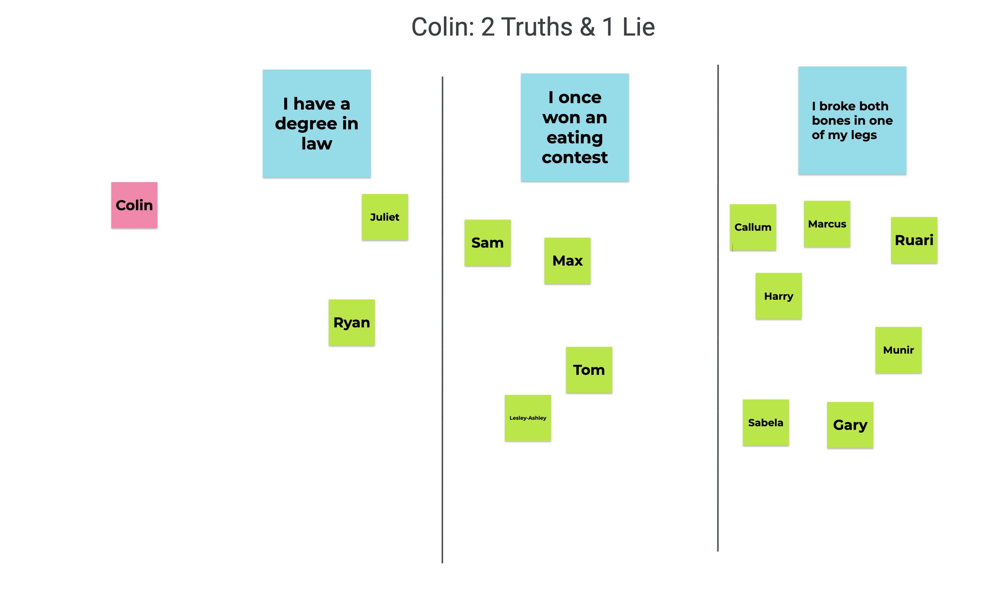

## Two Truths And A Lie

- This was another fun 'get to know you' type exercise
- Each person has to think of two facts about themselves which are true, and one which is a lie
- We ran this via a Jamboard:
    - We set up the Jamboard with a page for each member of the group
    - On each page, we place three 'large' post-its in three columns - then in advance of the event, each person writes their three facts into the three post-its
    - On each page is also a collection of smaller post-its , which each player will use to vote during the game
    - During the call, we go through the Jamboard page-by-page.
    - For each player's page, there was an opportunity for two other players to ask them questions about their facts to see if their stories would hold up
    - After this, each player votes by moving the small post-it with their name on it, into one of the columns below one of the facts. They are voting for the one which they think is the lie.
    - Once everyone has voted, the true facts and the lie are revealed. There is often some discussion around the true facts, which again helps people come out of their shell
    - Players get a point if they correctly identified the lie. The player whose page we are on also gets a point for every person who did not correctly identify the lie.

Here is an illustration of what a single slide of the Jamboard looked like after everyone had cast their votes:

