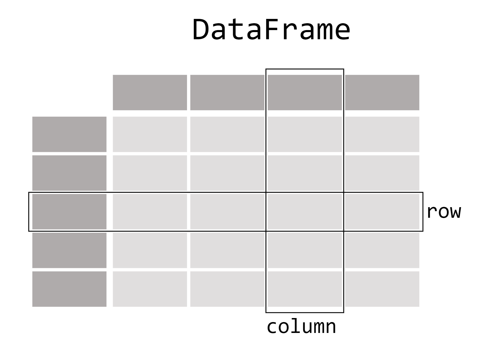

## Pandas

---

## Overview

- High level overview of the pandas python library
- What is pandas used for?
- What is a pandas DataFrame?

---

### Learning Objectives

- Understand how you can use pandas to read in csv files
- Manipulate some pandas DataFrames and save the result as a csv file
- Understand what pandas can be used for and when you might want to use it

---

## What is pandas?

- **Pandas** is a python library that's used for data analysis and data manipulation
- It provides functionality to make it easy to manipulate tabular data e.g. data stored in spreadsheets (csv or excel files) or relational databases.

---

### Installing pandas

Pandas can be installed using the following command:

```bash
pip install pandas
```

If you want to install pandas in a virtual environment remember
you'll need to activate it first.

**Note** For some Windows users you may need to install pandas using one of the following commands:

```bash
python -m pip install pandas
py -m pip install pandas
```

---

### What kind of data does pandas handle?

When working with tabular data, such as data stored in spreadsheets or relational databases, pandas is the right tool for you. Pandas will help you to explore, clean, and process your data. In pandas, a data table is called a **DataFrame**.

<!-- .element: class="centered" -->

---

### How do I read and write tabular data?

Pandas supports many file formats and data sources (csv, excel, sql, json, parquet, ...).
Loading in data from any of these formats can be done with one of pandas built-in read_* methods.

For example, we can read in the purchases.csv file in the handouts by using the following code:

```py
import pandas as pd

# df is short for dataframe
df = pd.read_csv("purchases.csv")

# Let's print this dataframe as well
print(df)
```

**Note**: Make sure you've saved the _purchases.csv_ file in the same directory as the
python script you're running if you want to test the code.

---

To save a pandas DataFrame back to a csv file you can use pandas to_* method.
Continuing from the example on the previous slide:

```py
# save the dataframe as a csv

df.to_csv("new_purchases.csv", index=False)
```

---

### How do I select a subset of a DataFrame?

You can access specific columns of a DataFrame in the following ways:

```py
import pandas as pd

df = pd.read_csv("purchases.csv")

# access the customer_name column
print(df["customer_name"])

# notice the type of the object
print(type(df["customer_name"]))
```

To select a single column from a DataFrame we can use square brackets ```[]``` with
the name of the column we're interested in.

**Note**: A single column in a pandas DataFrame is called a **Series**

---

We can select multiple columns by passing in a list of the column names we're interested in e.g:

```py
# continuing from the example above

df[["timestamp", "location", "customer_name"]]
```

We can also filter to specific rows from a DataFrame

```py
df[df["amount_spent"] > 100]
df[df["location"] == "Manchester"]
```


---

### How do I select specific rows and columns from a dataframe?

There are two options when you want to filter to specific rows and columns, you
can use either the **loc** or **iloc** methods.

Imagine we want to get the names of all the customers who have spent more than £100.
This can be done in the following way

```py
# Using the loc method
df.loc[df["amount_spent"] > 100, "customer_name"]
```

You can think of this as saying "if the amount spent is greater than £100, then display the corresponding customer_name".
```df["amount_spent"] > 100``` is the condition and ```"customer_name"``` is the resulting data that is displayed:

```py
# If you want to see multiple columns
df.loc[df["amount_spent"] > 100, ["customer_name","location"]]
```

---

If we're interested in specific rows and columns at a certain index position, we can use iloc:

```py
df.iloc[0:2, 1]
```

This will display the first two rows
and the second column in the DataFrame (as with most python things, the indexing starts at 0).

The loc and iloc methods have the following structure
inside the square brackets

```py
[<row filter>, <column filter>]
```

The comma separates the row and column filters.

---

### How do I create new columns from existing ones?

Using the _purchases.csv_ handout, imagine I want to create a new column that shows how much the customers spent in another currency (euros for example):

```py
# assuming the exchange rate is 1.2
df["amount_spent_euros"] = df["amount_spent"] * 1.2
```

To create a new column, use ```[]``` with the new column name inside.

**Note:** The calculation that takes place happens element wise and therefore
all values in the column are independently multiplied by 1.2

---

It's also possible to create new columns by adding, multiplying, dividing or concatenate
existing columns together.

```py
# string concatenation example
df["string_concat"] = df["timestamp"] + df["location"]
```

More flexible and advanced options are also available when creating new columns.
You can use the ```apply()``` method to enable a function to transform each element in a column:

```py
def extract_first_name(customer_name):
    first_name = customer_name.split()[0]
    return first_name

# you can think of x as representing any single value in the customer_name column
df["customer_first_name"] = df["customer_name"].apply(lambda x: extract_first_name(x))
```

---

### How do I aggregate data?

Another important feature of pandas DataFrames is the ability to group by certain columns for aggregation. The idea is exactly the same as group by in SQL.

Imagine we want to find out the total amount spent in each store. We can use a group by to find this out:

```py
df.groupby("location").sum()

# orders per customer in each location
df.groupby(["location", "customer_name"]).count().reset_index()

# you can also use apply() with groupby
def total_amount_spent_per_location(group):
    group["total_location_amount"] = group["amount_spent"].sum()
    return group

df.groupby("location").apply(lambda x: total_amount_spent_per_location(x))
```

**Note:** There are many different ways you can use `groupby`. It's worth doing some of your own research if you come across a use case for a pandas group by.

---

### How to I combine data from multiple DataFrames?

Similarly to SQL, it's also possible to join different DataFrames
together and there are a few options available.

We'll now use both the store_locations.csv and purchases.csv files the handouts.

There are two ways, _merge_ and _concatenate_.

---

## Merge

```py
import pandas as pd

purchases_df = pd.read_csv("purchases.csv")
locations_df = pd.read_csv("store_locations.csv")

resulting_dataframe = pd.merge(
    left=purchases_df,
    right=locations_df,
    how="inner",
    on="location"
)
```

---

### Concatenate

The additional_purchases.csv file provides more purchase data that can be appended onto the existing dataframe

```py
# continuing from the example on the previous slide
additional_purchases_df = pd.read_csv("additional_purchases.csv")

total_purchases_df = pd.concat([purchases_df, additional_purchases_df])
total_purchases_df.reset_index(drop=True, inplace=True)
print(total_purchases_df)
```


---

## Overview - recap

- High level overview of the pandas python library
- What is pandas used for?
- What is a pandas DataFrame?

---

### Learning Objectives - recap

- Understand how you can use pandas to read in csv files
- Manipulate some pandas DataFrames and save the result as a csv file
- Understand what pandas can be used for and when you might want to use it

---

### Further Reading

Ultimately, the best way to learn pandas is to practice.
Some useful resources are google, stackoverflow and the pandas documentation

- [Pandas documentation](pandas.pydata.org/pandas-docs/stable/index.html)

---

### Emoji Check:

On a high level, do you think you understand the main concepts of this session? Say so if not!

1. 😢 Haven't a clue, please help!
2. 🙁 I'm starting to get it but need to go over some of it please
3. 😐 Ok. With a bit of help and practice, yes
4. 🙂 Yes, with team collaboration could try it
5. 😀 Yes, enough to start working on it collaboratively

Notes:
The phrasing is such that all answers invite collaborative effort, none require solo knowledge.

The 1-5 are looking at (a) understanding of content and (b) readiness to practice the thing being covered, so:

1. 😢 Haven't a clue what's being discussed, so I certainly can't start practising it (play MC Hammer song)
2. 🙁 I'm starting to get it but need more clarity before I'm ready to begin practising it with others
3. 😐 I understand enough to begin practising it with others in a really basic way
4. 🙂 I understand a majority of what's being discussed, and I feel ready to practice this with others and begin to deepen the practice
5. 😀 I understand all (or at the majority) of what's being discussed, and I feel ready to practice this in depth with others and explore more advanced areas of the content
