## Tableau

---

### Overview

- Connecting to different sources
- Creating a Tableau data source
- Creating views in the Tableau workspace
- Creating Dashboards

---

### Learning Objectives

- Understand what Tableau is and when to use it
- Learn how to connect to any data source in Tableau
- Be able to create a Tableau data source
- Build custom visualisations in Tableau
- To create a functional Tableau dashboard

---

### Tableau

- Tableau is a very simple yet powerful tool for everything to do with data.
- The company's mission is to help people see and understand data.
- Tableau is a completely drag and drop software.
- It enables you to create visualizations much faster than in other programs.

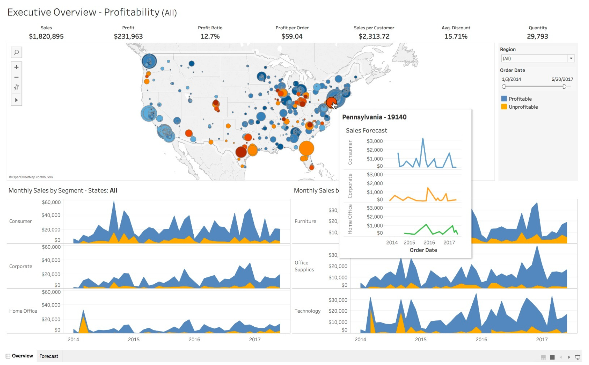

---

### Connecting to a Data Source

- Tableau has lots of native data connectors.
- You can connect to files such as text and excel files.
- You can connect to servers, such as databases or even cloud services like AWS Redshift and BigQuery.

A. You can navigate to the Connect menu by toggling the home icon.

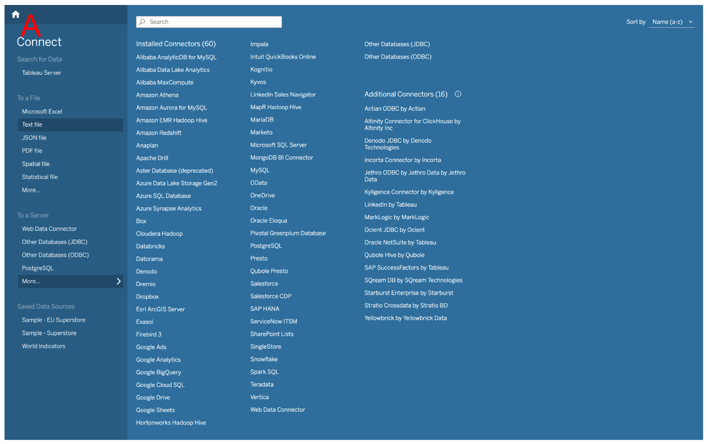

---

### Connecting to a CSV

- While on the Connect page, click on the text file option. CSV files are just text files.
- Once the data is loaded if the CSV doesn’t contain a header, we can manually rename our fields.

A. Click on each field to rename it.

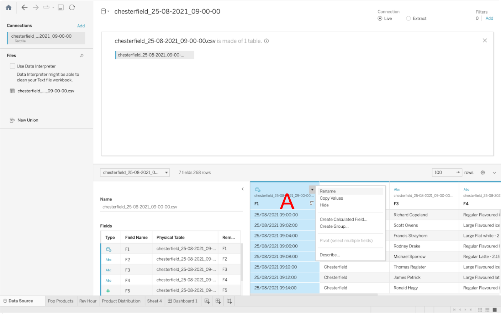

---

### Connecting to PostgreSQL

- While on the Connect page, navigate to Server submenu and click on the *more* option to see a list of all installed connectors.
- Select the PostgreSQL connector, enter your database details and sign in.
- If the connection fails, it is most likely due to a missing driver.
- Navigate to Driver Download, download the relevant jar file and copy it in ~/Library/Tableau/Drivers directory.

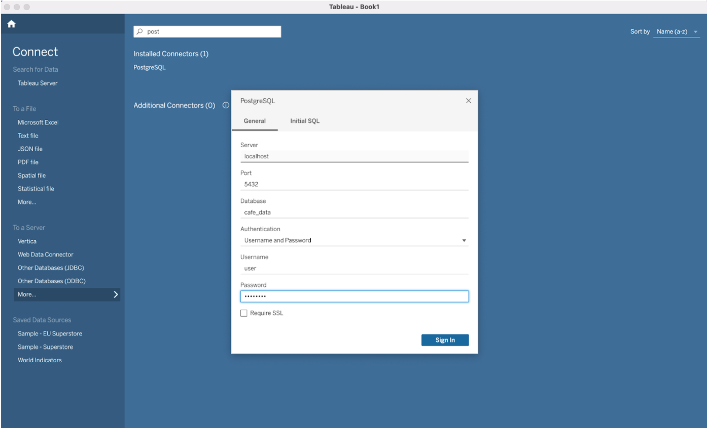

---

### The Data Source Tab: Logical Layer

- Tableau takes you to the data source page after you establish the initial connection to your data.
- In the Logical layer you specify relationships instead of joins:
    - Relationships are a dynamic, flexible way to combine data from multiple tables.
    - Relationships have No up-front join type.
    - They defer joins to the time and context of analysis.
    - Relationships can be many-to-many and support full outer joins.

---

### The Data Source Tab: Logical Layer

A. Left pane: Displays the connected data source and other details about your data.\
B. Canvas: Logical Layer - The canvas opens with the logical layer, where you can create relationships between tables.\
C. Data grid: Displays the first 1,000 rows of data.

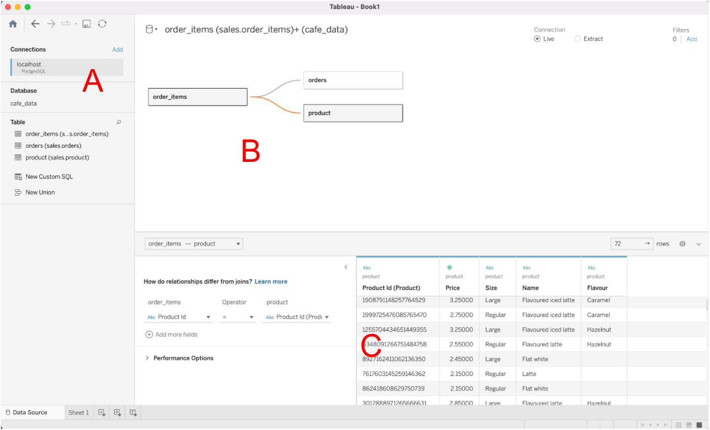

---

### The Data Source Tab: Physical Layer

- Navigate to the physical layer by double clicking on a datasource in the logical layer.

A. Left pane: Displays the connected data source and other details about your data.\
B. Canvas: Physical Layer - In the physical layer you can create unions and joins between tables.\
C. Data grid: Displays the first 1,000 rows of data.

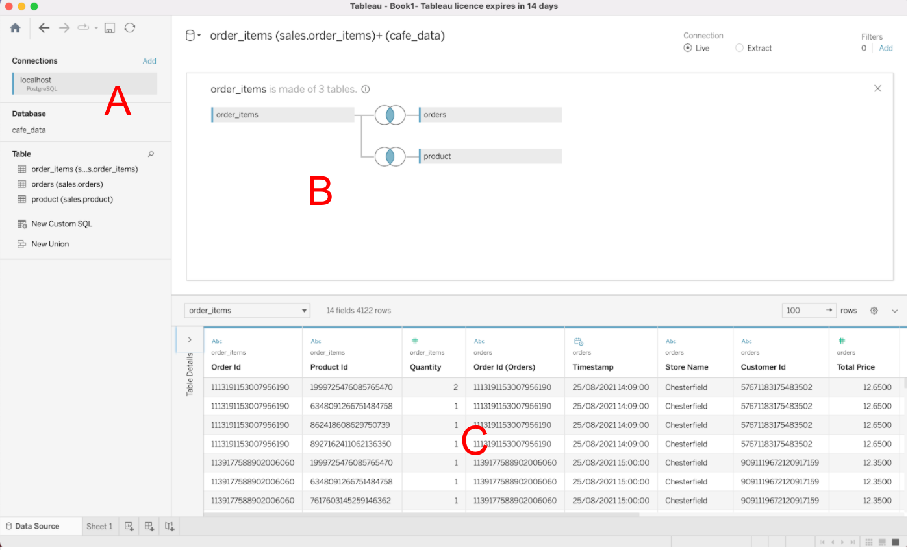

---

### The Tableau Workspace

- The Tableau workspace consists of menus, a toolbar, the Data pane, cards and shelves, and one or more sheets. Sheets can be worksheets, dashboards, or stories.

---

### The Tableau Workspace

A. Cards & Shelves: Drag fields to the cards and shelves to add data to your view.\
B. Toolbar: Use the toolbar to access commands and analysis and navigation tools.\
C. View: The canvas where you create visualisations.\
D. Creates a view based on fields already in the view.

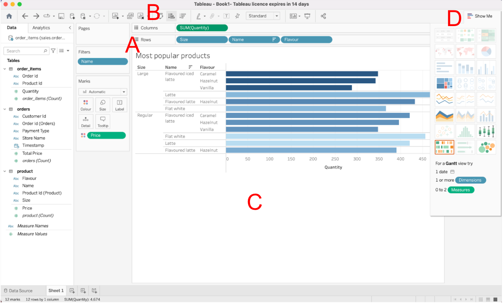

---

### The Tableau Workspace: Continued

A. Filters: Allows you to filter our dataset.\
&emsp;a. The filter can be interactive by selecting show filter.\
&emsp;b. The same filter can be applied to multiple worksheets.

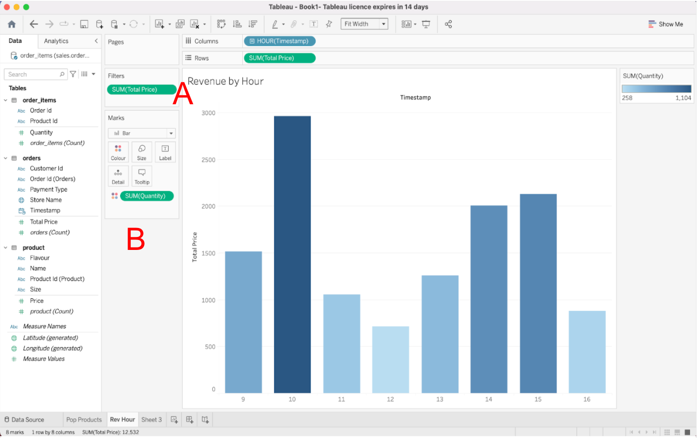

B. Marks: Tableau displays data using marks, where every mark corresponds to a row in your data source.\
&emsp;a. Marks can be continuous or discrete.\
&emsp;b. The colour mark changes the colour of the measures of dimensions. Size changes size and so on.

---

### Calculated Fields

- Calculated fields allow you to create new data from data that already exists in your data source.
- You essentially create a new field in your data source, the values or members of which are determined by a calculation you control.

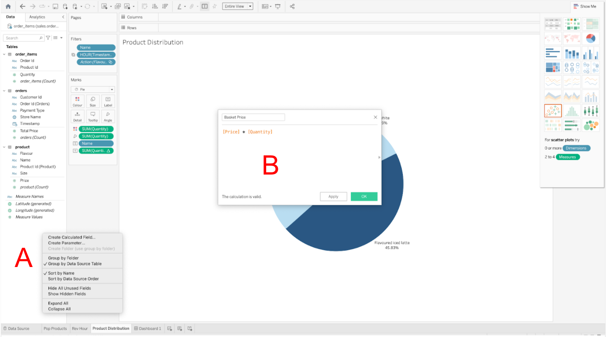

A. Right click on the tables pane and select Create Calculated Field.\
B. The popup window which allows you to enter the calculation. In the example a field called Basket Price is created by multiplying the price field by the quantity field.

---

### Parameters

- A parameter is a workbook variable such as a number, date, or string that can replace a constant value in a calculation, filter, or reference line.
- Think of parameters as variables just like you would variables in a programming language.

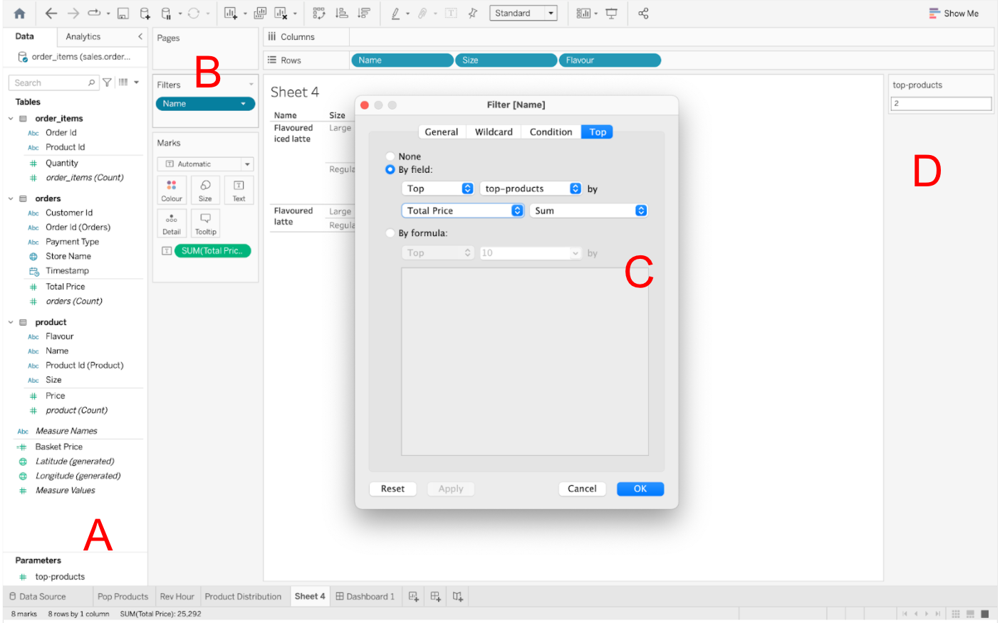

A. Right click the tables pane and select Create Parameter.\
B. A filter which uses the parameter to select the top N products.\
C. Filter pane which showcases the dynamic nature of parameters.\
D. The parameter user form.

---

### Dashboards

- Once you’ve created one or more views on different sheets in Tableau, you can pull them into a dashboard.

---

### Dashboards

A. Sheets: These are the views created in each worksheet.\
B. Objects: In addition to sheets, you can add dashboard objects that add visual appeal and interactivity.\
C. Dashboard: Drag and drop sheets here to build the dashboard.

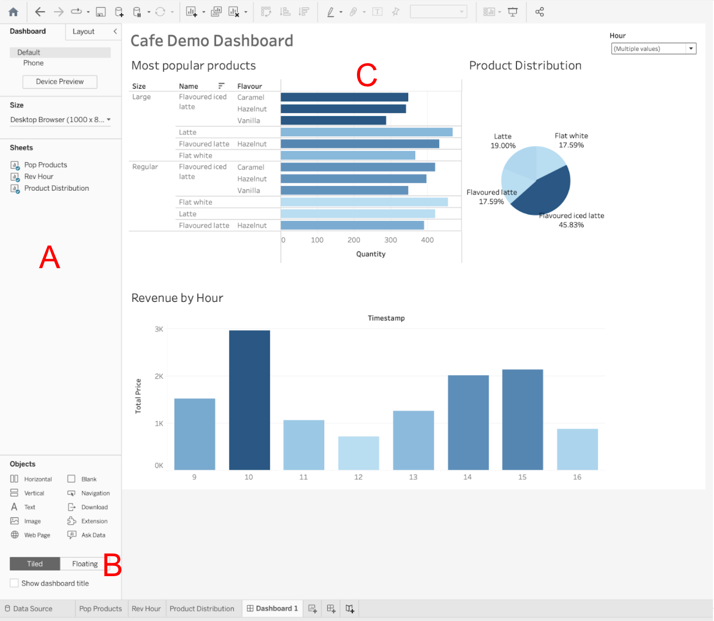

---

### Dashboards: Interactivity

- You can add interactivity to dashboards to enhance users’ data insights.
- In the upper corner of a sheet, enable the Use as Filter option to use selected marks in the sheet as filters for other sheets in the dashboard.
- In the example image, the popular products marks have been used as a filter. When one mark is selected the other views update.

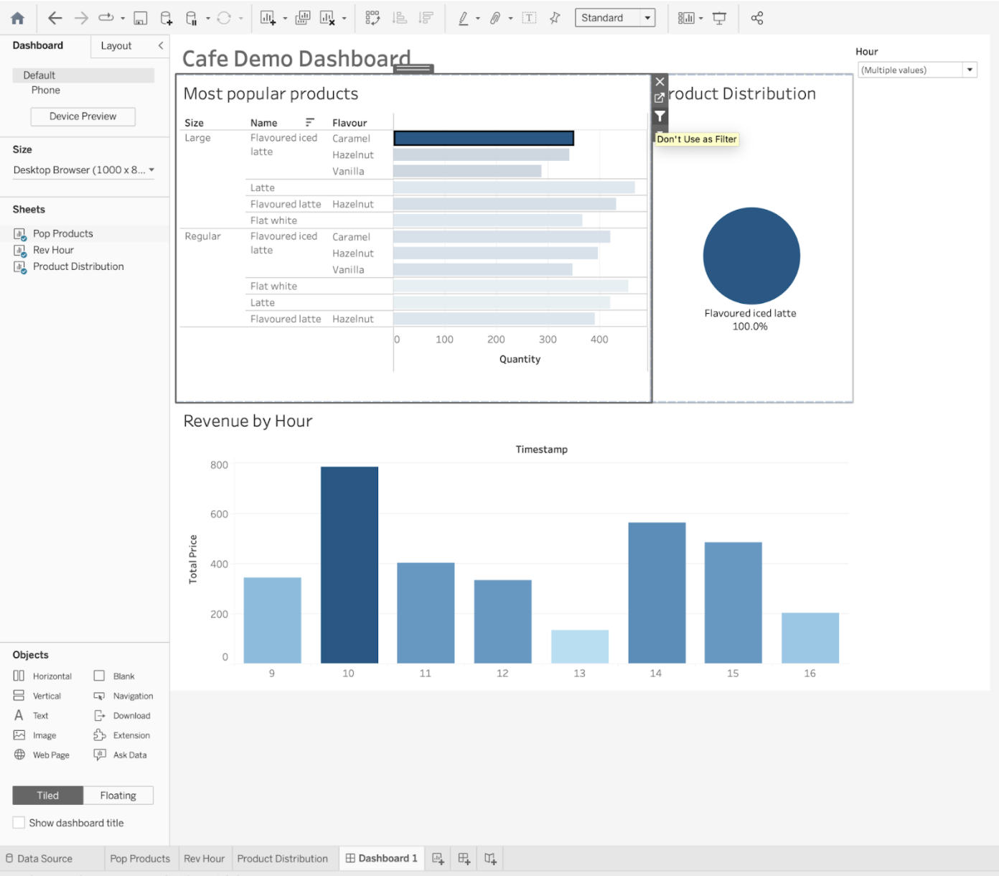

---

### Bonus Slide: Tableau Prep

- Tableau Prep changes the way traditional data prep is done in an organisation. By providing a visual and direct way to combine, shape and clean data.
- Tableau Prep makes it easier for analysts and business users to start their analysis faster.

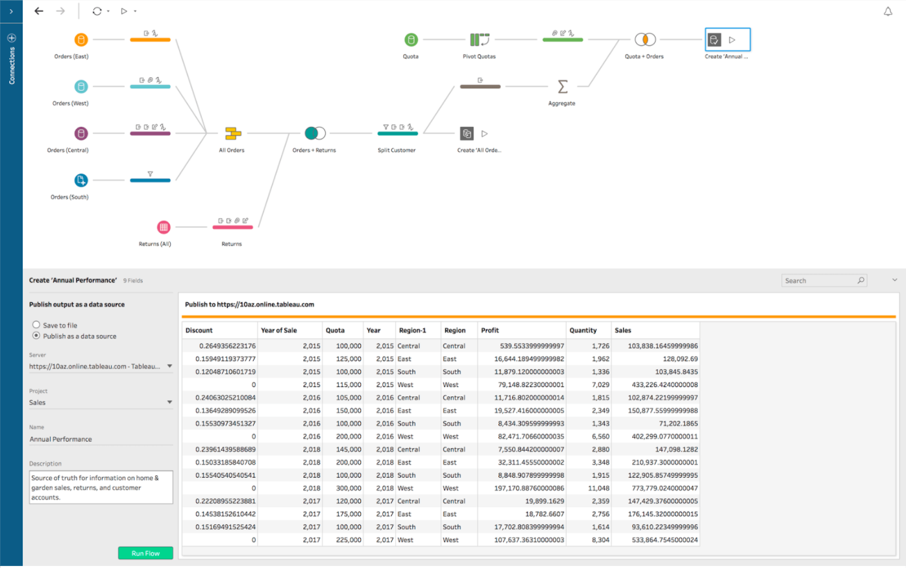

- Tableau Prep is comprised of two products: Tableau Prep Builder for building your data flows, and Tableau Prep Conductor for scheduling, monitoring and managing flows across the organisation.

---

### Exercise

- Using Python convert the Chesterfield data CSV to 1NF.
- Open Tableau and connect to the 1NF dataset.
- Create the following visualizations:
    - Stacked bar chart showing total revenue per product.
    - A pie chart showing total revenue distributed by product.
    - A tree diagram showing the total revenue per product name, size and flavour.
    - Put the three visualizations into a dashboard.

---

### Overview - recap

- Connecting to different sources
- Creating a Tableau data source
- Creating views in the Tableau workspace
- Creating Dashboards

---

### Learning Objectives - recap

- Understand what Tableau is and when to use it
- Learn how to connect to any data source in Tableau
- Be able to create a Tableau data source
- Build custom visualisations in Tableau
- To create a functional Tableau dashboard

---

### Further Reading

- Tableau Public Gallery: https://public.tableau.com/en-gb/s/viz-gallery
- Tableau Tutorial: https://www.youtube.com/watch?v=fO7g0pnWaRA

---

### Emoji Check:

On a high level, do you think you understand the main concepts of this session? Say so if not!

1. 😢 Haven't a clue, please help!
2. 🙁 I'm starting to get it but need to go over some of it please
3. 😐 Ok. With a bit of help and practice, yes
4. 🙂 Yes, with team collaboration could try it
5. 😀 Yes, enough to start working on it collaboratively

Notes:
The phrasing is such that all answers invite collaborative effort, none require solo knowledge.

The 1-5 are looking at (a) understanding of content and (b) readiness to practice the thing being covered, so:

1. 😢 Haven't a clue what's being discussed, so I certainly can't start practising it (play MC Hammer song)
2. 🙁 I'm starting to get it but need more clarity before I'm ready to begin practising it with others
3. 😐 I understand enough to begin practising it with others in a really basic way
4. 🙂 I understand a majority of what's being discussed, and I feel ready to practice this with others and begin to deepen the practice
5. 😀 I understand all (or at the majority) of what's being discussed, and I feel ready to practice this in depth with others and explore more advanced areas of the content
