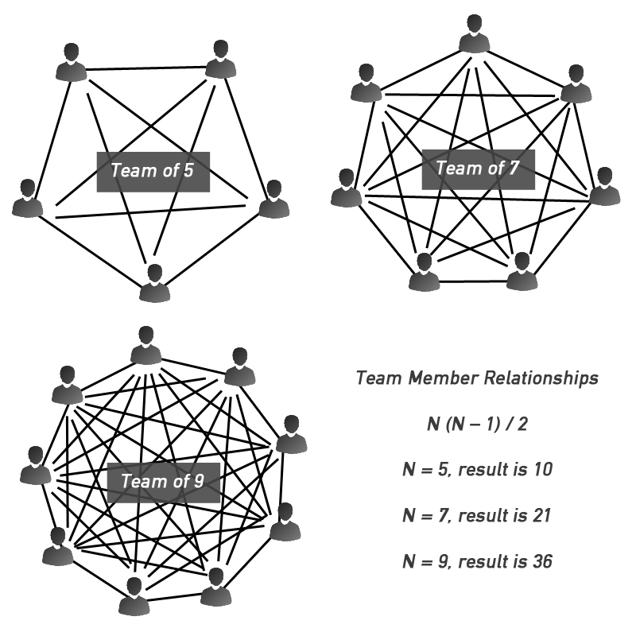
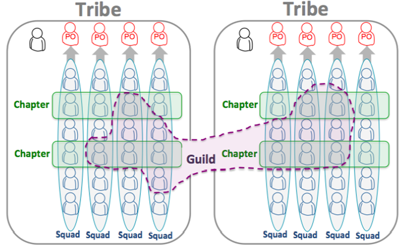
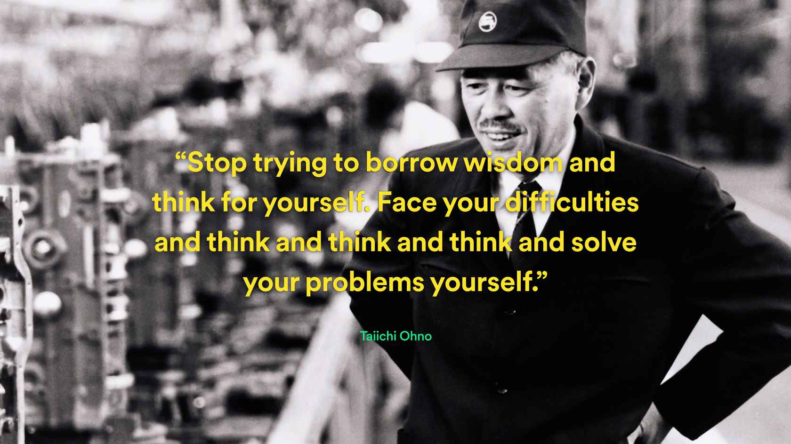
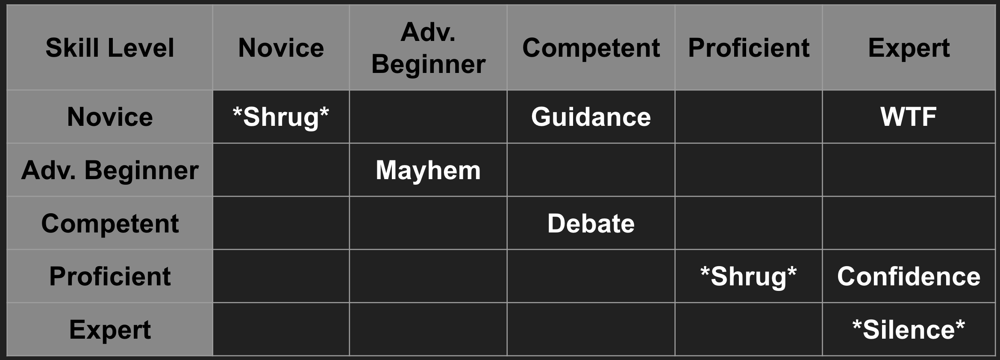

## Working In A Team

---

### Overview

- Team Dynamics
- Distributed teams
- Pair programming
- Mobbing

Notes:
Extreme Programming advocates frequent "releases" in short development cycles, which is intended to improve productivity and introduce checkpoints at which new customer requirements can be adopted.

---

### Learning Objectives

- Define team dynamics
- Recognise the different ways engineering teams operate
- Discover ways to apply them to your own work

---

## Team Dynamics

---

### Variables that influence team dynamics

- Personalities
- Roles
- Organisation and culture
- Processes and methodologies
- Team size

Notes:
Personalities within the team you're working on, normally best with a mixture of personalities.

Given our position as consultants - the personalities within the client/wider organisation.i.e talk about these aspects in the context of squad/team and client.

---

### More people != more value

<!-- .element: class="centered" -->

Notes:
How the nodes (people) becomes harder the greater the team size... Mention Amazon size of team, i.e. a team that could be served with two pizzas

---

### The Spotify model

<!-- .element: class="centered" -->

[View video](https://www.youtube.com/watch?v=R2o-Xm3UVjs)<!-- .element: class="centered" -->

Notes:
Terms recap from the video:

- Squad: Small cross-functional team - delivering the end-to-end
- Tribe: Lightweight matrix, a primary dimension focused on product delivery and quality.
- Chapter: Group formed based on competency areas such as quality assistance, Agile coaching, or web development.
- Guild: A lightweight community of interest where people across the whole company gather and share knowledge of a specific area. Anyone can join or leave a Guild at anytime - IW IDEA OF COPs

---

### There is no Spotify model

<!-- .element: class="centered" -->

[Recommended watch](https://www.infoq.com/presentations/spotify-culture-stc/)<!-- .element: class="centered" -->

Notes:
Many organisations operate using the Spotify model or have adopted parts of it, which is why it's useful to know this. But the bottom line is, the Spotify culture is not about following a prescribed process or strategy; it's about being independent, doing things, measuring their impact and constantly tweaking our process to improve.

Side note: Taiichi Ohno, fathered the Toyota Production System, which inspired Lean Manufacturing

---

### Distributed teams

- Every team is distributed in some way - even if it's in the same room
- Members of the team you're in, working from different locations
- High likelihood in tech that you're not always going to be co-located

---

### Mitigating the issues that may arise?

Notes:
Ask the group what issues might arise with distributed teams and how they would mitigate them?

---

## Communication is Key!

---

### Tools for effective communication

- Instant messaging
- Email
- Video conferencing
- Face-to-face (hopefully soon!)

---

### Video Conferencing

- Appropriate attire
- Suitable location
- The right equipment
- Stable internet connection

---

### Pair Programming

<!-- .element: class="centered" -->

---

### Pair Programming

- Two people, programming together
- One **driver** and one **observer** (or navigator)
- The driver does the coding but the observer is just as important
- The observer provides the direction for the driver to code

---

### Pair Programming

- Help reduce bugs 👍
- Knowledge sharing 👍
- Moral support 👍
- Pressure of being watched 👎
- Can easily be overdone 👎
- There needs to be a balance between the people 👎
- Not appropriate for every problem 👎

---

### The Dreyfus Squared Model

<!-- .element: class="centered" height="300px" -->

What might happen when people of different skill levels pair?

Notes:
This model aims to illustrate how two people with relative levels of expertise might interact when pairing together

- Novice|Novice: *shrug* - neither party knows what to do, so not much progress made
- Advanced Beg|Advance Beg: Mayhem - both know enough to be start, but can lead to chaos - manageable but need to be careful
- Competent|Competent: Debate - both parties have a fairly good idea of approach, but maybe not optimal approach, so can lead to lots of discussion around how to do things
- Competent|Novice - Guidance - one party has enough knowledge to pass on to the other, but not so much that they run too fast
- Proficient|Proficient: *shrug* - both parties won't feel like they get much out of it, could probably do it just as well alone
- Expert|Novice: WTF - the novice will not understand what the expert is doing
- Expert|Proficient - confidence - expert will help the proficient user hone their skills or show them an optimal approach
- Expert|Expert - Silence - neither party really has anything to gain or anything to share

---

### Mobbing

<!-- .element: class="centered" -->

---

### Mobbing

- Anything more than two people
- **One** driver and **any number** of observers/navigators
- Collectively write code together
- Best done in front of a large screen/projector
- Rotate the driver often for variation

---

### Mobbing

- Collaboration and knowledge sharing 👍
- Joint understanding of the final code = less siloed knowledge 👍
- Less time stuck on menial aspects of the programming 👍
- Get to know the people you work with/their styles well 👍
- Doesn't favour all styles - quieter voices can get lost 👎
- Doesn't favour small tasks 👎
- Too many 'mobbers' can waste time on unnecessary discussions 👎

---

### Key Terms - recap

- **Distributed teams:** Members of the team you're in, working from different locations.
- **Pair programming:** Two people, programming together. One drives - writes the code, while the other navigates.
- **Mobbing:** Programming with more than two people. The entire team works together on one task at the time.

---

### Exercise

Split into pairs for some pair programming on VS code.

Implement a new feature from the mini project on one of your apps.

We'll swap pairs later in the day and work on the code base of the person who hasn't implemented that feature.

---

### Overview - recap

- Team Dynamics
- Distributed teams
- Pair programming
- Mobbing

Notes:
Extreme Programming advocates frequent "releases" in short development cycles, which is intended to improve productivity and introduce checkpoints at which new customer requirements can be adopted.

---

### Learning Objectives - recap

- Define team dynamics
- Recognise the different ways engineering teams operate
- Discover ways to apply them to your own work

---

### Further Reading

- [The Spotify model paper](https://blog.crisp.se/wp-content/uploads/2012/11/SpotifyScaling.pdf)
- [The Spotify engineering culture (video)](https://www.youtube.com/watch?v=R2o-Xm3UVjs)
- [There is no Spotify model (video)](https://www.infoq.com/presentations/spotify-culture-stc/)
- [The Agile Manifesto](https://agilemanifesto.org/)
- [The Lean Startup (book)](http://theleanstartup.com/)
- [The Mythical Man-Month (book)](https://www.amazon.co.uk/Mythical-Man-Month-Software-Engineering-Anniversary/dp/0201835959)
- [The Dreyfus Model of Skill Acquisition](https://en.wikipedia.org/wiki/Dreyfus_model_of_skill_acquisition)

---

### Emoji Check:

On a high level, do you think you understand the main concepts of this session? Say so if not!

1. 😢 Haven't a clue, please help!
2. 🙁 I'm starting to get it but need to go over some of it please
3. 😐 Ok. With a bit of help and practice, yes
4. 🙂 Yes, with team collaboration could try it
5. 😀 Yes, enough to start working on it collaboratively

Notes:
The phrasing is such that all answers invite collaborative effort, none require solo knowledge.

The 1-5 are looking at (a) understanding of content and (b) readiness to practice the thing being covered, so:

1. 😢 Haven't a clue what's being discussed, so I certainly can't start practising it (play MC Hammer song)
2. 🙁 I'm starting to get it but need more clarity before I'm ready to begin practising it with others
3. 😐 I understand enough to begin practising it with others in a really basic way
4. 🙂 I understand a majority of what's being discussed, and I feel ready to practice this with others and begin to deepen the practice
5. 😀 I understand all (or at the majority) of what's being discussed, and I feel ready to practice this in depth with others and explore more advanced areas of the content
